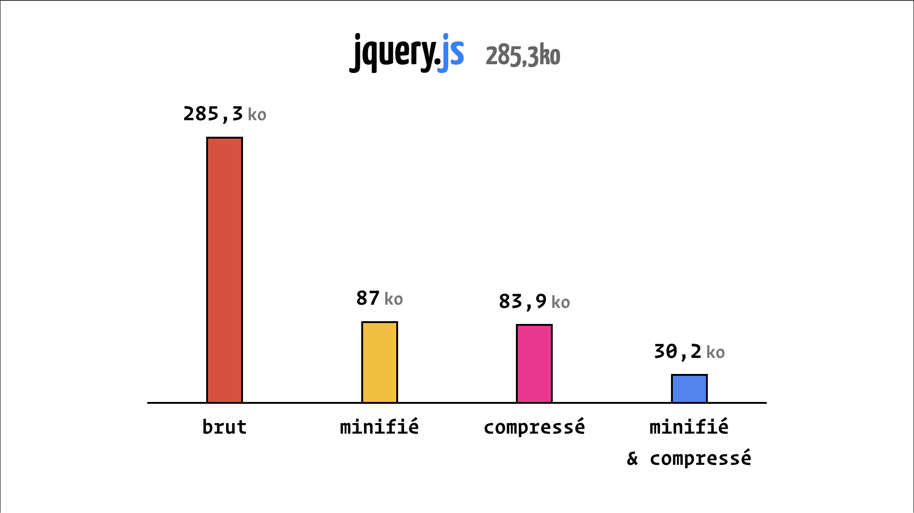
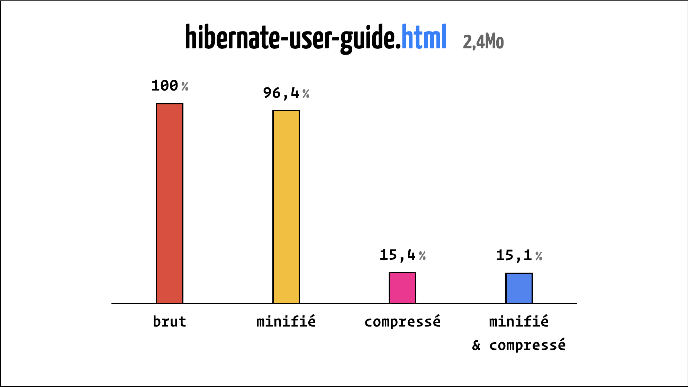
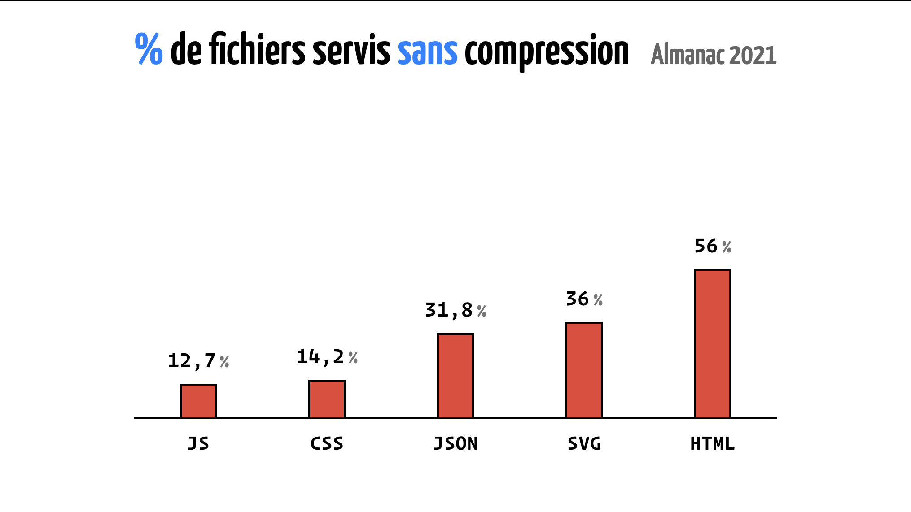

---
authors:
  - name: Antoine Caron
    title: Engineering manager Frontend
    avatar: https://pbs.twimg.com/profile_images/1633242263860965376/iw95gEVA_400x400.jpg
    bio: développeur frontend passionné qui essaie de faire du code de qualité tout en s'amusant. Il a une expertise solide en développement Web, React et frontend, et a travaillé chez M6web/Bedrock Streaming depuis 2017 en tant que Lead Frontend Developer. Il a enseigné également à Polytech Lyon. Très impliqué dans les communauté open source mais également les communautés locales, Antoine a repris avec quelques amis les rênes du Meetup LyonJS depuis 2020.
  - name: Hubert Sablionnière
    title: Engineering manager Backend
    avatar: https://lh3.googleusercontent.com/-zULkNj_mgrE/AAAAAAAAAAI/AAAAAAAAmiM/s1x33T4pEBo/photo.jpg
    bio: Hubert est passionné par le Web. Il est toujours à la recherche de nouvelles idées et autres bidouilles pour améliorer l'expérience des utilisateurs et des développeurs.
---

# La compression web

Alors que vous lisez ces lignes des millions de requêtes HTTP sont échangées sur le web.
Des millions de clients s'affèrent à décompresser leurs contenu alors que des millions de serveurs ont de leur coté compressés.
Et ça, pour nous Hubert et Antoine, ça nous facine, alors on a passé beaucoup de temps à étudier ce sujet afin de vous en partager l'essentiel ici.
On risque de glisser quelques discrètes références au jeu du Scrabble.

## Un peu de lexique

Avant de creuser un peu le sujet il est imporant de bien comprendre les termes utilisés.
Quand on parle de compression, le monde se divise en deux catégories :

- La compression sans perte de données
- La compression avec perte de données

En général, on associe la compression avec perte de données à des formats d'images ou d'audio/vidéo : JPEG, MP3 ou MPEG.
Mais en fait, sur le Web, on retrouve également de la compression avec perte de données, sur du JavaScript, du CSS ou encore du HTML.
Et dans ces cas là, on parle de **minification**.

Prenons un exemple simple avec ce code JavaScript :

```javascript
export function add(firstNumber, secondNumber) {
  return firstNumber + secondNumber;
}

// Recursive FTW!
export function factorial(number) {
  if (number === 0) {
    return 1;
  }
  return number * factorial(number - 1);
}
```

Pour l'instant, le fichier fait 228 octets, le **minifier** va le transformer car il connait la syntaxe du langage.
Il va retirer les points-virgules, les commentaires qui ne changent pas le comportement du code.

```javascript
export function add(firstNumber, secondNumber) {
  return firstNumber + secondNumber;
}

export function factorial(number) {
  if (number === 0) return 1;

  return number * factorial(number - 1);
}
```

On gagne déjà quelques octets en passant à 203 octets.
Mais le minifieur va aller bien plus loin que ça, en ajustant la syntaxe javascript de manière bien plus fine.

Par exemple ici:

- Il va transformer un `if` en une ternaire
- Supprimer les sauts de lignes
- Supprimer les espaces inutiles

Pour arriver à un résultat le plus petit possible sans changer le fonctionnement du code.

```javascript
export function add(f, s) {
  return f + s;
}
export function factorial(n) {
  return n === 0 ? 1 : n * factorial(n - 1);
}
```

Et ça, c'est qu'un exemple assez simple des transformations qu'un minifieur moderne est capable de faire.
Une fois qu'on a atteint les limites de ce qu'on peut faire avec la minification, on va appliquer de la **compression**.

Le compresseur, _l'outil dont on va se servir pour compresser le contenu du fichier sans perte_, ne connait pas la syntaxe du langage du fichier qu'il va compresser.
Il va lui agire directement sur les octets du fichier, en utilisant des algorithmes de compression.
Sur l'exemple précédent, en appliquant la minification on est passé à 98 octets, et en appliquant la compression on passe à un fichier de 89 octets.
Belle économie, non ?

Nous vous l'accordons, cet exemple n'est pas très représentatif, voyons donc sur des exemples plus représentatifs.
Regardons avec l'exemple de Jquery, un fichier de 285.3 Ko non minifié et non compressé.



On constate que sur un fichier plus conséquent, la minification et la compression apportent des gains bien plus importants.
Ici on gagne preque 90% du poids total du fichier. 
La minification à elle seule permet de gagner 69% du poids total du fichier en effet dans le fichier de base de Jquery il y a beaucoup de commentaires.

Ces logiques ne s'appliquement bien heureusement pas qu'au Javascript.
Regardons avec un fichier html conséquent, la doc complète d'Hibernate en un seul fichier.
_Oui ça existe !_



Dans ce cas là, on peut observer que la minification apporte peu, en effet, il y a peu à minifier dans un fichier HTML.

Sur les graphiques précédent, on comprends que la minification apporte de bons résultats.
Cela dépend quand même du format du fichier, sur un fichier HTML il y a souvent peut de code inutile à supprimer.
Cependant ce qu'il faut retenir et noter c'est que **la compression apporte toujours des meilleurs résulats quand elle est précédée d'une étape de minification**.

## Quels impacts pour les utilisateurs·rices ?

Ok la compression et la minification permettent de réduire la taille des fichiers, mais quel impact cela a-t-il pour les utilisateurs·rices ?
Est-ce que ça a un impact sur la vitesse de chargement des pages ?

Prenons par hasard une page web, [la page wikipedia du Scrabble](https://fr.wikipedia.org/wiki/Scrabble).
Une page web, c'est un ensemble de requêtes en cascade.
Le chargement et l'analyse de la page déclence en cascade le chargement et l'analyse d'autre ressources, etc.


Comparons donc en 3g, en 4g et sans limitation de réseau le temps de chargement de la page wikipedia du Scrabble.

<video src="./src/videos/wpt-scrabble-3gslow.mp4" controls="" aria-describeby="3g-description"></video>

<p if="3g-description">
En 3g, le temps de chargement de la page est de 17,2 secondes sans compression et 7,4 secondes avec.
C'est énorme !
</p>

<video src="./src/videos/wpt-scrabble-4g.mp4" controls="" aria-describeby="4g-description"></video>

<p if="4g-description">
En 4g, le temps de chargement de la page est de 2,4 secondes sans compression et 2,1 secondes avec.
Moins impressionnant mais toujours relativement conséquent.
</p>

<video src="./src/videos/wpt-scrabble-nolimit.mp4" controls="" aria-describeby="no-limit-description"></video>

<p if="no-limit-description">
Sans limitation le temps de chargement complet est équivalent, autour d' 1,2 seconde.
Cependant, le contenu de la page apparait plus rapidement avec la compression.
</p>

Vous allez nous dire, oui mais en 2024 tout le monde sait qu'il faut compresser ses fichiers.
Alors !

Vous connaissez [l'almanach du web](https://almanac.httparchive.org/fr/) ? 
C'est une étude qui permet de voir l'évolution des pratiques sur le web.

Regardons [les résultats de l'étude de 2022 sur la compression](https://almanac.httparchive.org/en/2022/page-weight#compression).



Clairement ça nous a fait très peur.
Et la, on parle du web public accessible à tous, pas des intranets ou des applications internes.

Bon, on peut se rassurer, [l'étude de 2024 vient de sortir](https://almanac.httparchive.org/en/2024/markup#compression) et les chiffres sont meilleurs.
Seulement 11% des fichiers HTML ne sont pas compressés alors qu'en 2022 c'était 56%.

Retenez donc que **la compression est encore nécessaire en 2024**.

## Dans les tuyaux

Ok, maintenant qu'on sait qu'il faut compresser, comment ça marche dans le navigateur ?

## Un peu d'histoire

Bon tout cela n'est pas nouveau, la compression web avec gzip on la retrouve définie dans une RFC de 1992.
Jean-Loup Gailly et Mark Adler posent les bases de la compression tel qu'on la connait depuis plus de 30 ans maintenant.
Pour se faire ils se sont basés de travaux de Phil Katz sur PKZIP qui lui défini dans une RFC dédié le format de fichier zip tel que vous le connaissez certainement.

<!-- TODO insérer photo de Phil Katz -->

Mais Phil Katz n'a pas construit la format zip à partir de rien, il a repris des travaux bien plus anciens.
Reprenant les travaux d'Abraham Lempel et de Jacob Ziv datant de 1977, il réutilise l'algorithme LZ77 comme base.
Enfin pour encoder de manière optimisée, Phil Katz a également pu se baser sur les travaux de David Huffman datant de 1952 avec son codage de Huffman.

La compression dans le web est un bel exemple de cascade de découvertes et des impacts de la recherche fondamentale dans notre société.
Plus de 30 ans nous séparent maintenant de la publication de gzip, et plus de 40 ans séparent cette publication des travaux initiaux de David Huffman.

Le web sans la compression serait terriblement différent si ces travaux n'avaient pas été menés, on pourrait même imaginer que la révolution qu'il a apporté aurait été limitée.

## Comprenons le codage de Huffman

## LZ77 c'est quoi ?

## Et concrètement ?

## À la recherche du pouillème

## Au dela du poullième

## Conclusion

Dans cet article nous avons essayé de faire de le tour de ce qui nous parait essentiel pour comprendre la compression dans le monde du Web.
Bon, nous avons aussi inséré discrètement quelques références au Scrabble.
Retenez donc ces neufs rappels et principes.

1. La compression va de pair avec la minification.
2. La compression est encore nécessaire en 2024.
3. La compression est natif au fonctionnement du Web.
4. La compression n'interrompt pas le flux.
5. L'algorithme de Huffman c'est un peu comme c _lettre compte moins_.
6. C'est _mot compte moins_.
7. La compression dans le web ça marche mieux avec brotli.
8. Les fichiers statiques se compressent une seule fois au build.
9. La compression n'a pas d'effet sur les fichiers déjà compressés.

Si cet article vous a plu il existe plusieurs captations d'une conférence que nous avons donné dans différentes villes de France.
En voici une donnée en 2023 à Nantes.

https://www.youtube.com/watch?v=JARVYdwNSrI
