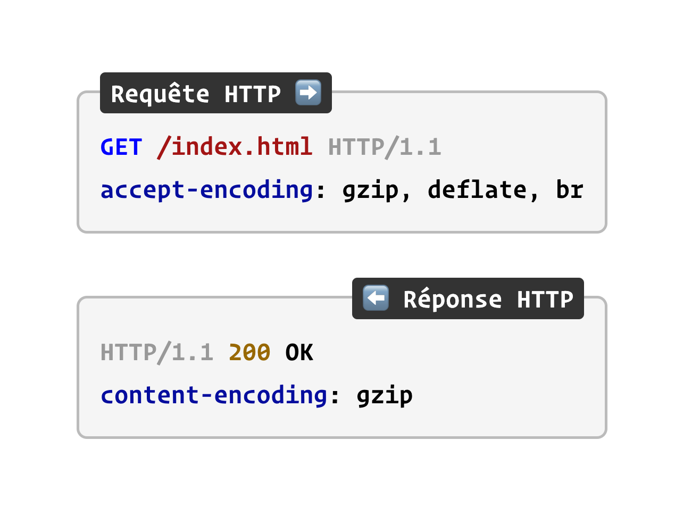
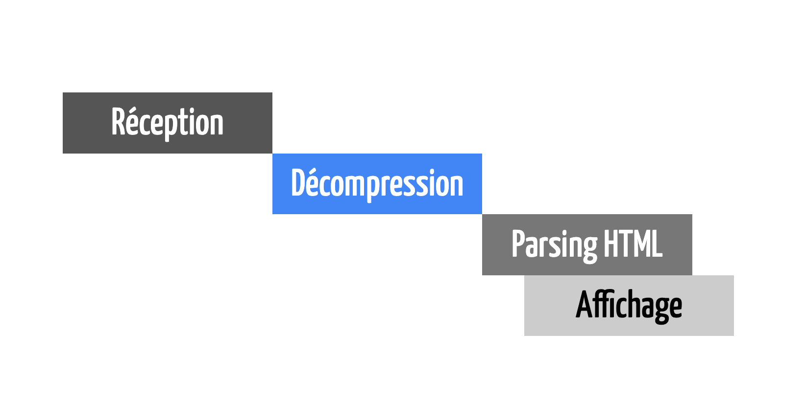
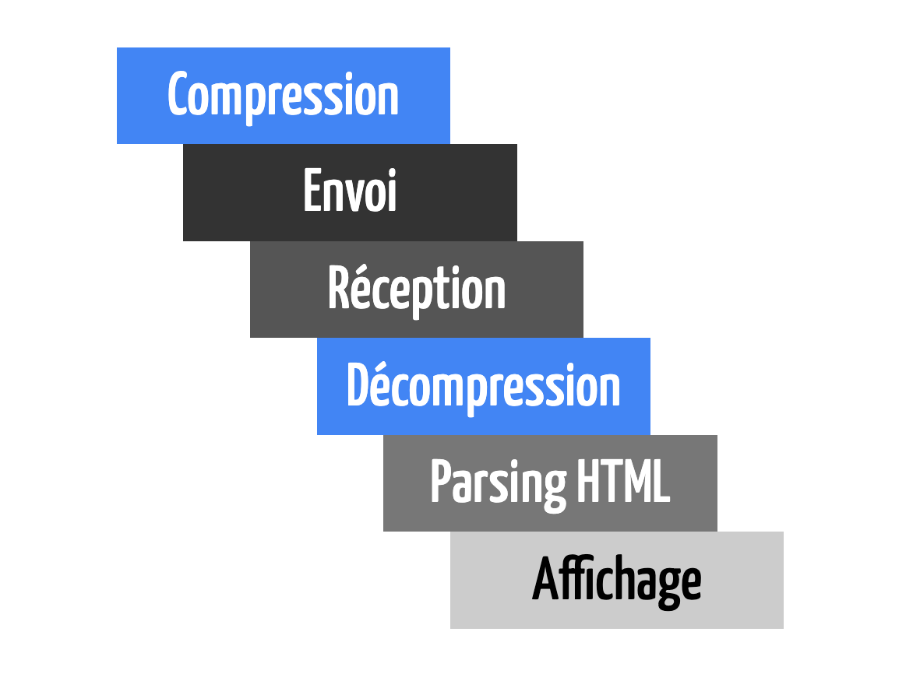
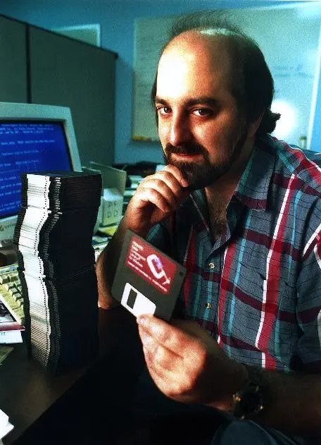

---
authors:
  - name: Antoine Caron
    title: Engineering manager Frontend
    avatar: https://pbs.twimg.com/profile_images/1633242263860965376/iw95gEVA_400x400.jpg
    bio: développeur frontend passionné qui essaie de faire du code de qualité tout en s'amusant. Il a une expertise solide en développement Web, React et frontend, et a travaillé chez M6web/Bedrock Streaming depuis 2017 en tant que Lead Frontend Developer. Il a enseigné également à Polytech Lyon. Très impliqué dans les communauté open source mais également les communautés locales, Antoine a repris avec quelques amis les rênes du Meetup LyonJS depuis 2020.
  - name: Hubert Sablionnière
    title: Engineering manager Backend
    avatar: https://lh3.googleusercontent.com/-zULkNj_mgrE/AAAAAAAAAAI/AAAAAAAAmiM/s1x33T4pEBo/photo.jpg
    bio: Hubert est passionné par le Web. Il est toujours à la recherche de nouvelles idées et autres bidouilles pour améliorer l'expérience des utilisateurs et des développeurs.
---

# La compression web

Alors que vous lisez ces lignes des millions de requêtes HTTP sont échangées sur le web.
Des millions de clients s'affèrent à décompresser leurs contenu alors que des millions de serveurs ont de leur coté compressés.
Et ça, pour nous Hubert et Antoine, ça nous facine, alors on a passé beaucoup de temps à étudier ce sujet afin de vous en partager l'essentiel ici.
Nous risquons de glisser quelques discrètes références au jeu du Scrabble.

## Un peu de lexique

Avant de creuser un peu le sujet il est imporant de bien comprendre les termes utilisés.
Quand on parle de compression, le monde se divise en deux catégories :

- La compression sans perte de données
- La compression avec perte de données

En général, on associe la compression avec perte de données à des formats d'images ou d'audio/vidéo : JPEG, MP3 ou MPEG.
Mais en fait, sur le Web, on retrouve également de la compression avec perte de données, sur du JavaScript, du CSS ou encore du HTML.
Et dans ces cas là, on parle de **minification**.

Prenons un exemple simple avec ce code JavaScript :

```javascript
export function add(firstNumber, secondNumber) {
  return firstNumber + secondNumber;
}

// Recursive FTW!
export function factorial(number) {
  if (number === 0) {
    return 1;
  }
  return number * factorial(number - 1);
}
```

Pour l'instant, le fichier fait 228 octets, le **minifier** va le transformer car il connait la syntaxe du langage.
Il va retirer les points-virgules, les commentaires qui ne changent pas le comportement du code.

```javascript
export function add(firstNumber, secondNumber) {
  return firstNumber + secondNumber;
}

export function factorial(number) {
  if (number === 0) return 1;

  return number * factorial(number - 1);
}
```

On gagne déjà quelques octets en passant à 203 octets.
Mais le minifieur va aller bien plus loin que ça, en ajustant la syntaxe javascript de manière bien plus fine.

Par exemple ici:

- Il va transformer un `if` en une ternaire
- Supprimer les sauts de lignes
- Supprimer les espaces inutiles

Pour arriver à un résultat le plus petit possible sans changer le fonctionnement du code.

```javascript
export function add(f, s) {
  return f + s;
}
export function factorial(n) {
  return n === 0 ? 1 : n * factorial(n - 1);
}
```

Et ça, c'est qu'un exemple assez simple des transformations qu'un minifieur moderne est capable de faire.
Une fois qu'on a atteint les limites de ce qu'on peut faire avec la minification, on va appliquer de la **compression**.

Le compresseur, _l'outil dont on va se servir pour compresser le contenu du fichier sans perte_, ne connait pas la syntaxe du langage du fichier qu'il va compresser.
Il va lui agire directement sur les octets du fichier, en utilisant des algorithmes de compression.
Sur l'exemple précédent, en appliquant la minification on est passé à 98 octets, et en appliquant la compression on passe à un fichier de 89 octets.
Belle économie, non ?

Nous vous l'accordons, cet exemple n'est pas très représentatif, voyons donc sur des exemples plus représentatifs.
Regardons avec l'exemple de Jquery, un fichier de 285.3 Ko non minifié et non compressé.


On constate que sur un fichier plus conséquent, la minification et la compression apportent des gains bien plus importants.
Ici on gagne preque 90% du poids total du fichier. 
La minification à elle seule permet de gagner 69% du poids total du fichier en effet dans le fichier de base de Jquery il y a beaucoup de commentaires.

Ces logiques ne s'appliquement bien heureusement pas qu'au Javascript.
Regardons avec un fichier html conséquent, la doc complète d'Hibernate en un seul fichier.
_Oui ça existe !_


Dans ce cas là, on peut observer que la minification apporte peu, en effet, il y a peu à minifier dans un fichier HTML.

Sur les graphiques précédent, on comprends que la minification apporte de bons résultats.
Cela dépend quand même du format du fichier, sur un fichier HTML il y a souvent peut de code inutile à supprimer.
Cependant ce qu'il faut retenir et noter c'est que **la compression apporte toujours des meilleurs résulats quand elle est précédée d'une étape de minification**.

## Quels impacts pour les utilisateurs·rices ?

Ok la compression et la minification permettent de réduire la taille des fichiers, mais quel impact cela a-t-il pour les utilisateurs·rices ?
Est-ce que ça a un impact sur la vitesse de chargement des pages ?

Prenons par hasard une page web, [la page wikipedia du Scrabble](https://fr.wikipedia.org/wiki/Scrabble).
Une page web, c'est un ensemble de requêtes en cascade.
Le chargement et l'analyse de la page déclence en cascade le chargement et l'analyse d'autre ressources, etc.


Comparons donc en 3g, en 4g et sans limitation de réseau le temps de chargement de la page wikipedia du Scrabble.

<video src="./src/videos/wpt-scrabble-3gslow.mp4" controls="" aria-describeby="3g-description"></video>

<p if="3g-description">
En 3g, le temps de chargement de la page est de 17,2 secondes sans compression et 7,4 secondes avec.
C'est énorme !
</p>

<video src="./src/videos/wpt-scrabble-4g.mp4" controls="" aria-describeby="4g-description"></video>

<p if="4g-description">
En 4g, le temps de chargement de la page est de 2,4 secondes sans compression et 2,1 secondes avec.
Moins impressionnant mais toujours relativement conséquent.
</p>

<video src="./src/videos/wpt-scrabble-nolimit.mp4" controls="" aria-describeby="no-limit-description"></video>

<p if="no-limit-description">
Sans limitation le temps de chargement complet est équivalent, autour d' 1,2 seconde.
Cependant, le contenu de la page apparait plus rapidement avec la compression.
</p>

Vous allez nous dire, oui mais en 2024 tout le monde sait qu'il faut compresser ses fichiers.
Alors !

Vous connaissez [l'almanach du web](https://almanac.httparchive.org/fr/) ? 
C'est une étude qui permet de voir l'évolution des pratiques sur le web.

Regardons [les résultats de l'étude de 2022 sur la compression](https://almanac.httparchive.org/en/2022/page-weight#compression).


Clairement ça nous a fait très peur.
Et la, on parle du web public accessible à tous, pas des intranets ou des applications internes.

Bon, on peut se rassurer, [l'étude de 2024 vient de sortir](https://almanac.httparchive.org/en/2024/markup#compression) et les chiffres sont meilleurs.
Seulement 11% des fichiers HTML ne sont pas compressés alors qu'en 2022 c'était 56%.

Retenez donc que **la compression est encore nécessaire en 2024**.

## Dans les tuyaux

Ok, maintenant qu'on sait qu'il faut compresser, comment ça marche dans le navigateur ?
Alors déjà retenez que la compression n'est en effet pas obligatoire.
C'est le navigateur qui envoi une entête `Accept-Encoding` dans la requête HTTP pour indiquer au serveur qu'il est capable de décompresser le contenu.



Grâce à cet entête, le serveur va pouvoir choisir de compresser ou non le contenu tout en retournant l'entête `Content-Encoding` pour indiquer au navigateur le type de compression utilisé.
Un server ne peut donc pas choisir de retourner compresser un contenu dans un format que le navigateur ne sait pas décompresser.

Le site web caniuse.com qui permet de voir la compatibilité des technologies web dans les navigateurs a un affichage très spécifique pour le support de gzip.
En effet, le [support de gzip est tellement répandu](https://caniuse.com/sr_content-encoding-gzip) qu'il est considéré comme acquis.

C'est cool non ? C'est pas tout !

Au départ on pensait naïvement que la compression et la décompression étaient une étape bloquante entre le serveur et le navigateur.
Même si cette étape était bloquante, on gagnait du temps car le fichier était plus petit.
Si on schématise, ce qu'on imaginait, on pensait que le serveur compressait tout le contenu puis l'envoyait au navigateur qui décompressait tout le contenu et l'affichait.



Ce n'est pas comme ça que le web fonctionne, nos navigateurs peuvent afficher du DOM qu'il reçoit progressivement.
Sans compression, un server qui envoie une page web de plusieurs Mo par exemple va le faire progressivement mais le rendu va se faire progressivement.

Pour le prouver, on a donc fait un site web qui contient l'intégralité des oeuvres de Sherlock Holmes (toutes les nouvelles et les romans).
_Oui la page est lourde, mais justement le but c'est de mieux se rendre compte du chargement progressif._
_Et puis bon, on vient peut-être de créer la meilleure façon de lire Sherlock Holmes en ligne._
On a même activé la compression pour voir ce que ça donne.

<video src="./articleAssets/flux.mp4"></video>

Dans cette vidéo, on voit bien que le contenu est affiché progressivement, même si le fichier toujours en cours de téléchargement.
Et cela, même si le serveur compresse le contenu à la volée, on observe que le DOM se construit de manière progressive.
Dans cette situation on pourrait même imaginer que le serveur n'a pas encore compressé les derniers octets du fichier html que le navigateur a déjà décompressé et affiché une partie de la page web.



Retenez donc que **la compression et la décompression n'interrompent pas le flux**.

## Un peu d'histoire

Bon tout cela n'est pas nouveau, la compression web avec gzip on la retrouve définie dans une RFC de 1992.
Jean-Loup Gailly et Mark Adler posent les bases de la compression tel qu'on la connait depuis plus de 30 ans maintenant.
Pour se faire ils se sont basés de travaux de Phil Katz sur PKZIP qui lui défini dans une RFC dédié le format de fichier zip tel que vous le connaissez certainement.



Mais Phil Katz n'a pas construit la format zip à partir de rien, il a repris des travaux bien plus anciens.
Reprenant les travaux d'Abraham Lempel et de Jacob Ziv datant de 1977, il réutilise l'algorithme LZ77 comme base.
Enfin pour encoder de manière optimisée, Phil Katz a également pu se baser sur les travaux de David Huffman datant de 1952 avec son codage de Huffman.

La compression dans le web est un bel exemple de cascade de découvertes et des impacts de la recherche fondamentale dans notre société.
Plus de 30 ans nous séparent maintenant de la publication de gzip, et plus de 40 ans séparent cette publication des travaux initiaux de David Huffman.

Le web sans la compression serait terriblement différent si ces travaux n'avaient pas été menés, on pourrait même imaginer que la révolution qu'il a apporté aurait été limitée.

## Comprenons le codage de Huffman

Après cette délicieuse tranche d'histoire, on va essayer de comprendre un peu mieux le codage de Huffman.
David Huffman en 1952 il se dit _"En codant les caractères qui apparaissent le plus souvent avec peu de bits, et en codant les caractères qui apparaissent le moins souvent avec beaucoup de bits, en moyenne, on devrait réduire le nombre de total de bits et gagner de la place._"

Vous n'avez rien compris ? C'est normal, c'est un peu comme le Scrabble.
Vous connaissez ce jeu où on tire des tuiles avec des lettres et où il faut former des mots ?
Les lettres les plus courantes ont un faible nombre de points, alors que les lettres les moins courantes ont un nombre de points plus élevé.
C'est un peu la même logique.

Si on est capable de générer un code binaire pour chaque caractère. 
Les caractères les plus fréquents auront un code binaire court, et les caractères les moins fréquents auront un code binaire long.
Et dans les faits ça marche terriblement bien.

Ce qu'il faut savoir, c'est que David Huffman a 26 ans quand il publie cela.
Alors qu'il étudie au MIT, dans la même classe que Claude Shannon, alors que son professeur lui donne un choix de publier un article ou de passer un examen, David choisi de faire un article scientifique.
Il publie alors le codage de Huffman et l'algorithme qui permet de le déterminer.
Il prouve également mathématiquement que son codage est le plus optimal possible.

Si on reprend l'image du Scrabble, appliquer le codage de Huffman sur un mot, c'est comme avoir une case _lettre compte moins_.


## LZ77 c'est quoi ?

Bon en 1977, alors que Carlos sortait son célèbre _Big Bisou_, Abraham Lempel et Jacob Ziv publient un article sur un algorithme de compression sans perte.
Ils se disent qu'au vu de la teneur des messages qu'on échange numériquement à l'époque, on peut surement faire mieux que simplement appliquer un codage de Huffman.

Prenons cette exemple de texte :

> *"*On peut tromper une personne mille fois._<br>
On peut tromper mille personnes une fois._<br>
Mais on ne peut pas tromper mille personnes, mille fois.*"*

Clairement dans ce message on se répète beaucoup, et on ne répète pas juste des lettres, on répète des motifs complexes.
L'idée de Lempel et Ziv c'est de dire, si on a déjà vu un motif, on peut le remplacer par une référence à ce motif.


En inventant un systeme d'encodage efficace pour ces références, on peut réduire la taille du message.
Il faut également trouver un moyen simple et efficace de trouver ces motifs dans le message.

## Et concrètement ?

Alors en fait, un an après avoir créé l'algorithme Lempel et Ziv créent... l'algorithme LZ78.
En fait il existe une vraie famille d'algorithme LZ, LZ77, LZ78, LZSS, LZW, etc.


Vous allez retrouver une alternative LZW dans les formats de fichiers GIF et TIFF.
LZSS dans Winrar, LZMA dans 7zip.
D'ailleurs vous avez peut-être déjà [entendu parler de LZMA cette année](https://linuxfr.org/users/ytterbium/journaux/xz-liblzma-compromis).
Si ces sujets vous intéressent, nous vous conseillons [la vidéo de Colt McAnlis](https://www.youtube.com/watch?v=Jqc418tQDkg) à ce sujet.

Bon pour revenir en revenir à gzip, revenons donc à Phil Katz.
En 1990, il se dit: "Si à mon fichier, j'applique l'algorithme LZ77 pour obtenir des étiquettes et des symboles, puis le codage de Huffman, je vais obtenir un fichier plus petit."
Il décide d'appeler cela Deflate, et référence ça dans la [RFC 1951](https://www.rfc-editor.org/rfc/rfc1951.txt).
En rajoutant des entêtes et des pieds de page, il obtient le format de fichier zip.

Quelques années plus tard, Jean-Loup Gailly et Mark Adler se disent: "Et si on appliquait ça au web ?"
Ils créent alors la zlib et formalise une nouvelle RFC qui se base également sur Deflate mais avec des entêtes et des pieds de page différents de ce qu'à proposé Phil Katz.
On retrouve cela en détail dans la [RFC 1952](https://www.rfc-editor.org/rfc/rfc1952.txt).


## À la recherche du pouillème

Définissons ensemble ce qu'est un pouillème.
C'est déjà scientifiquement une unité de mesure qui veut dire "à peu près pas beaucoup".
Au vu du nombre d'échanges sur le web, si on arrive à gagner un pouillème supplémentaire grâce à la compression, il y a clairement d'économies à faire.

Donc clairement, les gros consommateurs de bande passante, les géants du web, cherchent à gagner des pouillèmes.
En fait état par exemple cloudflare qui a son propre [fork de la zlib](https://github.com/cloudflare/zlib).

Déjà, quand gzip est apparu, il y avait déjà la possibilité de choisir entre plusieurs niveaux de compression.
De 1 à 9, ces niveaux permettent d'avoir une compression plus ou moins forte du fichier.
En jouant sur quelques paramètres, et contre quelques millisecondes de calculs supplémentaires, gzip va alors trouver des motifs plus complexes et donc plus efficaces.

Graph 9 niveaux de gzip

Dans les années 2010, Google se dit: "Et si on faisait mieux que gzip tout en gardant le format de fichier gzip ?"
Ils créent alors [Zopfli](https://github.com/google/zopfli) qui est clairement une implémentation de gzip qui brutforce la recherche de motifs dans l'algo LZ.
On gagne quelques pouillèmes, mais on beaucoup de temps de calcul.

Quelques années plus tard, certains même ingénieurs de chez Google se disent plusieurs choses:
- le format de fichier gzip est un peu vieux et on pourrait faire mieux pour gagner déjà quelques octets.
- dans le web, on connait à peu pres la structure des fichiers qu'on manipule. On sait par exemple qu'un fichier html va avoir une balise `html` et qu'une feuille de style CSS va certainement avoir des attributs comme `margin`.

Ils créent alors Brotli et le spécifie dans la [RFC 7932](https://www.rfc-editor.org/rfc/rfc7932).

Donc oui Brotli triche, il possède à la compression et à la décompression un énorme dictionnaire dans lequel il peut référencer des étiquettes avec LZ77.
13 504 mots sont dans ce [dictionnaire](https://gist.github.com/klauspost/2900d5ba6f9b65d69c8e) auquel il peut appliquer 121 transformations (comme lowercase, uppercase, etc), ce qui nous donne 1 633 984 *possibilités*.
C'est énorme !
Et en 2024, Brotli est supporté par tous les [navigateurs modernes](https://caniuse.com/brotli).

Comparons maintenant l'efficacité de ces trois algorithmes sur un fichier js comme `jquery.min.js` avec les différents niveaux.

Retenez donc que **la compression dans le web ça marche mieux avec brotli**.

Maintenant comparons les performances et le temps nécessaire à la compression et la décompression pour chaque niveau.

[L'almanac du web vous propose donc une recommendation claire](https://almanac.httparchive.org/en/2021/compression#fig-10) pour choisir le niveau de compression à utiliser.
Les fichiers statiques doivent être compressés une seule fois au build avec les meilleurs niveaux de Brotli et Gzip ou Zopfli.
Les fichiers dynamiques doivent être compressés à la volée avec un niveau de compression plus faible pour ne pas ralentir le serveur.
Il est donc recommandé d'appliquer dans cette situation un niveau de 5 avec Brotli et de 6 avec Gzip.


Bon, pourquoi nous avons décidé de mettre cette photo des chats d'Hubert ?
Cette image est un JPEG, un format d'image qui utilise la compression avec perte de données.
Voici les résultats de la compression de cette image avec Brotli, Gzip et Zopfli.

Clairement ce n'est pas efficace, la compression avec perte de données a déjà fait le travail, il n'y a rien à enlever.
Vous pourriez nous reprochez de dire une évidence, mais l'[Almanach du web nous rappelle](https://almanac.httparchive.org/en/2020/compression) que 3,27% des JPEG sont servis compressés avec gzip dans le web.

Cependant, tous les fichiers binaires ne sont pas compressés par défaut.
Il faudrait donc appliquer la compression sans perte pour les servir.
Les formats `font/otf`, `font/ttf`, `image/bmp`, `image/x-icon` et `application/wasm` sont des exemples de fichiers binaires qui ne sont pas compressés par défaut.

On peut également citer le format WASM qui est souvent oublié dans la configuration des fichiers compressés.
Pourtant, les binaires wasm sont souvent très lourds et peuvent bénéficier de la compression.

<!-- graph sur le sql.wasm-->

## Au dela du poullième

## Conclusion

Dans cet article nous avons essayé de faire de le tour de ce qui nous parait essentiel pour comprendre la compression dans le monde du Web.
Bon, nous avons aussi inséré discrètement quelques références au Scrabble.
Retenez donc ces neufs rappels et principes.

1. La compression va de pair avec la minification.
2. La compression est encore nécessaire en 2024.
3. La compression est natif au fonctionnement du Web.
4. La compression n'interrompt pas le flux.
5. L'algorithme de Huffman c'est un peu comme c _lettre compte moins_.
6. C'est _mot compte moins_.
7. La compression dans le web ça marche mieux avec brotli.
8. Les fichiers statiques se compressent une seule fois au build.
9. La compression n'a pas d'effet sur les fichiers déjà compressés.

Si cet article vous a plu il existe plusieurs captations d'une conférence que nous avons donné dans différentes villes de France.
En voici une donnée en 2023 à Nantes.

https://www.youtube.com/watch?v=JARVYdwNSrI
