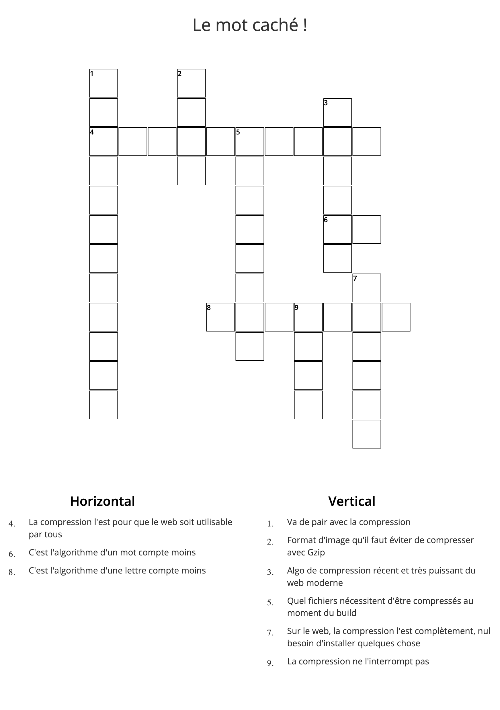

#  Le Jeu pour compléter "La compression Web : comment (re)prendre le contrôle ?"

Compléter cette grille de mot croisés et découvrer le mot code qui vous permet d'obternir des cadeaux par nos partenaires et employeurs [Clever Cloud](https://www.clever-cloud.com/fr/home/) et [Scaleway](https://www.scaleway.com/en/).
Faire ce petit jeu, cela vous permettra aussi de reprendre les notions importantes que nous avons voulu transmettre lors du talk.
Pensez également à nous donner un feedback pour le talk ! 

<p align='center' style='padding:20px 10%;gap: 25px;background-color: white;min-height: 100px;display: flex;justify-content: center;align-items: center;flex-direction: column'>


</p>

## La grille à remplir



## Le message à décoder avec la clé

Prenez la première lettre de chaque mot de la grille cela vous forme la clé pour déchiffrer le message suivant qui vous permettra de débloquer vos cadeaux chez Clever Cloud et Scaleway.
Le [chiffre de vigenère](https://www.dcode.fr/chiffre-vigenere#q1) est utilisé pour chiffer le message avec cette clé.

Vous pouvez utiliser site web: https://www.dcode.fr/chiffre-vigenere

Message à décoder avec algo (vous pouvez également tenter de le brutforce mais ça à moins de saveur)

```
- Bxve vpostcdfe dp phiqjv pzpm Zhmufjsj hanxrtrj wr jtpn er jpqbhfrpa VPIZHMUF2023 dmt ivze mpafpeh folff s 100€ or jwqmjgk abbw fxvf dpf wwamvvld

- Pvsfjdgwc y'hidntfw xnpq edjisygl jz mpaflaa aacsr AO ql havqgw nylaqa dygfq ly xn nbl xnnncdf "PZPIHQQC" qbmc qlgxxrhwc qlx oafqaef 
```
