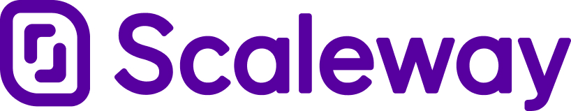

#  Le Jeu pour compléter "La compression Web : comment (re)prendre le contrôle ?"

Complétez cette grille de mot croisés et découvrez le mot code qui vous permettra d'obtenir des cadeaux par nos partenaires et employeurs [Clever Cloud](https://www.clever-cloud.com/fr/home/) et [Scaleway](https://www.scaleway.com/en/).
Faire ce petit jeu, cela vous permettra aussi de reprendre les notions importantes que nous avons voulu transmettre lors de la présentation.
Pensez également à nous donner un feedback pour la présentation ! 

<br>
<br>

<p align="center">
  
  &nbsp;&nbsp;&nbsp;&nbsp;&nbsp;
  
</p>

<br>

## La grille à remplir


## Comment récupérer votre voucher chez Clever Cloud ?

Si vous avez trouvé tous les mots de la grille, rendez-vous sur https://www.clever-cloud.com/game-devfest-nantes-2023 et remplissez le formulaire.
La réponse est la première lettre de chaque mot dans l'ordre de 1 à 9.

## Comment récupérer votre voucher chez Scaleway ?

Prenez la première lettre de chaque mot de la grille cela vous forme la clé pour déchiffrer le message suivant qui vous permettra de débloquer vos cadeaux chez Clever Cloud et Scaleway.
Le [chiffre de vigenère](https://www.dcode.fr/chiffre-vigenere#q1) est utilisé pour chiffer le message avec cette clé.

Vous pouvez utiliser site web: https://www.dcode.fr/chiffre-vigenere

Message à décoder avec algo (vous pouvez également tenter de le brutforce mais ça à moins de saveur)

```
- Bxve vpostcdfe dp phiqjv pzpm Zhmufjsj hanxrtrj wr jtpn er jpqbhfrpa VPIZHMUF2023 dmt ivze mpafpeh folff s 100€ or jwqmjgk abbw fxvf dpf wwamvvld

- Pvsfjdgwc y'hidntfw xnpq edjisygl jz mpaflaa aacsr AO ql havqgw nylaqa dygfq ly xn nbl xnnncdf "PZPIHQQC" qbmc qlgxxrhwc qlx oafqaef 
```
