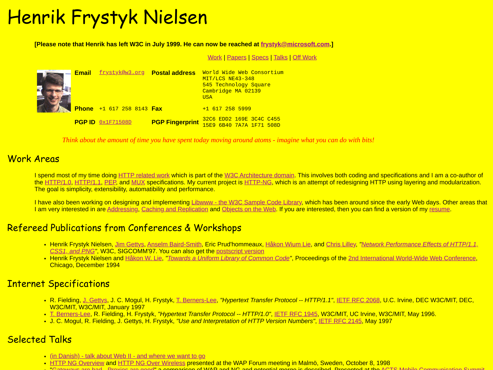

# La compression Web : comment (re)prendre le contrôle ?

## poster fade-from
> @00:00:00@

## blank

## blank black

## text
🍿 Texte
> texte

## media

> notes

## blank black
> notes

## poster
> @00:01:20@
> ...

## media

> URL browser

## code
```http type="request"
GET /index.html HTTP/1.1
```
```http type="response"
HTTP/1.1 200 OK
cache-control: [...]
```
> notes

## poster
Merci beaucoup !

## credits

Section 1 :

* text : https://example.com

Section 2 :

* text 2 : https://example.com
