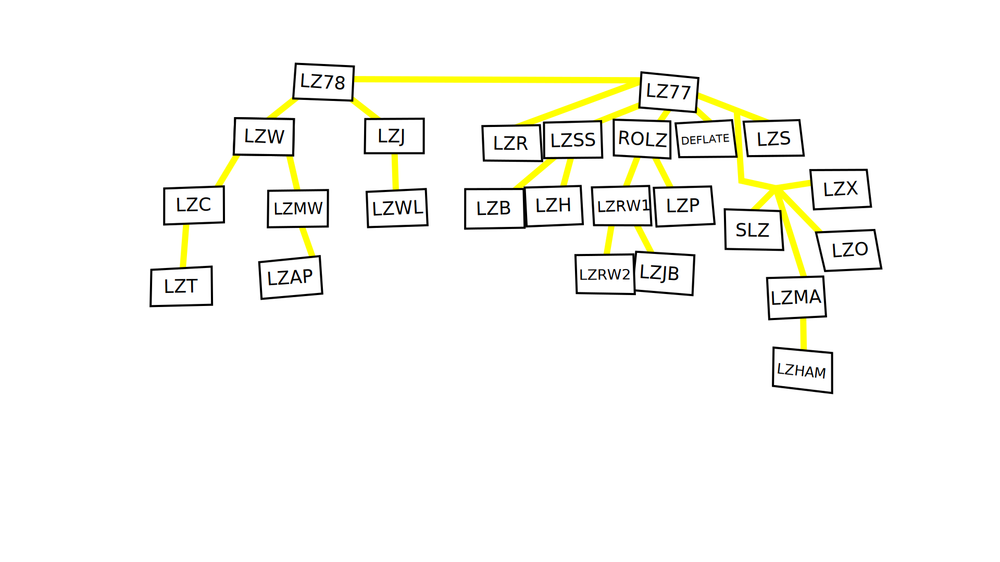
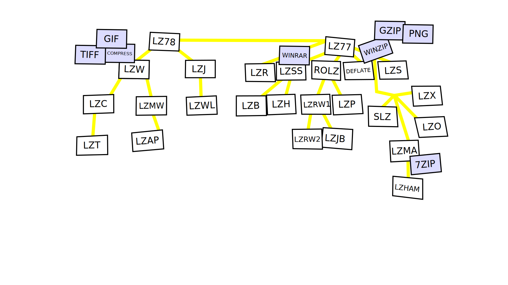

---
author:
author-twitter:
author-company:
event: DevFest Nantes
date: 19 octobre 2023
---

# La compression Web : comment (re)prendre le contrôle ?

## blank
> @00:00:00@

## huffman score=auto fade-from todo
DEIOXYZ
<!-- animation shuffle -->
> intro avec des questions
> Qui a déjà essayé de zipper un point zip ?
> Qui a acheté sa license winrar ?
> Qui connait par coeur les flags de la commande tar ?

## blank black

## poster fade-from
La compression web
> Bonjour

## blank black fade-to

## section
Lexique

## text
🤔 *Avec* ou *Sans* perte de données ?
> nous on va parler principalement sans perte

## text
🗑️ Minification

## blank

## code
```js simple-js-example
export function add (firstNumber, secondNumber) {

}


export function factorial (number) {


}
```

## code
```js simple-js-example
export function add (firstNumber, secondNumber) {
  return firstNumber + secondNumber;
}


export function factorial (number) {


}
```

## code
```js simple-js-example
export function add (firstNumber, secondNumber) {
  return firstNumber + secondNumber;
}


export function factorial (number) {
  if (number === 0) {
    return 1;
  }
  return number * factorial(number - 1);
}
```

## code
```js simple-js-example
export function add (firstNumber, secondNumber) {
  return firstNumber + secondNumber;
}

// Recursive FTW!
export function factorial (number) {
  if (number === 0) {
    return 1;
  }
  return number * factorial(number - 1);
}
```

## code
```js simple-js-example size
export function add (firstNumber, secondNumber) {
  return firstNumber + secondNumber;
}

// Recursive FTW!
export function factorial (number) {
  if (number === 0) {
    return 1;
  }
  return number * factorial(number - 1);
}
```

## code
```text simple-js-example size highlight
export function add (firstNumber, secondNumber) {

  return firstNumber + secondNumber;
                                   _
}


// Recursive FTW!
_________________
export function factorial (number) {

  if (number === 0) {
                    _
    return 1;
            _
  }
  _
  return number * factorial(number - 1);
                                       _
}
```

## code
```js simple-js-example size
export function add (firstNumber, secondNumber) {
  return firstNumber + secondNumber
}


export function factorial (number) {
  if (number === 0)
    return 1

  return number * factorial(number - 1)
}
```

## code
```text simple-js-example size highlight
export function add (firstNumber, secondNumber) {

  return firstNumber + secondNumber

}


export function factorial (number) {

  if (number === 0)
  __ _            _
    return 1
    ______


  return number * factorial(number - 1)
  ______
}
```

## code
```js simple-js-example size
export function add (firstNumber, secondNumber) {
  return firstNumber + secondNumber
}


export function factorial (number) {
  return number === 0
    ? 1
    : number * factorial(number - 1)

}
```

## code
```text simple-js-example size highlight
export function add (firstNumber, secondNumber) {
                      __________   ___________
  return firstNumber + secondNumber
          __________    ___________
}


export function factorial (number) {
                            _____
  return number === 0
          _____
    ? 1

    : number * factorial(number - 1)
       _____              _____


}
```

## code
```js simple-js-example size
export function add (f, s) {
  return f + s
}


export function factorial (n) {
  return n === 0
    ? 1
    : n * factorial(n - 1)

}
```

## code
```text simple-js-example size highlight
export function add (f, s) {
                   _   _  _
  return f + s
__      _ _ _
}


export function factorial (n) {
                         _   _
  return n === 0
__        _   _
    ? 1
____ _
    : n * factorial(n - 1)
____ _ _ _           _ _


}
```

## code
```js simple-js-example size
export function add(f,s){return f+s}export function factorial(n){return n===0?1:n*factorial(n-1)}
```

## text
🤐 Compression

## code
```text simple-js-example size=98
6578 706f 7274 2066 756e
6374 696f 6e20 6164 6428
662c 7329 7b72 6574 7572
6e20 662b 737d 6578 706f
7274 2066 756e 6374 696f
6e20 6661 6374 6f72 6961
6c28 6e29 7b72 6574 7572
6e20 6e3d 3d3d 303f 313a
6e2a 6661 6374 6f72 6961
6c28 6e2d 3129 7d0a
```

## code
```text simple-js-example size=98
6578 706f 7274 2066 756e  export fun
6374 696f 6e20 6164 6428  ction add(
662c 7329 7b72 6574 7572  f,s){retur
6e20 662b 737d 6578 706f  n f+s}expo
7274 2066 756e 6374 696f  rt functio
6e20 6661 6374 6f72 6961  n factoria
6c28 6e29 7b72 6574 7572  l(n){retur
6e20 6e3d 3d3d 303f 313a  n n===0?1:
6e2a 6661 6374 6f72 6961  n*factoria
6c28 6e2d 3129 7d0a       l(n-1)}.
```

## code
```text simple-js-example highlight size=98
6578 706f 7274 2066 756e  export fun
______________            ______
6374 696f 6e20 6164 6428  ction add(

662c 7329 7b72 6574 7572  f,s){retur

6e20 662b 737d 6578 706f  n f+s}expo
               _________        ____
7274 2066 756e 6374 696f  rt functio
____                      __
6e20 6661 6374 6f72 6961  n factoria

6c28 6e29 7b72 6574 7572  l(n){retur

6e20 6e3d 3d3d 303f 313a  n n===0?1:

6e2a 6661 6374 6f72 6961  n*factoria

6c28 6e2d 3129 7d0a       l(n-1)}.
```

## code
```text simple-js-example highlight size=98
6578 706f 7274 2066 756e  export fun
                 _______         ___
6374 696f 6e20 6164 6428  ction add(
____________              _____
662c 7329 7b72 6574 7572  f,s){retur

6e20 662b 737d 6578 706f  n f+s}expo

7274 2066 756e 6374 696f  rt functio
       _________________     _______
6e20 6661 6374 6f72 6961  n factoria
__                        _
6c28 6e29 7b72 6574 7572  l(n){retur

6e20 6e3d 3d3d 303f 313a  n n===0?1:

6e2a 6661 6374 6f72 6961  n*factoria

6c28 6e2d 3129 7d0a       l(n-1)}.
```

## code
```text simple-js-example highlight size=98
6578 706f 7274 2066 756e  export fun

6374 696f 6e20 6164 6428  ction add(

662c 7329 7b72 6574 7572  f,s){retur
            ____________       _____
6e20 662b 737d 6578 706f  n f+s}expo
__                        _
7274 2066 756e 6374 696f  rt functio

6e20 6661 6374 6f72 6961  n factoria

6c28 6e29 7b72 6574 7572  l(n){retur
            ____________       _____
6e20 6e3d 3d3d 303f 313a  n n===0?1:
__                        _
6e2a 6661 6374 6f72 6961  n*factoria

6c28 6e2d 3129 7d0a       l(n-1)}.
```

## code fade-from
```text simple-js-example size=77
1f61 0048 2c8b 7784 cb16  .a.H,.w...
8dd4 944e cb27 3d6d 1fad  ...N.'=m..
c3cc d8dc 54cc 5c29 94b5  ....T.\)..
0a4b 4b9f ec81 59c9 149d  .KK...Y...
9f06 4121 4be3 0117 3fb4  ..A!K...?.
79e3 6c88 29dd 41c5 84f9  y.l.).A...
6610 d694 7aa6 cbde d094  f...z.....
c9f5 1caf 01c7 00         .......
```

## blank black fade-to

## section
Ordres de  grandeur

## barchart
math-example.*js*
brut : 228
minifié : 98
compressé : 126
minifié<br>& compressé : 77
<!-- avec brotli 11 -->

## barchart
jquery.*js*
brut : 285314
minifié : 87029
compressé : 69545
minifié<br>& compressé : 27450
<!-- 3.7.1, avec brotli 11 -->

## barchart percent
jquery.*js*
brut : 285314
minifié : 87029
compressé : 69545
minifié<br>& compressé : 27450
<!-- 3.7.1, avec brotli 11 -->

## barchart
bootstrap.*css*
brut : 205484
minifié : 161487
compressé : 19073
minifié<br>& compressé : 17589
<!-- avec brotli 11 -->

## barchart
hibernate-user-guide.*html*
brut : 2421852
minifié : 2334777
compressé : 372419
minifié<br>& compressé : 366546
<!-- avec gzip -->

## barchart
firefox-logo.*svg*
brut : 15858
minifié : 12163
compressé : 3020
minifié<br>& compressé : 2609
<!-- avec brotli 11 -->

## barchart
departements-region.*json*
brut : 9576
minifié : 7152
compressé : 1315
minifié<br>& compressé : 1244
<!-- avec gzip -->

## tip
1) La minification va de pair avec la compression
<!--Règle foobar
Lorem ipsum dolor sit amet, consectetur adipiscing elit.-->

## blank

## todo
histogramme de temps de chargement (pur, min, gzip, minzip) jquery
un groupe de 4 barres pour le edge
un groupe de 4 barres pour le slow 3G
un groupe de 4 barres pour fibre
> projection en temps de chargement (pour 2 types de connexion)

## barchart
jquery.*js*
brut : 285314
minifié : 87029
compressé : 69545
minifié<br>& compressé : 27450

## todo
waterfall WPT de wikipedia

## todo
vidéo WPT no compression / compression (fibre)

## todo
vidéo WPT no compression / compression (3G)

## tip
2) La compression c'est nécessaire

## media


## barchart unit="%" todo fade-from
no compress
JS : 12.7
CSS : 14.2
JSON : 31.8
SVG : 36.0
HTML : 56.0
<!-- à retravailler -->

## blank black fade-to

## section
Dans les  tuyaux

## blank

## code
```http type="request"
GET /index.html HTTP/1.1
 
```
```http type="request" hide-height
GET /index.html HTTP/1.1
accept-encoding: gzip, deflate, br
```
```http type="response" hide
HTTP/1.1 200 OK
 
```

## code
```http type="request"
GET /index.html HTTP/1.1
 
```
```http type="request" hide-height
GET /index.html HTTP/1.1
accept-encoding: gzip, deflate, br
```
```http type="response"
HTTP/1.1 200 OK
 
```

## code
```http type="request"
GET /index.html HTTP/1.1
accept-encoding: 
```
```http type="request" hide-height
GET /index.html HTTP/1.1
accept-encoding: gzip, deflate, br
```
```http type="response"
HTTP/1.1 200 OK
 
```

## code
```http type="request"
GET /index.html HTTP/1.1
accept-encoding: gzip
```
```http type="request" hide-height
GET /index.html HTTP/1.1
accept-encoding: gzip, deflate, br
```
```http type="response"
HTTP/1.1 200 OK
 
```

## code
```http type="request"
GET /index.html HTTP/1.1
accept-encoding: gzip, deflate
```
```http type="request" hide-height
GET /index.html HTTP/1.1
accept-encoding: gzip, deflate, br
```
```http type="response"
HTTP/1.1 200 OK
 
```

## code
```http type="request"
GET /index.html HTTP/1.1
accept-encoding: gzip, deflate, br
```
```http type="request" hide-height
GET /index.html HTTP/1.1
accept-encoding: gzip, deflate, br
```
```http type="response"
HTTP/1.1 200 OK
 
```

## code
```http type="request"
GET /index.html HTTP/1.1
accept-encoding: gzip, deflate, br
```
```http type="request" hide-height
GET /index.html HTTP/1.1
accept-encoding: gzip, deflate, br
```
```http type="response"
HTTP/1.1 200 OK
content-encoding: 
```

## code
```http type="request"
GET /index.html HTTP/1.1
accept-encoding: gzip, deflate, br
```
```http type="request" hide-height
GET /index.html HTTP/1.1
accept-encoding: gzip, deflate, br
```
```http type="response"
HTTP/1.1 200 OK
content-encoding: gzip
```

## code
```http type="request"
GET /index.html HTTP/1.1
accept-encoding: gzip, deflate, br
```
```http type="request" hide-height
GET /index.html HTTP/1.1
accept-encoding: gzip, deflate, br
```
```http type="response"
HTTP/1.1 200 OK
content-encoding: br
```

> c'est un peu magique
> le navigateur et le serveur travaillent ensemble pour gérer ça tout seul
> ça marche aussi automatiquement quand on fait un `fetch`

## todo
demo firefox
juste pour montrer les en-tête
et les sizes dans les devtools
> montrer transfer size
> resource size (entre parenthèses)
> post-compression dans l'en-tête content-length

## tip
3) La compression, c'est natif au fonctionnement du Web

## media


## blank

## todo
c'est petit mais est-ce que ça bloque ?

## gantt title="The title" todo
Compression : 0
Transfert : 100
Décompression : 100
Parsing : 100
Affichage : 100
> slides diagram de gantt DL/DECOMPRESSION/PARSE/AFFICHAGE
> pas cheveauché
> On pourrait penser que la compression introduit une phase ça bloque

## gantt title="The title 2" todo
Compression : 0
Transfert : 80
Décompression : 80
Parsing : 80
Affichage : 80

## todo demo
demo sherlock HTML streaming sans compression
> BIEN EXPLIQUER

## todo demo
demo sherlock HTML streaming sans compression ralenti

## todo
slides diagram de gantt DL/PARSE/AFFICHAGE
cheveauché => constat du streaming (temps réel) d'un navigateur 

## todo demo
demo sherlock HTML streaming avec compression ralenti

## todo
slides diagram de gantt DL/DECOMPRESSION/PARSE/AFFICHAGE
cheveauché

## tip
4) La compression n'interrompt pas le flux

## blank

## todo fade-from
on parle des valises et tshirt en boule ou pliés
(demander à Geoffroy comment mettre en place une démo)
> streamer, c'est bien, mais sur le réseau, il y a des paquets et "une valise à moitié vide, pas besoin de plier les
> tshirts"


## blank black fade-to
> transition
> on vient de comprendre que compresser c'est indispensable
> ça l'est toujours dans un monde de fibre, de 5G, de CPU M2
> ça a encore un impact sur nos utilisateurs et sur l'environnement
> mais ça date pas d'hier
> ça fait combien de temps qu'on se pose cette question ?
> 56K

## section
Retour  aux sources

## timeline year=2023 fade-from
Aujourd'hui, 2023
> #AC# Mais tout ça, ça ne date pas d'hier.
> Il va falloir sortir la DeLorean mon cher Hubert
> Quand on parle de Gzip, on parle pas d'un truc qui date d'hier.

## timeline year=2010 animated
Bien avant bootstrap
> #HS# On est bien avant Bootstrap, bien avant react

## timeline year=2000 animated
Bien avant les années 2000
> #AC# On est bien avant le web des années 2000 avec les compteurs de visiteurs
> Les design métaliques qui me manquent un peu

## timeline year=1980 animated
PKZIP, 1986, Phil Katz, 
GZIP, 1992, Jean-Loup Gailly / Mark Adler, 
> #HS# Il faut remonter à 1992 pour retrouver la RFC de GZIP par Jean-Loup Gailly et Mark Adler
> RFC 1952
> Tu faisais quoi en 1992 toi Antoine ?
> #AC# 😅
> Ils posent les bases d'un modèle de compression basés et inspirés de traveaux de PKZIP par Phil Katz quelques années
> avant.
> On parle du Web 56k de l'époque, économiser autant de bits, c'était une révolution.
> Mais pour faire PKZIP et GZIP, ils ne sont pas partis de rien
> Il ont été piocher d'abord dans des travaux des années 70 et même des années 50

## timeline year=1970 animated
LZ77, 1977, Abraham Lempel and Jacob Ziv, 
> #AC# Oulà oui on parle de travaux fait 20 ans avant.
> Tu faisais quoi en 1977 toi Hubert ?
> #HS# 😅
> Travaux de deux scientifiques Abraham Lempel and Jacob Ziv qui proposent en 1977 un algortithme de compression de
> texte nommé LZ77
> _LZ77 mais qu'est-ce que ça peut pouvoir dire ? ça reste encore un mystère_

## timeline year=1950 animated
Code de Huffman, 1951, David A. Huffman, 
> #HS# Oui mais PKZIP et GZIP n'ont pas été piocher que dans les travaux des années 70
> Ils ont été reprendre de travaux publiés en 1951 par Mr Huffman.
> Le codage de huffman, on est là bien avant les problématiques de l'interweb
> #AC# Donc, ce qu'on est en train de dire, c'est que la recherche fondamentale
> ça peut avoir des impacts considérables sur l'évolution de la technologie des années après?
> 40 ans séparent PKZIP du codage d'Huffman et plus de 30 ans séparent GZIP de 2023.
> #HS# Oui allez Antoine, on est content mais il faut qu'on avance et qu'on leur explique comment ça marche

## blank black fade-to

## section
Code de  Huffman
> le but de huffman c'est d'encoder les caractères en fonction de la fréquence
> c'est comme le scrabble !
> à l'époque ce n'est qu'un papier du MIT
> storytelling de exam vs paper
> classe de Claude Shannon
> le plus ouf c'est qu'il trouve l'algo pour la meilleure solution
> et qu'il le prouve mathématiquement
> ex: HUBERT ET ANTOINE (ou autre)
> on montre la l'algo avec la construction d'un arbre
> résultat : tableau de correspondance
> HUBERT ET ANTOINE
> 17*8 = 136
> HUBERT ET ANTOINE
> 54434443444334433 = 63

## blank
> #HS# Prenons un mot au hasard !

## text
sablonnière
> _Hubert affiche le mot "sablonnière" à l'écran._
> #AC# Hubert ?

## huffman score=auto
SABLONNIERE
> #HS# Non, mais c'est un vrai mot, on peut le jouer au Scrabble.
> #AC# Hubert !

## blank
> #HS# Bon, d'accord, de toute façon, j'ai jamais réussi à le placer.

## huffman
COMPRESSION
> #HS# Prenons un mot au hasard !
> Quand on stocke le mot "COMPRESSION" dans un fichier texte, on obtient un fichier de 9 octets, un octet par caractère.

## huffman score=8
COMPRESSION
> Chaque octet contient les 8 bits nécessaires pour représenter le code ASCII en binaire.

## media terminal

table ASCII ou alors avec la commande `ascii`
> Si vous êtes nul en code ASCII comme moi,
> vous pouvez utiliser la commande `ascii -b` sous Linux pour avoir la table de correspondance.

## media terminal


## media terminal


## huffman score=8 bits=auto
COMPRESSION
> En 1952, Huffman, constate que cette représentation binaire est linéaire.
> Le nombre total de bits est...

## huffman score=8 bits=auto total-score
COMPRESSION
> ...directement proportionnel au nombre de caractères,
> et lui, il veut limiter ce nombre de bits.
> Pour ça, il va se baser sur la fréquence (entropie ?).
> En codant les caractères qui apparaissent le plus souvent avec peu de bits,
> et en codant les caractères qui apparaissent le moins souvent avec beaucoup de bits,
> en moyenne, on devrait réduire le nombre de bits total et gagner de la place.
> #AC# J'crois qu'on les a perdus.
> #HS# Mais non, en fait,

## huffman step=0 score=4 total-score bits=inc
COMPRESSION
> TODO intégrer les notes

## barchart unit=""
Score des lettres au Scrabble (français)
// A : 1
// B : 3
// C : 3
// D : 2
// E : 1
// F : 4
// G : 2
// H : 4
// I : 1
// J : 8
// K : 10
// L : 1
// M : 2
// N : 1
// O : 1
// P : 3
// Q : 8
// R : 1
// S : 1
// T : 1
// U : 1
// V : 4
// W : 10
// X : 10
// Y : 10
// Z : 10

## barchart unit=""
Score des lettres au Scrabble (français)
A : 1
// B : 3
// C : 3
// D : 2
E : 1
// F : 4
// G : 2
// H : 4
I : 1
// J : 8
// K : 10
L : 1
// M : 2
N : 1
O : 1
// P : 3
// Q : 8
R : 1
S : 1
T : 1
U : 1
// V : 4
// W : 10
// X : 10
// Y : 10
// Z : 10

## barchart unit=""
Score des lettres au Scrabble (français)
A : 1
// B : 3
// C : 3
D : 2
E : 1
// F : 4
G : 2
// H : 4
I : 1
// J : 8
// K : 10
L : 1
M : 2
N : 1
O : 1
// P : 3
// Q : 8
R : 1
S : 1
T : 1
U : 1
// V : 4
// W : 10
// X : 10
// Y : 10
// Z : 10

## barchart unit=""
Score des lettres au Scrabble (français)
A : 1
B : 3
C : 3
D : 2
E : 1
// F : 4
G : 2
// H : 4
I : 1
// J : 8
// K : 10
L : 1
M : 2
N : 1
O : 1
P : 3
// Q : 8
R : 1
S : 1
T : 1
U : 1
// V : 4
// W : 10
// X : 10
// Y : 10
// Z : 10

## barchart unit=""
Score des lettres au Scrabble (français)
A : 1
B : 3
C : 3
D : 2
E : 1
F : 4
G : 2
H : 4
I : 1
// J : 8
// K : 10
L : 1
M : 2
N : 1
O : 1
P : 3
// Q : 8
R : 1
S : 1
T : 1
U : 1
V : 4
// W : 10
// X : 10
// Y : 10
// Z : 10

## barchart unit=""
Score des lettres au Scrabble (français)
A : 1
B : 3
C : 3
D : 2
E : 1
F : 4
G : 2
H : 4
I : 1
J : 8
// K : 10
L : 1
M : 2
N : 1
O : 1
P : 3
Q : 8
R : 1
S : 1
T : 1
U : 1
V : 4
// W : 10
// X : 10
// Y : 10
// Z : 10

## barchart unit=""
Score des lettres au Scrabble (français)
A : 1
B : 3
C : 3
D : 2
E : 1
F : 4
G : 2
H : 4
I : 1
J : 8
K : 10
L : 1
M : 2
N : 1
O : 1
P : 3
Q : 8
R : 1
S : 1
T : 1
U : 1
V : 4
W : 10
X : 10
Y : 10
Z : 10

## huffman score=auto
COMPRESSION
> Si on représentait chaque lettre en utilisant le score au Scrabble pour le nombre de bits,

## huffman total-score score=auto
COMPRESSION
> on obtiendrait un nombre total de bits plus petit.
> En gros, l'idée de Huffman c'est ça.
> #AC# Oui, sauf qu'avec un seul bit, t'as 0 et 1,
> tu vas pas pouvoir coder "R", "A", "I" et "E".
<!-- pourquoi pas mettre des séquences de bits en dessous de chaque lettre et mettre des ? en dessous de I et E -->
> Et en plus, là t'as utilisé une fréquence de lettres qui est plus ou moins basée sur des moyennes de la langue
> française alors que t'as qu'un tout petit mot.

## media contain black

> #AC# Huffman c'est un génie, le mec a 26 ans, anecdote exam vs papier, il invente un système pour trouver le meilleur
> codage binaire pour un ensemble de caractère et il prouve mathématiquement que c'est le meilleure codage binaire d'une
> série de caractère
> "et ça il le fait pour échapper à un partiel"
> "et en plus, il est dans la classe de Claude Shannon"
<!-- lunettes thug life sur son visage au moment ou tu dis, il choisi l'exam -->
<!-- parler de log de 2 au lieu de 8 -->

## media contain black thug-life="0.1,-0.05,14,5"


## huffman animation
COMPRESSION
> Pour la première étape de l'algo du codage de Huffman,

## huffman step=1 animation
COMPRESSION
<!--
<br> (huffman tree 1/16)
<br> lettre en dessous par ordre de fréquence avec le nombre d'occurence en haut de chaque lettre
-->
> on va compter la fréquence de chaque caractère dans la séquence qu'on essaye de coder

## huffman todo step=2 animation
COMPRESSION

## huffman todo step=3 animation
COMPRESSION

## huffman todo step=4 animation
COMPRESSION

## huffman todo step=5 animation
COMPRESSION

## huffman todo step=6 animation
COMPRESSION

## huffman todo step=7 animation
COMPRESSION

## huffman todo step=8 animation
COMPRESSION

## huffman todo step=9 animation
COMPRESSION

## huffman todo step=10 animation
COMPRESSION

## huffman todo step=11 animation
COMPRESSION

## huffman todo step=12 animation
COMPRESSION

## huffman todo step=13 animation
COMPRESSION

## huffman todo step=14 animation
COMPRESSION

## huffman todo step=15 animation
COMPRESSION

## huffman todo step=16 animation
COMPRESSION

## huffman todo step=17 animation
COMPRESSION

## huffman todo step=18 score-sheet
COMPRESSION
> on indique que il n'y a pas de conflit "on sait quand s'arrêter"
<!-- est-ce qu'on montre la logique de décompression pour expliquer qu'on sait voir les caractères et les lire ? -->

## huffman step=19
COMPRESSION
> <br> mode scrabble
> <br> score base  / score de huffman
> <br> avec score total
> ça marche pour n'importe quel suite de caractères
> c'est l'algo le plus optimisé

## huffman todo step=19 total-score
COMPRESSION
<!-- il manque l'affichage du gain de compression -->

## media todo contain white fade-from


## blank black fade-to

## section
LZ77

## text
Et 25 ans plus tard...

## text
_"On peut tromper une personne mille fois. On peut tromper mille personnes une fois. Mais on ne peut pas tromper mille personnes, mille fois."_
> A: Je mets n'importe qui au défi ici de dire cette cette citation des nuls de mémoire et sans se tromper.
> Personellement ça m'est impossible.
> H: On se répète un peu là non ? 
> En observant cette phrase on peut surement se dire que se limiter à optimiser caractère par caractère est limitant.

## media todo contain white


## text
On peut tromper une personne mille fois. On peut tromper mille personnes une fois. Mais on ne peut pas tromper mille personnes, mille fois.
> A: On va chasser les motifs répétitifs.

## media


> A: L'idée de Mr Lempel et Mr Ziv c'est de trouver un moyen de réduire le nombre de bit nécessaire pour représenter un motif qui se répète.
> Et si on remplaçait des parties du messages par des étiquettes/des pointeurs vers une autre partie du message.
> H: Je ne sais pas si vous l'aviez remarqué mais il y a quelques motifs de répétitions dans la phrase _"On peut tromper..."_"
> A: Je vais vous montrer sur un exemple simple

## lz step=4
mille feuille
9,8,4,ille

## lz step=5
mille feuille
9,4,8,ille
> A: On va lire char par char le texte qu'on souhaite compresser.

## lz step=6
mille feuille
9,4,8,ille

## lz step=7
mille feuille
9,4,8,ille

## lz step=8
mille feuille
9,4,8,ille

## lz step=9
mille feuille
9,4,8,ille
> A: Dès qu'on trouve un motif qui se répète par rapport à ce qu'on a déjà vu, on le remplacer par une "etiquette"
> L'étiquette possède une info de la distance, ici 4 et de la longueur 4.
> On va essayer sur notre citation de la cité de la peur.

## lz step=0
On peut tromper une personne mille fois. On peut tromper mille personnes une fois. Mais on ne peut pas tromper mille personnes, mille fois.

## lz step=10
On peut tromper une personne mille fois. On peut tromper mille personnes une fois. Mais on ne peut pas tromper mille personnes, mille fois.

## lz step=20
On peut tromper une personne mille fois. On peut tromper mille personnes une fois. Mais on ne peut pas tromper mille personnes, mille fois.

## lz step=30
On peut tromper une personne mille fois. On peut tromper mille personnes une fois. Mais on ne peut pas tromper mille personnes, mille fois.

## lz step=40
On peut tromper une personne mille fois. On peut tromper mille personnes une fois. Mais on ne peut pas tromper mille personnes, mille fois.

## lz step=41
On peut tromper une personne mille fois. On peut tromper mille personnes une fois. Mais on ne peut pas tromper mille personnes, mille fois.
41,15,41,on peut tromper

## lz step=42
On peut tromper une personne mille fois. On peut tromper mille personnes une fois. Mais on ne peut pas tromper mille personnes, mille fois.
41,15,41,on peut tromper
57,5,28,mille

## lz step=43
On peut tromper une personne mille fois. On peut tromper mille personnes une fois. Mais on ne peut pas tromper mille personnes, mille fois.
41,15,41,on peut tromper
57,5,28,mille
63,8,43,personne

## lz step=45
On peut tromper une personne mille fois. On peut tromper mille personnes une fois. Mais on ne peut pas tromper mille personnes, mille fois.
41,15,41,on peut tromper
57,5,28,mille
63,8,43,personne

## lz step=48
On peut tromper une personne mille fois. On peut tromper mille personnes une fois. Mais on ne peut pas tromper mille personnes, mille fois.
41,15,41,on peut tromper
57,5,28,mille
63,8,43,personne

## lz step=49
On peut tromper une personne mille fois. On peut tromper mille personnes une fois. Mais on ne peut pas tromper mille personnes, mille fois.
41,15,41,on peut tromper
57,5,28,mille
63,8,43,personne
77,4,42,fois

## lz step=50
On peut tromper une personne mille fois. On peut tromper mille personnes une fois. Mais on ne peut pas tromper mille personnes, mille fois.
41,15,41,on peut tromper
57,5,28,mille
63,8,43,personne
77,4,42,fois

## lz step=52
On peut tromper une personne mille fois. On peut tromper mille personnes une fois. Mais on ne peut pas tromper mille personnes, mille fois.
41,15,41,on peut tromper
57,5,28,mille
63,8,43,personne
77,4,42,fois

## lz step=60
On peut tromper une personne mille fois. On peut tromper mille personnes une fois. Mais on ne peut pas tromper mille personnes, mille fois.
41,15,41,on peut tromper
57,5,28,mille
63,8,43,personne
77,4,42,fois

## lz step=65
On peut tromper une personne mille fois. On peut tromper mille personnes une fois. Mais on ne peut pas tromper mille personnes, mille fois.
41,15,41,on peut tromper
57,5,28,mille
63,8,43,personne
77,4,42,fois
94,4,50,peut

## lz step=70
On peut tromper une personne mille fois. On peut tromper mille personnes une fois. Mais on ne peut pas tromper mille personnes, mille fois.
41,15,41,on peut tromper
57,5,28,mille
63,8,43,personne
77,4,42,fois
94,4,50,peut
103,23,54,tromper mille personnes


## lz step=71
On peut tromper une personne mille fois. On peut tromper mille personnes une fois. Mais on ne peut pas tromper mille personnes, mille fois.
41,15,41,on peut tromper
57,5,28,mille
63,8,43,personne
77,4,42,fois
94,4,50,peut
103,23,54,tromper mille personnes

## lz step=72
On peut tromper une personne mille fois. On peut tromper mille personnes une fois. Mais on ne peut pas tromper mille personnes, mille fois.
41,15,41,on peut tromper
57,5,28,mille
63,8,43,personne
77,4,42,fois
94,4,50,peut
103,23,54,tromper mille personnes
128,10,87,mille fois.

## lz step=73
On peut tromper une personne mille fois. On peut tromper mille personnes une fois. Mais on ne peut pas tromper mille personnes, mille fois.
41,15,41,on peut tromper
57,5,28,mille
63,8,43,personne
77,4,42,fois
94,4,50,peut
103,23,54,tromper mille personnes
128,10,98,mille fois.


## lz step=74
On peut tromper une personne mille fois. On peut tromper mille personnes une fois. Mais on ne peut pas tromper mille personnes, mille fois.
41,15,41,on peut tromper
57,5,28,mille
63,8,43,personne
77,4,42,fois
94,4,50,peut
103,23,54,tromper mille personnes
128,10,98,mille fois.

## lz step=75
On peut tromper une personne mille fois. On peut tromper mille personnes une fois. Mais on ne peut pas tromper mille personnes, mille fois.
41,15,41,on peut tromper
57,5,28,mille
63,8,43,personne
77,4,42,fois
94,4,50,peut
103,23,54,tromper mille personnes
128,10,98,mille fois

## lz step=76
On peut tromper une personne mille fois. On peut tromper mille personnes une fois. Mais on ne peut pas tromper mille personnes, mille fois.
41,15,41,on peut tromper
57,5,28,mille
63,8,43,personne
77,4,42,fois
94,4,50,peut
103,23,54,tromper mille personnes
128,10,98,mille fois
> A: On a clairement moins de tuiles en bas qu'en haut non ? 
> H: Pourtant si on reçoit le texte du bas on peut facilement regénérer le texte du haut.
> Même si on le reçoit progressivement.

## text
😅 C'est plus petit ça ? 
> A: Vous allez me dire, "Mais Antoine, ton étiquette on peut pas l'écrire sur 8 bits" 
> ou bien "Comment on fait pour reconnaitre une etiquette d'une lettre classique."

## text
🪄 Lettre: *0* | 8 bits
<br>
Tag: *1* | 7 bits *distance* | 5 bits *longueur*
> H: Imaginons qu'on dise qu'on rajoute un bit en début pour indiquer si c'est une étiquette ou une lettre.
> Et pour les tags on utilise 7 et 5 bits pour coder respectivement la distance et la longueur.

## barchart
Comparaison du nombre de bits utilisés
Raw : 1112
LZ : 640
> A: Et on obtiens ce résultat là, soit près de la moitié des bits gagné
> H: En vrai c'est cool, mais on est pas sûr que ce soit le meilleur étiquettage possible
> A: Et plus on se répète plus c'est efficace.
> ça explique pourquoi ça marche tellement bien avec les attributs CSS par exemple.

## text
*LZ77*, *LZ78*, *LZSS*, *LZW*, *LZH*, *LZMA*... 
> A: Justement Hubert, c'est à ce moment là qu'on leur explique qu'il existe une tripatouillée de variantes de cette algorithme.

## lz step=75
On peut tromper une personne mille fois. On peut tromper mille personnes une fois. Mais on ne peut pas tromper mille personnes, mille fois.
41,15,41,on peut tromper
57,5,28,mille
63,8,43,personne
77,4,42,fois
94,4,50,peut
103,23,54,tromper mille personnes
128,10,98,mille fois
> A: Prenons cette étape là, la dernière étiquette est-elle réellement la meilleur à trouver.
> Est-ce qu'on devrait pas aller chercher MILLE et FOIS séparément?
> Ou bien, encore plus simplement, quelle est la plus petite taille de motif qu'on étiquette.

## blank black fade-to

## section todo
ET  CONCRETEMENT ?
<!--DANS LA  PRATIQUE-->

## media

> H: Vous avez des super contenus sur internet qui vous expliquent celà.
> Et beaucoup de variantes de cet algorithme ont fait outils que vous connaissez probablement tous.
> A: Ah oui tiens, même _Winrar_, vous aviez payé votre license vous ?

## media white


## media white


## todo
deflate / pkzip v2
Phil Katz
(v1 1986 / v2 ?) (30 ans)
> dans les années 90, tout le monde a essayé d'optimisé pour que ça marche bien pour du texte

## todo
gzip
Jean-loup Gailly and Mark Adler
1992 (30 ans)

## media


## media


## media fade-from


## todo
exemple binaire de gzip en mode décompression

## blank black fade-to

## section
A la recherche  du pouilleme
> à la recherche du pouillème
> pourquoi ? 1% c'est beaucoup de moula
> cloudflare qui a un fork de zlib

## todo
cloudflare qui a un fork de zlib

## todo
ordre de grandeur taille niveau gzip

## barchart compact todo
Niveaux de compression gzip (jquery.*js*)
min : 87029
1 : 35238
2 : 33957
3 : 33003
4 : 31336
5 : 30406
6 : 30190
7 : 30143
8 : 30129
9 : 30129

## media

> zopfli
> complexité de la recherche de motifs
> meilleure taux mais moins bonne perf
> MEME FORMAT OMG !!

## barchart todo
gzip vs. zopfli (jquery.*js*)
min : 87029
gzip *9* : 30129
zopfli : 29227

## media

> brotli
> stats et ordre de grandeur
> huffman de l'espace (context modeling)
> taille des fenetres LZ
> dictionnaire statique qui reflète le Web ou plus ou moins (montrer)
> transformations de dico (montrer)

## todo
ordre de grandeur taille

## barchart compact todo
Niveaux de compression brotli (jquery.*js*)
min : 87029
1 : 34909
2 : 32234
3 : 31956
4 : 31290
5 : 29734
6 : 29543
7 : 29478
8 : 29416
9 : 29400
10 : 27853
11 : 27450

## barchart todo
gzip vs. zopfli vs. brotli (jquery.*js*)
min : 87029
gzip *9* : 30129
zopfli : 29227
brotli *11* : 27450

## todo
exemple dictionnaire

## todo
plus on est vieux => plus on est abstrait
plus on est récent => plus on connait ce qu'on compresse (pour gagner sur les derniers %)

## media


## tip
7) La compression brotli, ça marche
<!--La compression, c'est mieux avec brotli-->

## barchart unit="ms" todo
Temps de compression zopfli (jquery.*js*)
zopfli : 142.2

## barchart small unit="ms" todo
Temps de compression zopfli (jquery.*js*)
gz*1* : 1.8
gz*2* : 1.9
gz*3* : 2.1
gz*4* : 2.3
gz*5* : 2.9
gz*6* : 3.4
gz*7* : 3.6
gz*8* : 3.7
gz*9* : 3.7
zopfli : 142.2

## barchart small unit="" todo
Temps de compression brotli (jquery.*js*)
br*1* : 1.3
br*2* : 1.8
br*3* : 2.0
br*4* : 2.4
br*5* : 3.3
br*6* : 3.9
br*7* : 5.1
br*8* : 6.3
br*9* : 8.8
br*10* : 37.3
br*11* : 97.2

## barchart small unit="" todo
Temps de décompression gzip (jquery.*js*)
gz*1* : 1.0
gz*2* : 1.1
gz*3* : 1.1
gz*4* : 1.1
gz*5* : 1.1
gz*6* : 1.1
gz*7* : 1.0
gz*8* : 1.1
gz*9* : 1.1
zopfli : 1.1

## barchart small unit="" todo
Temps de décompression brotli (jquery.*js*)
br*1* : 1.0
br*2* : 1.0
br*3* : 1.0
br*4* : 0.9
br*5* : 1.0
br*6* : 1.0
br*7* : 1.0
br*8* : 0.9
br*9* : 0.9
br*10* : 1.1
br*11* : 1.1

## tip
8) La compression des fichiers statiques se fait une seule fois au moment du build

## todo
almanac
Precompressed 	11 	9 or Zopfli
Dynamically compressed 	5 	6

## todo
maintenant que vous voyez comment ça compresse
quel sort on réserve au gens qui compresse du JPEG ?
explications

## tip
9) La compression, n'a pas d'effet sur les fichiers déjà compressés
> anecdote zipper un .zip
> On peut compresser une fois mille fichiers,
> mais peut pas compresser mille fois un fichier.

## todo fade-from
almanac
JPG
PNG
MP4
fonts

## blank black fade-to

## section
Au dela du  pouilleme

## media

> zstd

## media fade-from

> dictionnaire brouillon WICG

## blank black fade-to

## section
Recap

## tip
1) Ça va de pair avec la minification
2) C'est nécessaire
3) C'est natif au fonctionnement du Web
4) Ça n'interrompt pas le flux
5) C'est lettre compte moins
6) C'est mot compte moins
7) Brotli, ça marche
8) Les fichiers statiques, c'est une seule fois au build
9) Ça n'a pas d'effet sur les fichiers déjà compressés

## huffman score=auto fade-from todo
OXYDIEZ

## poster
Merci beaucoup !

## credits
Section 1 :

* text : https://example.com

Section 2 :

* text 2 : https://example.com
