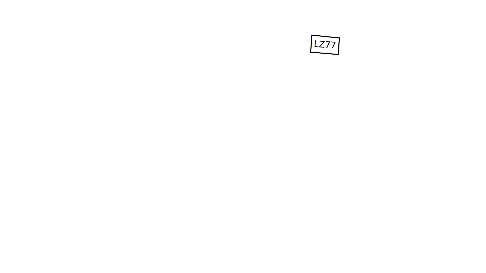

---
author:
author-twitter:
author-company:
event: DevFest Nantes
date: 19 octobre 2023
---

# La compression Web : comment (re)prendre le contrôle ?

## blank
> @00:00:00@

## huffman score=auto
DEIOXYZ
<!-- animation shuffle -->
> #HS# (en train de chercher un mot)
> #AC# Tu fais quoi Hubert ?
> #HS# Bah je cherche un mot avec ce tirage, là, mais je galère.
> #AC# C'est super hein, mais on est pas là pour ça.

## poster fade-from
La compression web
> #AC# Bonjour à *toutes et à tous*, j'm'appelle Antoine Caron,
> j'suis développeur Web chez Scaleway et je suis accompagné d'Hubert Sablonnière, développeur Web chez Clever Cloud.
> #HS# _(signe de la main)_ Bonjour ! Je suis joueur de Scrabble aussi.
> #AC# _(un peu saoulé)_ Oui oui, on a compris.
> Aujourd'hui, on aimerait vous parler de compression,
> et vu que c'est un sujet assez vaste, on a choisi de se concentrer sur un contexte qu'on aime particulièrement :
> *le Web* !
> #HS# En fait, il y a un truc qui nous fascine tous les deux...
> À l'instant où on vous parle, y'a des *millions* de serveurs dans le monde qui sont en train de compresser des réponses HTTP, et  y'a des *milliards* de navigateurs qui sont en train de les décompresser.
> Du coup, on a regardé comment ça marche et on aimerait vous partager ça...

## blank black
> ...en ajoutant au passage quelques rappels et bonnes pratiques.

## section
Lexique
> @00:01:00@
> #HS# On va commencer tout de suite par des petites clarifications lexicales.
> Quand on parle de compression, le monde se divise en deux catégories :

## text
🤔 *Avec* ou *Sans* perte de données ?
> la compression avec perte de données,
> et la compression sans perte de données.
> En général, on associe souvent la compression avec perte de données a des formats d'image ou d'audio/vidéo : JPEG, MP3 ou MPEG.
> 

## text
🗑️ Minification

## blank

## code title="math-example.js"
```js simple-js-example
export function add (firstNumber, secondNumber) {

}


export function factorial (number) {


}
```

## code title="math-example.js"
```js simple-js-example
export function add (firstNumber, secondNumber) {
  return firstNumber + secondNumber;
}


export function factorial (number) {


}
```

## code title="math-example.js"
```js simple-js-example
export function add (firstNumber, secondNumber) {
  return firstNumber + secondNumber;
}


export function factorial (number) {
  if (number === 0) {
    return 1;
  }
  return number * factorial(number - 1);
}
```

## code title="math-example.js"
```js simple-js-example
export function add (firstNumber, secondNumber) {
  return firstNumber + secondNumber;
}

// Recursive FTW!
export function factorial (number) {
  if (number === 0) {
    return 1;
  }
  return number * factorial(number - 1);
}
```

## code title="math-example.js"
```js simple-js-example size
export function add (firstNumber, secondNumber) {
  return firstNumber + secondNumber;
}

// Recursive FTW!
export function factorial (number) {
  if (number === 0) {
    return 1;
  }
  return number * factorial(number - 1);
}
```

## code title="math-example.js"
```text simple-js-example size highlight
export function add (firstNumber, secondNumber) {

  return firstNumber + secondNumber;
                                   _
}


// Recursive FTW!
_________________
export function factorial (number) {

  if (number === 0) {
                    _
    return 1;
            _
  }
  _
  return number * factorial(number - 1);
                                       _
}
```

## code title="math-example.*min*.js"
```js simple-js-example size
export function add (firstNumber, secondNumber) {
  return firstNumber + secondNumber
}


export function factorial (number) {
  if (number === 0)
    return 1

  return number * factorial(number - 1)
}
```

## code title="math-example.*min*.js"
```text simple-js-example size highlight
export function add (firstNumber, secondNumber) {

  return firstNumber + secondNumber

}


export function factorial (number) {

  if (number === 0)
  __ _            _
    return 1
    ______


  return number * factorial(number - 1)
  ______
}
```

## code title="math-example.*min*.js"
```js simple-js-example size
export function add (firstNumber, secondNumber) {
  return firstNumber + secondNumber
}


export function factorial (number) {
  return number === 0
    ? 1
    : number * factorial(number - 1)

}
```

## code title="math-example.*min*.js"
```text simple-js-example size highlight
export function add (firstNumber, secondNumber) {
                      __________   ___________
  return firstNumber + secondNumber
          __________    ___________
}


export function factorial (number) {
                            _____
  return number === 0
          _____
    ? 1

    : number * factorial(number - 1)
       _____              _____


}
```

## code title="math-example.*min*.js"
```js simple-js-example size
export function add (f, s) {
  return f + s
}


export function factorial (n) {
  return n === 0
    ? 1
    : n * factorial(n - 1)

}
```

## code title="math-example.*min*.js"
```text simple-js-example size highlight
export function add (f, s) {
                   _   _  _
  return f + s
__      _ _ _
}


export function factorial (n) {
                         _   _
  return n === 0
__        _   _
    ? 1
____ _
    : n * factorial(n - 1)
____ _ _ _           _ _


}
```

## code title="math-example.*min*.js"
```js simple-js-example size
export function add(f,s){return f+s}export function factorial(n){return n===0?1:n*factorial(n-1)}
```

## text
🤐 Compression

## code title="math-example.min.js"
```text bin-js-example size=98
6578 706f 7274 2066 756e
6374 696f 6e20 6164 6428
662c 7329 7b72 6574 7572
6e20 662b 737d 6578 706f
7274 2066 756e 6374 696f
6e20 6661 6374 6f72 6961
6c28 6e29 7b72 6574 7572
6e20 6e3d 3d3d 303f 313a
6e2a 6661 6374 6f72 6961
6c28 6e2d 3129 7d0a
```

## code title="math-example.min.js"
```text bin-js-example size=98
6578 706f 7274 2066 756e  export fun
6374 696f 6e20 6164 6428  ction add(
662c 7329 7b72 6574 7572  f,s){retur
6e20 662b 737d 6578 706f  n f+s}expo
7274 2066 756e 6374 696f  rt functio
6e20 6661 6374 6f72 6961  n factoria
6c28 6e29 7b72 6574 7572  l(n){retur
6e20 6e3d 3d3d 303f 313a  n n===0?1:
6e2a 6661 6374 6f72 6961  n*factoria
6c28 6e2d 3129 7d0a       l(n-1)}.
```

## code title="math-example.min.js"
```text bin-js-example highlight size=98
6578 706f 7274 2066 756e  export fun
______________            ______
6374 696f 6e20 6164 6428  ction add(

662c 7329 7b72 6574 7572  f,s){retur

6e20 662b 737d 6578 706f  n f+s}expo
               _________        ____
7274 2066 756e 6374 696f  rt functio
____                      __
6e20 6661 6374 6f72 6961  n factoria

6c28 6e29 7b72 6574 7572  l(n){retur

6e20 6e3d 3d3d 303f 313a  n n===0?1:

6e2a 6661 6374 6f72 6961  n*factoria

6c28 6e2d 3129 7d0a       l(n-1)}.
```

## code title="math-example.min.js"
```text bin-js-example highlight size=98
6578 706f 7274 2066 756e  export fun
                 _______         ___
6374 696f 6e20 6164 6428  ction add(
____________              _____
662c 7329 7b72 6574 7572  f,s){retur

6e20 662b 737d 6578 706f  n f+s}expo

7274 2066 756e 6374 696f  rt functio
       _________________     _______
6e20 6661 6374 6f72 6961  n factoria
__                        _
6c28 6e29 7b72 6574 7572  l(n){retur

6e20 6e3d 3d3d 303f 313a  n n===0?1:

6e2a 6661 6374 6f72 6961  n*factoria

6c28 6e2d 3129 7d0a       l(n-1)}.
```

## code title="math-example.min.js"
```text bin-js-example highlight size=98
6578 706f 7274 2066 756e  export fun

6374 696f 6e20 6164 6428  ction add(

662c 7329 7b72 6574 7572  f,s){retur
            ____________       _____
6e20 662b 737d 6578 706f  n f+s}expo
__                        _
7274 2066 756e 6374 696f  rt functio

6e20 6661 6374 6f72 6961  n factoria

6c28 6e29 7b72 6574 7572  l(n){retur
            ____________       _____
6e20 6e3d 3d3d 303f 313a  n n===0?1:
__                        _
6e2a 6661 6374 6f72 6961  n*factoria

6c28 6e2d 3129 7d0a       l(n-1)}.
```

## code title="math-example.min.js.*gz*" fade-from
```text bin-js-example size=89
1f8b 0800 0000 0000 0003  ..........
4bad 28c8 2f2a 5148 2bcd  K.(./*QH+.
4b2e c9cc cf53 484c 49d1  K....SHLI.
48d3 29d6 ac2e 4a2d 292d  H.)...J-)-
ca53 48d3 2eae 4d45 5393  .SH...MES.
9698 5c92 5f94 9998 a391  ..\._.....
0757 9767 6b6b 6b60 6f68  .W.gkkk`oh
95a7 8524 ab6b a859 cb05  ...$.k.Y..
000d c88f 1162 0000 00    .....b...
```

## blank black

## section
Ordres de  grandeur
> @00:03:00@

## barchart logo=js
math-example.*js* _228o_
brut : 228 brut
minifié : 98 min
compressé : 153 compressed
minifié<br>& compressé : 89 gzip

## barchart logo=js
jquery.*js* _285,3ko_
brut : 285314 brut
minifié : 87029 min
compressé : 83915 compressed
minifié<br>& compressé : 30190 gzip

## barchart logo=js percent
jquery.*js* _285,3ko_
brut : 285314 brut
minifié : 87029 min
compressé : 83915 compressed
minifié<br>& compressé : 30190 gzip

## barchart logo=js percent
lodash.*js* _544,1ko_
brut : 544098 brut
minifié : 73650 min
compressé : 97170 compressed
minifié<br>& compressé : 25684 gzip

## barchart logo=css percent
bootstrap.*css* _205,5ko_
brut : 205484 brut
minifié : 161487 min
compressé : 26408 compressed
minifié<br>& compressé : 23906 gzip

## barchart logo=html percent
hibernate-user-guide.*html* _2,4Mo_
brut : 2421852 brut
minifié : 2334777 min
compressé : 372419 compressed
minifié<br>& compressé : 366546 gzip

## barchart logo=svg percent
firefox-logo.*svg* _15,9ko_
brut : 15858 brut
minifié : 12163 min
compressé : 3726 compressed
minifié<br>& compressé : 3169 gzip

## barchart logo=json percent
departements-region.*json* _9,6ko_
brut : 9576 brut
minifié : 7152 min
compressé : 1315 compressed
minifié<br>& compressé : 1244 gzip

## tip
1) La compression, ça va de pair avec la minification.
<!--Règle foobar
Lorem ipsum dolor sit amet, consectetur adipiscing elit.-->

## blank

## text
🎓 En théorie

## barchart logo=js unit="time" speed="50"
jquery.js _285,3ko_ _*3G lente à 50ko/s*_
brut : 285314 brut
minifié : 87029 min
compressé : 83915 compressed
minifié<br>& compressé : 30190 gzip

## barchart logo=js unit="time" speed="1125"
jquery.js _285,3ko_ _*4G à 1,1Mo/s*_
brut : 285314 brut
minifié : 87029 min
compressé : 83915 compressed
minifié<br>& compressé : 30190 gzip

## media


## text
⏱️ En pratique

## media


## media contain


## wpt title="en.wikipedia.org/wiki/Scrabble _*3G slow à 50ko/s*_"
<video src="src/videos/wpt-scrabble-3gslow.mp4" controls></video>
<!-- https://www.webpagetest.org/video/view.php?tests=231012_BiDcBM_BC9-l:sans%20compression-e:17.1,231012_AiDc6X_BGC-l:avec%20compression-e:7.4&bg=ffffff&text=000000 -->

## blank white

## wpt title="en.wikipedia.org/wiki/Scrabble _*4G à 1,1Mo/s*_"
<video src="src/videos/wpt-scrabble-4g.mp4" controls></video>
<!-- https://www.webpagetest.org/video/view.php?tests=231012_BiDcVA_BH1-l:sans%20compression-e:2.4,231012_BiDcF8_BHG-l:avec%20compression-e:2.1&bg=ffffff&text=000000 -->

## blank white

## wpt title="en.wikipedia.org/wiki/Scrabble _*sans limite*_"
<video src="src/videos/wpt-scrabble-nolimit.mp4" controls></video>
<!-- https://www.webpagetest.org/video/view.php?tests=231012_BiDcKV_BJ8-l:sans%20compression-e:1.2,231012_BiDcAV_BJA-l:avec%20compression-e:1.2&bg=ffffff&text=000000&slow=1 -->

## tip
2) La compression, c'est nécessaire (même en 2023).

## media


## media


## barchart unit="%" max="100"
*%* de fichiers servis *sans* compression _Almanac 2021_
// JS : 12.7 brut
// CSS : 14.2 brut
// JSON : 31.8 brut
// SVG : 36.0 brut
// HTML : 56.0 brut

## barchart unit="%" max="100"
*%* de fichiers servis *sans* compression _Almanac 2021_
JS : 12.7 brut
// CSS : 14.2 brut
// JSON : 31.8 brut
// SVG : 36.0 brut
// HTML : 56.0 brut

## barchart unit="%" max="100"
*%* de fichiers servis *sans* compression _Almanac 2021_
JS : 12.7 brut
CSS : 14.2 brut
// JSON : 31.8 brut
// SVG : 36.0 brut
// HTML : 56.0 brut

## barchart unit="%" max="100"
*%* de fichiers servis *sans* compression _Almanac 2021_
JS : 12.7 brut
CSS : 14.2 brut
JSON : 31.8 brut
// SVG : 36.0 brut
// HTML : 56.0 brut

## barchart unit="%" max="100"
*%* de fichiers servis *sans* compression _Almanac 2021_
JS : 12.7 brut
CSS : 14.2 brut
JSON : 31.8 brut
SVG : 36.0 brut
// HTML : 56.0 brut

## barchart unit="%" max="100" fade-from
*%* de fichiers servis *sans* compression _Almanac 2021_
JS : 12.7 brut
CSS : 14.2 brut
JSON : 31.8 brut
SVG : 36.0 brut
HTML : 56.0 brut
<!-- à retravailler -->

## blank black

## section
Dans les  tuyaux

## blank

## code
```http type="request"
GET /index.html HTTP/1.1
 
```
```http type="request" hide-height
GET /index.html HTTP/1.1
accept-encoding: gzip, deflate, br
```
```http type="response" hide
HTTP/1.1 200 OK
 
```

## code
```http type="request"
GET /index.html HTTP/1.1
 
```
```http type="request" hide-height
GET /index.html HTTP/1.1
accept-encoding: gzip, deflate, br
```
```http type="response"
HTTP/1.1 200 OK
 
```

## code
```http type="request"
GET /index.html HTTP/1.1
accept-encoding: 
```
```http type="request" hide-height
GET /index.html HTTP/1.1
accept-encoding: gzip, deflate, br
```
```http type="response"
HTTP/1.1 200 OK
 
```

## code
```http type="request"
GET /index.html HTTP/1.1
accept-encoding: gzip
```
```http type="request" hide-height
GET /index.html HTTP/1.1
accept-encoding: gzip, deflate, br
```
```http type="response"
HTTP/1.1 200 OK
 
```

## code
```http type="request"
GET /index.html HTTP/1.1
accept-encoding: gzip, deflate
```
```http type="request" hide-height
GET /index.html HTTP/1.1
accept-encoding: gzip, deflate, br
```
```http type="response"
HTTP/1.1 200 OK
 
```

## code
```http type="request"
GET /index.html HTTP/1.1
accept-encoding: gzip, deflate, br
```
```http type="request" hide-height
GET /index.html HTTP/1.1
accept-encoding: gzip, deflate, br
```
```http type="response"
HTTP/1.1 200 OK
 
```

## code
```http type="request"
GET /index.html HTTP/1.1
accept-encoding: gzip, deflate, br
```
```http type="request" hide-height
GET /index.html HTTP/1.1
accept-encoding: gzip, deflate, br
```
```http type="response"
HTTP/1.1 200 OK
content-encoding: 
```

## code
```http type="request"
GET /index.html HTTP/1.1
accept-encoding: gzip, deflate, br
```
```http type="request" hide-height
GET /index.html HTTP/1.1
accept-encoding: gzip, deflate, br
```
```http type="response"
HTTP/1.1 200 OK
content-encoding: gzip
```

## code
```http type="request"
GET /index.html HTTP/1.1
accept-encoding: gzip, deflate, br
```
```http type="request" hide-height
GET /index.html HTTP/1.1
accept-encoding: gzip, deflate, br
```
```http type="response"
HTTP/1.1 200 OK
content-encoding: br
```

> c'est un peu magique
> le navigateur et le serveur travaillent ensemble pour gérer ça tout seul
> ça marche aussi automatiquement quand on fait un `fetch`

## todo
demo firefox
juste pour montrer les en-tête
et les sizes dans les devtools
> montrer transfer size
> resource size (entre parenthèses)
> post-compression dans l'en-tête content-length

## tip
3) La compression, c'est natif au <br> fonctionnement du Web.

## media


## blank
> c'est petit mais est-ce que ça bloque ?

## gantt title="" todo
Réception : 0
Parsing HTML : 100
Affichage : 100

## gantt title="" todo
Réception : 0
Décompression : 100
Parsing HTML : 100
Affichage : 100
> slides diagram de gantt DL/DECOMPRESSION/PARSE/AFFICHAGE
> pas cheveauché
> On pourrait penser que la compression introduit une phase ça bloque

## todo demo
demo sherlock HTML streaming sans compression
> BIEN EXPLIQUER

## todo demo
demo sherlock HTML streaming sans compression ralenti

## gantt title="" todo
Réception : 0
Parsing HTML : 100
Affichage : 100

## gantt title="" todo
Réception : 0
Parsing HTML : 33
Affichage : 33

## todo demo
demo sherlock HTML streaming avec compression ralenti

## gantt title="" todo
Réception : 0
Décompression : 100
Parsing HTML : 100
Affichage : 20

## gantt title="" todo
Réception : 0
Décompression : 20
Parsing HTML : 20
Affichage : 20

## gantt title="" todo
Compression : 0
Envoi : 20
Réception : 20
Décompression : 20
Parsing HTML : 20
Affichage : 20

## tip fade-from
4) La compression, ça n'interrompt pas le flux.

<!--
## todo
on parle des valises et tshirt en boule ou pliés
(demander à Geoffroy comment mettre en place une démo)
> streamer, c'est bien, mais sur le réseau, il y a des paquets et "une valise à moitié vide, pas besoin de plier les
> tshirts"
-->

## blank black
> transition
> on vient de comprendre que compresser c'est indispensable
> ça l'est toujours dans un monde de fibre, de 5G, de CPU M2
> ça a encore un impact sur nos utilisateurs et sur l'environnement
> mais ça date pas d'hier
> ça fait combien de temps qu'on se pose cette question ?
> 56K

## section
Retour  aux sources

## timeline year=2023
Aujourd'hui, 2023
> #AC# Mais tout ça, ça ne date pas d'hier.
> Il va falloir sortir la DeLorean mon cher Hubert
> Quand on parle de Gzip, on parle pas d'un truc qui date d'hier.

## timeline year=2010 animated
Bien avant bootstrap
> #HS# On est bien avant Bootstrap, bien avant react

## timeline year=2000 animated
Bien avant les années 2000
> #AC# On est bien avant le web des années 2000 avec les compteurs de visiteurs
> Les design métaliques qui me manquent un peu

## timeline year=1980 animated
PKZIP, 1986, Phil Katz, 
GZIP, 1992, Jean-Loup Gailly / Mark Adler, 
> #HS# Il faut remonter à 1992 pour retrouver la RFC de GZIP par Jean-Loup Gailly et Mark Adler
> RFC 1952
> Tu faisais quoi en 1992 toi Antoine ?
> #AC# 😅
> Ils posent les bases d'un modèle de compression basés et inspirés de traveaux de PKZIP par Phil Katz quelques années
> avant.
> On parle du Web 56k de l'époque, économiser autant de bits, c'était une révolution.
> Mais pour faire PKZIP et GZIP, ils ne sont pas partis de rien
> Il ont été piocher d'abord dans des travaux des années 70 et même des années 50

## timeline year=1970 animated
LZ77, 1977, Abraham Lempel and Jacob Ziv, 
> #AC# Oulà oui on parle de travaux fait 20 ans avant.
> Tu faisais quoi en 1977 toi Hubert ?
> #HS# 😅
> Travaux de deux scientifiques Abraham Lempel and Jacob Ziv qui proposent en 1977 un algortithme de compression de
> texte nommé LZ77
> _LZ77 mais qu'est-ce que ça peut pouvoir dire ? ça reste encore un mystère_

## timeline year=1950 animated
Code de Huffman, 1951, David A. Huffman, 
> #HS# Oui mais PKZIP et GZIP n'ont pas été piocher que dans les travaux des années 70
> Ils ont été reprendre de travaux publiés en 1951 par Mr Huffman.
> Le codage de huffman, on est là bien avant les problématiques de l'interweb
> #AC# Donc, ce qu'on est en train de dire, c'est que la recherche fondamentale
> ça peut avoir des impacts considérables sur l'évolution de la technologie des années après?
> 40 ans séparent PKZIP du codage d'Huffman et plus de 30 ans séparent GZIP de 2023.
> #HS# Oui allez Antoine, on est content mais il faut qu'on avance et qu'on leur explique comment ça marche

## blank black

## section
Code de  Huffman
> le but de huffman c'est d'encoder les caractères en fonction de la fréquence
> c'est comme le scrabble !
> à l'époque ce n'est qu'un papier du MIT
> storytelling de exam vs paper
> classe de Claude Shannon
> le plus ouf c'est qu'il trouve l'algo pour la meilleure solution
> et qu'il le prouve mathématiquement
> ex: HUBERT ET ANTOINE (ou autre)
> on montre la l'algo avec la construction d'un arbre
> résultat : tableau de correspondance
> HUBERT ET ANTOINE
> 17*8 = 136
> HUBERT ET ANTOINE
> 54434443444334433 = 63

## blank
> #HS# Prenons un mot au hasard !

## text
sablonnière
> _Hubert affiche le mot "sablonnière" à l'écran._
> #AC# Hubert ?

## huffman score=auto
SABLONNIERE
> #HS# Non, mais c'est un vrai mot, on peut le jouer au Scrabble.
> #AC# Hubert !

## blank
> #HS# Bon, d'accord, de toute façon, j'ai jamais réussi à le placer.

## huffman
COMPRESSION
> #HS# Prenons un mot au hasard !
> Quand on stocke le mot "COMPRESSION" dans un fichier texte, on obtient un fichier de 9 octets, un octet par caractère.

## huffman score=8
COMPRESSION
> Chaque octet contient les 8 bits nécessaires pour représenter le code ASCII en binaire.

<!--
## media terminal

table ASCII ou alors avec la commande `ascii`
-->

## code
```text highlight
$ ascii
  _____
Usage: ascii [-adxohv] [-t] [char-alias...]

   -t = one-line output  -a = vertical format

   -d = Decimal table  -o = octal table  -x = hex table  -b binary table

   -h = This help screen -v = version information
```
> Si vous êtes nul en code ASCII comme moi,
> vous pouvez utiliser la commande `ascii -b` sous Linux pour avoir la table de correspondance.

<!--
## media terminal


## media terminal

-->

## code
```text style="font-size: 0.95rem" highlight="hide-mark"
$ ascii -b

0000000 NUL    0010000 DLE    0100000      0110000 0    1000000 @    1010000 P    1100000 `    1110000 p 
                                                                     _________
0000001 SOH    0010001 DC1    0100001 !    0110001 1    1000001 A    1010001 Q    1100001 a    1110001 q 

0000010 STX    0010010 DC2    0100010 "    0110010 2    1000010 B    1010010 R    1100010 b    1110010 r 
                                                                     _________
0000011 ETX    0010011 DC3    0100011 #    0110011 3    1000011 C    1010011 S    1100011 c    1110011 s 
                                                        _________    _________
0000100 EOT    0010100 DC4    0100100 $    0110100 4    1000100 D    1010100 T    1100100 d    1110100 t 

0000101 ENQ    0010101 NAK    0100101 %    0110101 5    1000101 E    1010101 U    1100101 e    1110101 u 
                                                        _________
0000110 ACK    0010110 SYN    0100110 &    0110110 6    1000110 F    1010110 V    1100110 f    1110110 v 

0000111 BEL    0010111 ETB    0100111 '    0110111 7    1000111 G    1010111 W    1100111 g    1110111 w 

0001000 BS     0011000 CAN    0101000 (    0111000 8    1001000 H    1011000 X    1101000 h    1111000 x 

0001001 HT     0011001 EM     0101001 )    0111001 9    1001001 I    1011001 Y    1101001 i    1111001 y 
                                                        _________
0001010 LF     0011010 SUB    0101010 *    0111010 :    1001010 J    1011010 Z    1101010 j    1111010 z 

0001011 VT     0011011 ESC    0101011 +    0111011 ;    1001011 K    1011011 [    1101011 k    1111011 { 

0001100 FF     0011100 FS     0101100 ,    0111100 <    1001100 L    1011100 \    1101100 l    1111100 | 

0001101 CR     0011101 GS     0101101 -    0111101 =    1001101 M    1011101 ]    1101101 m    1111101 } 
                                                        _________
0001110 SO     0011110 RS     0101110 .    0111110 >    1001110 N    1011110 ^    1101110 n    1111110 ~ 
                                                           _________
0001111 SI     0011111 US     0101111 /    0111111 ?    1001111 O    1011111 _    1101111 o    1111111 DEL
                                                        _________ 
```

## code
```text style="font-size: 0.95rem" highlight
$ ascii -b

0000000 NUL    0010000 DLE    0100000      0110000 0    1000000 @    1010000 P    1100000 `    1110000 p 
                                                                     _________
0000001 SOH    0010001 DC1    0100001 !    0110001 1    1000001 A    1010001 Q    1100001 a    1110001 q 

0000010 STX    0010010 DC2    0100010 "    0110010 2    1000010 B    1010010 R    1100010 b    1110010 r 
                                                                     _________
0000011 ETX    0010011 DC3    0100011 #    0110011 3    1000011 C    1010011 S    1100011 c    1110011 s 
                                                        _________    _________
0000100 EOT    0010100 DC4    0100100 $    0110100 4    1000100 D    1010100 T    1100100 d    1110100 t 

0000101 ENQ    0010101 NAK    0100101 %    0110101 5    1000101 E    1010101 U    1100101 e    1110101 u 
                                                        _________
0000110 ACK    0010110 SYN    0100110 &    0110110 6    1000110 F    1010110 V    1100110 f    1110110 v 

0000111 BEL    0010111 ETB    0100111 '    0110111 7    1000111 G    1010111 W    1100111 g    1110111 w 

0001000 BS     0011000 CAN    0101000 (    0111000 8    1001000 H    1011000 X    1101000 h    1111000 x 

0001001 HT     0011001 EM     0101001 )    0111001 9    1001001 I    1011001 Y    1101001 i    1111001 y 
                                                        _________
0001010 LF     0011010 SUB    0101010 *    0111010 :    1001010 J    1011010 Z    1101010 j    1111010 z 

0001011 VT     0011011 ESC    0101011 +    0111011 ;    1001011 K    1011011 [    1101011 k    1111011 { 

0001100 FF     0011100 FS     0101100 ,    0111100 <    1001100 L    1011100 \    1101100 l    1111100 | 

0001101 CR     0011101 GS     0101101 -    0111101 =    1001101 M    1011101 ]    1101101 m    1111101 } 
                                                        _________
0001110 SO     0011110 RS     0101110 .    0111110 >    1001110 N    1011110 ^    1101110 n    1111110 ~ 
                                                           _________
0001111 SI     0011111 US     0101111 /    0111111 ?    1001111 O    1011111 _    1101111 o    1111111 DEL
                                                        _________ 
```

## huffman score=8 bits=auto
COMPRESSION
> En 1952, Huffman, constate que cette représentation binaire est linéaire.
> Le nombre total de bits est...

## huffman score=8 bits=auto total-score
COMPRESSION
> ...directement proportionnel au nombre de caractères,
> et lui, il veut limiter ce nombre de bits.
> Pour ça, il va se baser sur la fréquence (entropie ?).
> En codant les caractères qui apparaissent le plus souvent avec peu de bits,
> et en codant les caractères qui apparaissent le moins souvent avec beaucoup de bits,
> en moyenne, on devrait réduire le nombre de bits total et gagner de la place.
> #AC# J'crois qu'on les a perdus.
> #HS# Mais non, en fait,

## huffman step=0 score=4 total-score bits=inc
COMPRESSION
> TODO intégrer les notes

## barchart narrow unit=""
Score des lettres au Scrabble (français)
// A : 1
// B : 3
// C : 3
// D : 2
// E : 1
// F : 4
// G : 2
// H : 4
// I : 1
// J : 8
// K : 10
// L : 1
// M : 2
// N : 1
// O : 1
// P : 3
// Q : 8
// R : 1
// S : 1
// T : 1
// U : 1
// V : 4
// W : 10
// X : 10
// Y : 10
// Z : 10

## barchart narrow unit=""
Score des lettres au Scrabble (français)
A : 1
// B : 3
// C : 3
// D : 2
E : 1
// F : 4
// G : 2
// H : 4
I : 1
// J : 8
// K : 10
L : 1
// M : 2
N : 1
O : 1
// P : 3
// Q : 8
R : 1
S : 1
T : 1
U : 1
// V : 4
// W : 10
// X : 10
// Y : 10
// Z : 10

## barchart narrow unit=""
Score des lettres au Scrabble (français)
A : 1
// B : 3
// C : 3
D : 2
E : 1
// F : 4
G : 2
// H : 4
I : 1
// J : 8
// K : 10
L : 1
M : 2
N : 1
O : 1
// P : 3
// Q : 8
R : 1
S : 1
T : 1
U : 1
// V : 4
// W : 10
// X : 10
// Y : 10
// Z : 10

## barchart narrow unit=""
Score des lettres au Scrabble (français)
A : 1
B : 3
C : 3
D : 2
E : 1
// F : 4
G : 2
// H : 4
I : 1
// J : 8
// K : 10
L : 1
M : 2
N : 1
O : 1
P : 3
// Q : 8
R : 1
S : 1
T : 1
U : 1
// V : 4
// W : 10
// X : 10
// Y : 10
// Z : 10

## barchart narrow unit=""
Score des lettres au Scrabble (français)
A : 1
B : 3
C : 3
D : 2
E : 1
F : 4
G : 2
H : 4
I : 1
// J : 8
// K : 10
L : 1
M : 2
N : 1
O : 1
P : 3
// Q : 8
R : 1
S : 1
T : 1
U : 1
V : 4
// W : 10
// X : 10
// Y : 10
// Z : 10

## barchart narrow unit=""
Score des lettres au Scrabble (français)
A : 1
B : 3
C : 3
D : 2
E : 1
F : 4
G : 2
H : 4
I : 1
J : 8
// K : 10
L : 1
M : 2
N : 1
O : 1
P : 3
Q : 8
R : 1
S : 1
T : 1
U : 1
V : 4
// W : 10
// X : 10
// Y : 10
// Z : 10

## barchart narrow unit=""
Score des lettres au Scrabble (français)
A : 1
B : 3
C : 3
D : 2
E : 1
F : 4
G : 2
H : 4
I : 1
J : 8
K : 10
L : 1
M : 2
N : 1
O : 1
P : 3
Q : 8
R : 1
S : 1
T : 1
U : 1
V : 4
W : 10
X : 10
Y : 10
Z : 10

## huffman score=auto
COMPRESSION
> Si on représentait chaque lettre en utilisant le score au Scrabble pour le nombre de bits,

## huffman total-score score=auto
COMPRESSION
> on obtiendrait un nombre total de bits plus petit.
> En gros, l'idée de Huffman c'est ça.
> #AC# Oui, sauf qu'avec un seul bit, t'as 0 et 1,
> tu vas pas pouvoir coder "R", "A", "I" et "E".
<!-- pourquoi pas mettre des séquences de bits en dessous de chaque lettre et mettre des ? en dessous de I et E -->
> Et en plus, là t'as utilisé une fréquence de lettres qui est plus ou moins basée sur des moyennes de la langue
> française alors que t'as qu'un tout petit mot.

## media contain black

> #AC# Huffman c'est un génie, le mec a 26 ans, anecdote exam vs papier, il invente un système pour trouver le meilleur
> codage binaire pour un ensemble de caractère et il prouve mathématiquement que c'est le meilleure codage binaire d'une
> série de caractère
> "et ça il le fait pour échapper à un partiel"
> "et en plus, il est dans la classe de Claude Shannon"
<!-- lunettes thug life sur son visage au moment ou tu dis, il choisi l'exam -->
<!-- parler de log de 2 au lieu de 8 -->

## media contain black thug-life="0.1,-0.05,14,5"


## huffman animation
COMPRESSION
> Pour la première étape de l'algo du codage de Huffman,

## huffman step=1 animation
COMPRESSION
<!--
<br> (huffman tree 1/16)
<br> lettre en dessous par ordre de fréquence avec le nombre d'occurence en haut de chaque lettre
-->
> on va compter la fréquence de chaque caractère dans la séquence qu'on essaye de coder

## huffman todo step=2 animation
COMPRESSION

## huffman todo step=3 animation
COMPRESSION

## huffman todo step=4 animation
COMPRESSION

## huffman todo step=5 animation
COMPRESSION

## huffman todo step=6 animation
COMPRESSION

## huffman todo step=7 animation
COMPRESSION

## huffman todo step=8 animation
COMPRESSION

## huffman todo step=9 animation
COMPRESSION

## huffman todo step=10 animation
COMPRESSION

## huffman todo step=11 animation
COMPRESSION

## huffman todo step=12 animation
COMPRESSION

## huffman todo step=13 animation
COMPRESSION

## huffman todo step=14 animation
COMPRESSION

## huffman todo step=15 animation
COMPRESSION

## huffman todo step=16 animation
COMPRESSION

## huffman todo step=17 animation
COMPRESSION

## huffman todo step=18 score-sheet
COMPRESSION
> on indique que il n'y a pas de conflit "on sait quand s'arrêter"
<!-- est-ce qu'on montre la logique de décompression pour expliquer qu'on sait voir les caractères et les lire ? -->

## huffman step=19
COMPRESSION
> <br> mode scrabble
> <br> score base  / score de huffman
> <br> avec score total
> ça marche pour n'importe quel suite de caractères
> c'est l'algo le plus optimisé

## huffman todo step=19 total-score
COMPRESSION
<!-- il manque l'affichage du gain de compression -->

## media contain white fade-from


## blank black

## section
LZ77

## text
🗓️ Et *25 ans* plus tard...

## text small
_*"*On peut tromper une personne mille fois._<br>
_On peut tromper mille personnes une fois._<br>
_Mais on ne peut pas tromper mille personnes, mille fois.*"*_
> A: Je mets n'importe qui au défi ici de dire cette cette citation des nuls de mémoire et sans se tromper.
> Personellement ça m'est impossible.
> H: On se répète un peu là non ? 
> En observant cette phrase on peut surement se dire que se limiter à optimiser caractère par caractère est limitant.

## media contain white


## text small
_*"*On peut tromper une personne mille fois._<br>
_On peut tromper mille personnes une fois._<br>
_Mais on ne peut pas tromper mille personnes, mille fois.*"*_
> A: On va chasser les motifs répétitifs.

## media


> A: L'idée de Mr Lempel et Mr Ziv c'est de trouver un moyen de réduire le nombre de bit nécessaire pour représenter un motif qui se répète.
> Et si on remplaçait des parties du messages par des étiquettes/des pointeurs vers une autre partie du message.
> H: Je ne sais pas si vous l'aviez remarqué mais il y a quelques motifs de répétitions dans la phrase _"On peut tromper..."_"
> A: Je vais vous montrer sur un exemple simple

## lzd init style="font-size: 1.5rem"
mille-feuille
-[--]----(--)
> A: On va lire char par char le texte qu'on souhaite compresser.
> A: Dès qu'on trouve un motif qui se répète par rapport à ce qu'on a déjà vu, on le remplacer par une "etiquette"
> L'étiquette possède une info de la distance, ici 4 et de la longueur 4.
> On va essayer sur notre citation de la cité de la peur.

## lzd step=0 style="font-size: 1.5rem"

## lzd finish style="font-size: 1.5rem"

## blank white

## lzd init
ON PEUT TROMPER UNE PERSONNE MILLE FOIS. ON PEUT TROMPER MILLE PERSONNES UNE FOIS. MAIS ON NE PEUT PAS TROMPER MILLE PERSONNES, MILLE FOIS.
--[-]--------------(-)---------------------------------------------------------------------------------------------------------------------
-----------------[-]------(-)--------------------------------------------------------------------------------------------------------------
[--------------]-------------------------(--------------)----------------------------------------------------------------------------------
-----------------------------[----]----------------------(----)----------------------------------------------------------------------------
--------------------[------]-----------------------------------(------)--------------------------------------------------------------------
---------------[---]----------------------------------------------------(---)--------------------------------------------------------------
-----------------------------------[----]------------------------------------(----)--------------------------------------------------------
----------------------------------------[--]-------------------------------------------(--)------------------------------------------------
-----------------[---]---------------------------------------------------------------------(---)-------------------------------------------
----------------------------------------------[-]-----------------------------------------------(-)----------------------------------------
------------------------------------------------[----------------------]------------------------------(----------------------)-------------
----------------------------[----------]---------------------------------------------------------------------------------------(----------)

## lzd step=0

## lzd replacement=0

## lzd replacement=1

## lzd replacement=2

## lzd replacement=3

## lzd replacement=4

## lzd replacement=5

## lzd replacement=6

## lzd replacement=7

## lzd replacement=8

## lzd replacement=9

## lzd replacement=10

## lzd replacement=11

## lzd finish

## blank white

## lzd init
Na, na, na, na, na, na, na, na, na, na, na, na, hey, Jude.
[---(--------------------------------------]---)----------

## lzd step=0

## lzd finish fade-from
> A: On a clairement moins de tuiles en bas qu'en haut non ? 
> H: Pourtant si on reçoit le texte du bas on peut facilement regénérer le texte du haut.
> Même si on le reçoit progressivement.

## blank black

## section
ET  CONCRETEMENT ?

## blank white

## media white


## media white


## media white


## media white


## media white


## media white


## media white


## media white


## media white


## media fade-into

> H: Vous avez des super contenus sur internet qui vous expliquent celà.
> Et beaucoup de variantes de cet algorithme ont fait outils que vous connaissez probablement tous.
> A: Ah oui tiens, même _Winrar_, vous aviez payé votre license vous ?

## todo
deflate / pkzip v2
Phil Katz
(v1 1986 / v2 ?) (30 ans)
> dans les années 90, tout le monde a essayé d'optimisé pour que ça marche bien pour du texte

## todo
gzip
Jean-loup Gailly and Mark Adler
1992 (30 ans)

## media


## media


## todo
exemple binaire de gzip en mode décompression

## gzip mode="bits" todo

## gzip mode="symbols" todo

## gzip mode="text" todo

## code todo title="RFC 1951: *DEFLATE*"
```text
Lit Value    Bits        Codes
---------    ----        -----
  0 - 143     8          00110000 through
                         10111111
144 - 255     9          110010000 through
                         111111111
256 - 279     7          0000000 through
                         0010111
280 - 287     8          11000000 through
                         11000111
```

## code todo title="RFC 1951: *DEFLATE*"
```text
     Extra                Extra                Extra
Code  Bits Lengths   Code  Bits Lengths   Code  Bits Lengths
---- ----- -------   ---- ----- -------   ---- ----- -------
 257     0      3     267     1   15,16    277     4  67- 82
 258     0      4     268     1   17,18    278     4  83- 98
 259     0      5     269     2   19-22    279     4  99-114
 260     0      6     270     2   23-26    280     4 115-130
 261     0      7     271     2   27-30    281     5 131-162
 262     0      8     272     2   31-34    282     5 163-194
 263     0      9     273     3   35-42    283     5 195-226
 264     0     10     274     3   43-50    284     5 227-257
 265     1  11,12     275     3   51-58    285     0     258
 266     1  13,14     276     3   59-66
```


## code todo title="RFC 1951: *DEFLATE*"
```text
     Extra                  Extra                  Extra
Code  Bits Distances   Code  Bits Distances   Code  Bits   Distances
---- ----- ---------   ---- ----- ---------   ---- ----- -----------
   0     0         1     10     4   33-  48     20     9   1025-1536
   1     0         2     11     4   49-  64     21     9   1537-2048
   2     0         3     12     5   65-  96     22    10   2049-3072
   3     0         4     13     5   97- 128     23    10   3073-4096
   4     1      5, 6     14     6  129- 192     24    11   4097-6144
   5     1      7, 8     15     6  193- 256     25    11   6145-8192
   6     2      9-12     16     7  257- 384     26    12  8193-12288
   7     2     13-16     17     7  385- 512     27    12 12289-16384
   8     3     17-24     18     8  513- 768     28    13 16385-24576
   9     3     25-32     19     8  769-1024     29    13 24577-32768
```

## media fade-from


## blank black

## section
A la recherche  du pouilleme
> à la recherche du pouillème
> pourquoi ? 1% c'est beaucoup de moula
> cloudflare qui a un fork de zlib

## media


## barchart small
Niveaux de compression *gzip* _jquery.min.js_
min : 87029 min
1 : 35238 gzip
2 : 33957 gzip
3 : 33003 gzip
4 : 31336 gzip
5 : 30406 gzip
6 : 30190 gzip
7 : 30143 gzip
8 : 30129 gzip
9 : 30129 gzip

## media

> zopfli
> complexité de la recherche de motifs
> meilleure taux mais moins bonne perf
> MEME FORMAT OMG !!

## barchart
Niveaux de compression _jquery.min.js_
min : 87029 min
gzip *9* : 30129 gzip
zopfli : 29227 zopfli

## media

> brotli
> stats et ordre de grandeur
> huffman de l'espace (context modeling)
> taille des fenetres LZ
> dictionnaire statique qui reflète le Web ou plus ou moins (montrer)
> transformations de dico (montrer)

## barchart small
Niveaux de compression *brotli* _jquery.min.js_
min : 87029 min
1 : 34909 brotli
2 : 32234 brotli
3 : 31956 brotli
4 : 31290 brotli
5 : 29734 brotli
6 : 29543 brotli
7 : 29478 brotli
8 : 29416 brotli
9 : 29400 brotli
10 : 27853 brotli
11 : 27450 brotli

## barchart
Niveaux de compression _jquery.min.js_
min : 87029 min
gzip *9* : 30129 gzip
zopfli : 29227 zopfli
brotli *11* : 27450 brotli

## blank white

## text
📖 *Dictionnaire* brotli

## text
😯 13 504 *"mots"*

## text
🗺️ Anglais, Espagnol, Chinois,
<br> Hindi, Russe, Arabe

## text
📄 HTML, CSS, JavaScript

## code
```text style="font-size: 0.95rem"
 time down life left back code data show only site city open just like free work text year over body
 love form book play live line help home side more word long them view find page days full head term
 each area from true mark able upon high date land news even next case both post used made hand here
 what name Link blog size base held make main user ') + hold ends with News read were sign take have
 game seen call path well plus menu film part join this list good need ways west jobs mind also logo
 rich uses last team army food king will east ward best fire Page know away .png move than load give
 self note much feed many rock icon once look hide died Home rule host ajax info club laws less half
 some such zone 100% ones care Time race blue four week face hope gave hard lost when park kept pass
 ship room HTML plan Type done save keep flag link sold five took rate town jump thus dark card file
 fear stay kill that fall auto ever .com talk shop vote deep mode rest turn born band fell rose url(
 skin role come acts ages meet gold .jpg item vary felt then send drop View copy 1.0" </a> stop else
 lies tour pack .gif past css? gray mean &gt; ride shot late said road var  feel john rick port fast
 'UA- dead </b> poor bill type U.S. wood must 2px; Info rank wide want wall lead [0]; paul wave sure
 $('# wait mass arms goes gain lang paid !--  lock unit root walk firm wife xml" song test 20px kind
 rows tool font mail safe star maps core rain flow baby span says 4px; 6px; arts foot real wiki heat
 step trip org/ lake weak told Form cast fans bank very runs july task 1px; goal grew slow edge id="
 sets 5px; .js? 40px if ( soon seat none tube zero sent reed fact into gift harm 18px came hill bold
 zoom void easy ring fill peak init cost 3px; jack tags bits roll edit knew near <!-- grow JSON duty
 Name sale you  lots pain jazz cold eyes fish www. risk tabs prev 10px rise 25px Blue ding 300, ball
 ford earn wild box. fair lack vers pair june tech if(! pick evil $("# warm lord does pull ,000 idea
```

## code
```text style="font-size: 0.95rem"
</a><a href="http://  </a></li><li class="  form action="http://  <div style="display:
type="text" name="q"  <table width="100%"   background-position:  " border="0" width="
rel="shortcut icon"   h6><ul><li><a href="    <meta http-equiv="  css" media="screen"
responsible for the   " type="application/  " style="background-  html; charset=utf-8"
 allowtransparency="  stylesheet" type="te  **<meta http-equiv="  ></span><span class=
"0" cellspacing="0">  ;*</script>*<script   sometimes called the  does not necessarily
For more information  at the beginning of   <!DOCTYPE html><html  particularly in the
type="hidden" name="  javascript:void(0);"  effectiveness of the   autocomplete="off"
generally considered  ><input type="text"   "></script>**<script  throughout the world
common misconception  association with the  </div>*</div>*<div c  during his lifetime,
corresponding to the  type="image/x-icon"   an increasing number  diplomatic relations
are often considered  meta charset="utf-8"   <input type="text"   examples include the
">*<div class="
&amp;nbsp;&amp;nbsp;  to determine whether  quite different from  marked the beginning
distance between the  contributions to the  conflict between the  widely considered to
was one of the first  with varying degrees  have speculated that  (document.getElement
participating in the  originally developed  eta charset="utf-8">   type="text/css" />*
interchangeably with  more closely related  social and political  that would otherwise
perpendicular to the  style type="text/css  type="submit" name="  families residing in
developing countries  computer programming  economic development  determination of the
```

## barchart tiny unit="raw"
Nombre de "mots" de N "lettres" dans le dictionnaire brotli
4 : 1024 brotli
5 : 1024 brotli
6 : 2048 brotli
7 : 2048 brotli
8 : 1024 brotli
9 : 1024 brotli
10 : 1024 brotli
11 : 1024 brotli
12 : 1024 brotli
13 : 512 brotli
14 : 512 brotli
15 : 256 brotli
16 : 128 brotli
17 : 128 brotli
18 : 256 brotli
19 : 128 brotli
20 : 128 brotli
21 : 64 brotli
22 : 64 brotli
23 : 32 brotli
24 : 32 brotli

## text
✂️ *×* 121 *transformations*

## code
```text style="font-size: 0.9rem"
n                 f                 fo                fou               ion               tion            
foun              ation             found             dation            founda            foundat         
ndation           undation          foundati          oundation         foundatio         foundation      
Foundation        FOUNDATION        foundation⎵       Foundation⎵       ⎵foundation       foundation"     
foundation.       foundation]       ⎵Foundation       .foundation       foundation'       foundation:     
foundation(       Foundation"       FOUNDATION⎵       Foundation'       foundation,       Foundation(     
Foundation.       ⎵FOUNDATION       FOUNDATION"       FOUNDATION'       Foundation,       FOUNDATION.     
FOUNDATION,       FOUNDATION(       ⎵foundation⎵      foundation,⎵      ⎵Foundation⎵      foundation">    
foundation\n      foundation.⎵      Foundation,⎵      .foundation(      Foundation">      foundation="    
⎵foundation.      .foundation⎵      ⎵FOUNDATION⎵      foundation='      Foundation.⎵      ⎵foundation(    
⎵Foundation.      FOUNDATION">       foundation      ⎵foundation,      Foundation="      FOUNDATION="    
FOUNDATION,⎵      Foundation='      ⎵Foundation,      FOUNDATION.⎵      ⎵FOUNDATION.      FOUNDATION='    
s⎵foundation⎵     ,⎵foundation⎵     e⎵foundation⎵     foundation⎵a⎵     ⎵foundation,⎵     foundatioing⎵   
⎵foundation.⎵     foundationed⎵     foundationly⎵     ⎵Foundation,⎵     ⎵foundation="     foundationer⎵   
foundational⎵     ⎵Foundation.⎵     ⎵foundation='     ⎵FOUNDATION="     ⎵FOUNDATION,⎵     ⎵FOUNDATION.⎵   
⎵Foundation="     ⎵FOUNDATION='     ⎵Foundation='     foundation⎵of⎵    foundation⎵in⎵    foundation⎵to⎵  
foundation⎵by⎵    foundation⎵on⎵    foundation⎵as⎵    foundation⎵is⎵    foundation\n\t    foundation⎵at⎵  
foundationful⎵    foundationive⎵    foundationest⎵    foundationize⎵    foundationous⎵    foundation⎵the⎵ 
foundation⎵and⎵   foundation⎵for⎵   ⎵the⎵foundation   .com/foundation   foundation⎵not⎵   foundationless⎵ 
foundation⎵that⎵  foundation⎵with⎵  foundation⎵from⎵  foundation.⎵The⎵  foundation.⎵This⎵
```

## text
🤯 *=* 1 633 984 *possibilités*
> plus on est vieux => plus on est abstrait
> plus on est récent => plus on connait ce qu'on compresse (pour gagner sur les derniers %)

<!--
## barchart
Niveaux de compression _dictionnaire-brotli.txt_
brut : 122824 brut
gzip *9* : 58915 gzip
brotli *11* : 26960 brotli
-->

## media


## tip
7) La compression, ça marche mieux avec brotli.

## barchart small unit="ms" max="142.2"
Temps de compression *brotli* _jquery.min.js_
1 : 1.3 brotli
2 : 1.8 brotli
3 : 2.0 brotli
4 : 2.4 brotli
5 : 3.3 brotli
6 : 3.9 brotli
7 : 5.1 brotli
8 : 6.3 brotli
9 : 8.8 brotli
10 : 37.3 brotli
11 : 97.2 brotli

## barchart unit="ms"
Temps de compression *zopfli* _jquery.min.js_
zopfli : 142.2 zopfli

## barchart small unit="ms" max="142.2"
Temps de compression *gzip* _jquery.min.js_
1 : 1.8 gzip
2 : 1.9 gzip
3 : 2.1 gzip
4 : 2.3 gzip
5 : 2.9 gzip
6 : 3.4 gzip
7 : 3.6 gzip
8 : 3.7 gzip
9 : 3.7 gzip

## barchart unit="ms"
Temps de compression _jquery.min.js_
gzip *9* : 3.7 gzip
zopfli : 142.2 zopfli
brotli *11* : 97.2 brotli

## blank white

## barchart unit="ms" max="142.2"
Temps de *dé*compression _jquery.min.js_
gzip *9* : 1.1 gzip
zopfli : 1.1 zopfli
brotli *11* : 1.1 brotli

<!--
## barchart small unit=""
Temps de décompression gzip _jquery.min.js_
gz*1* : 1.0
gz*2* : 1.1
gz*3* : 1.1
gz*4* : 1.1
gz*5* : 1.1
gz*6* : 1.1
gz*7* : 1.0
gz*8* : 1.1
gz*9* : 1.1
zopfli : 1.1

## barchart small unit=""
Temps de décompression brotli _jquery.min.js_
br*1* : 1.0
br*2* : 1.0
br*3* : 1.0
br*4* : 0.9
br*5* : 1.0
br*6* : 1.0
br*7* : 1.0
br*8* : 0.9
br*9* : 0.9
br*10* : 1.1
br*11* : 1.1
-->

## tip
8) La compression <br> des fichiers statiques <br>se fait une seule fois au build.

## media


## blank
> maintenant que vous voyez comment ça compresse
> quel sort on réserve au gens qui compresse du JPEG ?
> explications

## barchart
cats.*jpeg* _591,8ko_
brut : 591794 brut
gzip *9* : 584070 gzip
brotli *11* : 579413 brotli

## barchart percent
cats.*jpeg* _591,8ko_
brut : 591794 brut
gzip *9* : 584070 gzip
brotli *11* : 579413 brotli

## barchart unit="%" max="100"
*%* de fichiers servis *avec* compression _Almanac 2020_
JPEG : 3.27 brut
GIF : 3.42 brut
PNG : 3.70 brut
<!-- https://almanac.httparchive.org/en/2020/compression -->

## tip
9) La compression, ça n'a pas d'effet sur <br>les fichiers déjà compressés.
> anecdote zipper un .zip
> On peut compresser une fois mille fichiers,
> mais peut pas compresser mille fois un fichier.

## code title="Formats binaires *compressibles* :"
```text
application/wasm
font/otf
font/ttf
image/bmp
image/x-icon
```
<!--application/tar-->

<!--
## barchart percent
cats.*bmp* _5,1Mo_
brut : 5062638 brut
gzip *9* : 1745586 gzip
brotli *11* : 1430160 brotli
-->

## barchart percent fade-from
sql.*wasm* _613,4ko_
brut : 613426 brut
gzip *9* : 302566 gzip
brotli *11* : 262591 brotli
<!-- https://github.com/sql-js/sql.js -->

## blank black

## section
Au dela du  pouilleme

## media

> zstd

## media fade-from

> dictionnaire brouillon WICG

## blank black

## section
Recap

## tip recap
1) Ça va de pair avec la minification.
2) C'est nécessaire (même en 2023).
3) C'est natif au fonctionnement du Web.
4) Ça n'interrompt pas le flux.
5) C'est _lettre compte moins_.
6) C'est _mot compte moins_.
7) Ça marche mieux avec brotli.
8) Le statique se compresse une seule fois au build.
9) Ça n'a pas d'effet sur les fichiers déjà compressés.

## huffman score=auto
OXYDIEZ

## poster
Merci beaucoup !

## credits

Références :

* Dépôt de la présentation : https://github.com/hsablonniere/talk-compression/tree/devfest-nantes-2023

Liens :

* Bundlephobia : https://bundlephobia.com
* Almanac de l'HTTP Archive : https://almanac.httparchive.org
* Can I use (gzip) : https://caniuse.com/sr_content-encoding-gzip
* Can I use (brotli) : https://caniuse.com/brotli
* Why the LZ algorithms are so dominant (Scott McAnlis) : https://www.youtube.com/watch?v=Jqc418tQDkg
* RFC zlib : https://www.rfc-editor.org/rfc/rfc1950
* RFC gzip : https://www.rfc-editor.org/rfc/rfc1951
* RFC deflate : https://www.rfc-editor.org/rfc/rfc1952
* Data Compression (Bill Bird) - 11 DEFLATE (gzip) : https://www.youtube.com/watch?v=SJPvNi4HrWQ
* Fork zlib de Cloudflare : https://github.com/cloudflare/zlib
* Projet brotli : https://github.com/google/zopfli
* RFC brotli : https://www.rfc-editor.org/rfc/rfc7932
* RFC zstd : https://www.rfc-editor.org/rfc/rfc8878.html
* Brouillon WICG "Compression Dictionary Transport" : https://github.com/WICG/compression-dictionary-transport

<!--
Images :

* alice-butenko-zstWUZFj77w-unsplash.jpg
-->

Polices :

* Yanone Kaffeesatz : https://fonts.google.com/specimen/Yanone+Kaffeesatz
* Just Another Hand : https://fonts.google.com/specimen/Just+Another+Hand
* Boogaloo : https://fonts.google.com/specimen/Boogaloo
* Interstate : https://fonts.adobe.com/fonts/interstate
* Sufler : https://www.dafontfree.io/sufler-font/
* OperatorMono : https://www.typography.com/blog/introducing-operator
