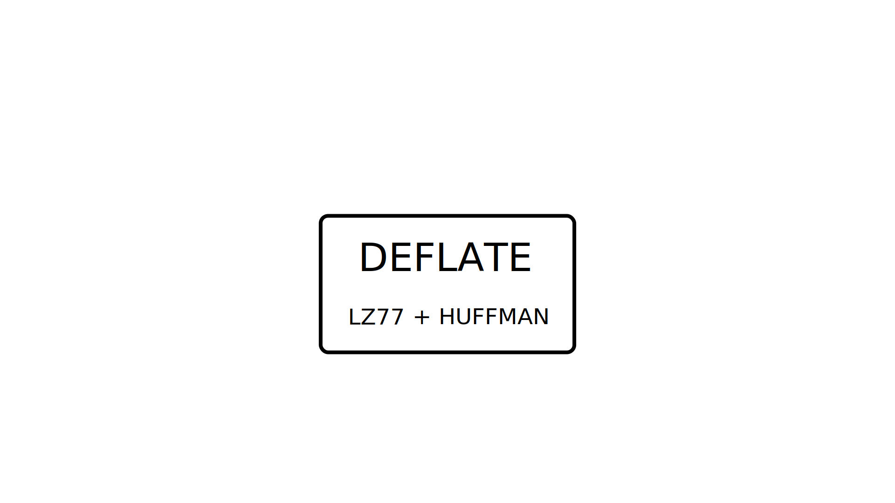
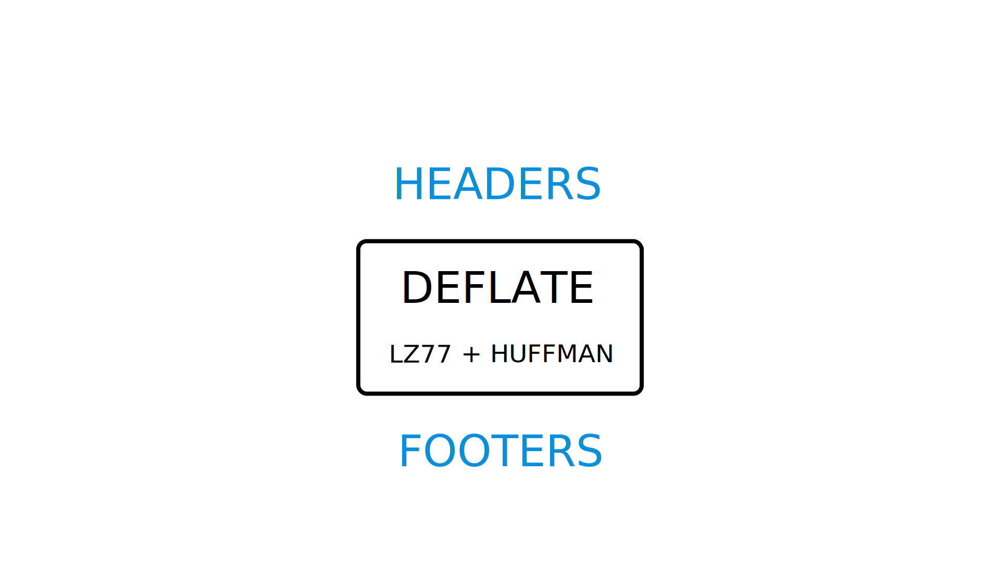
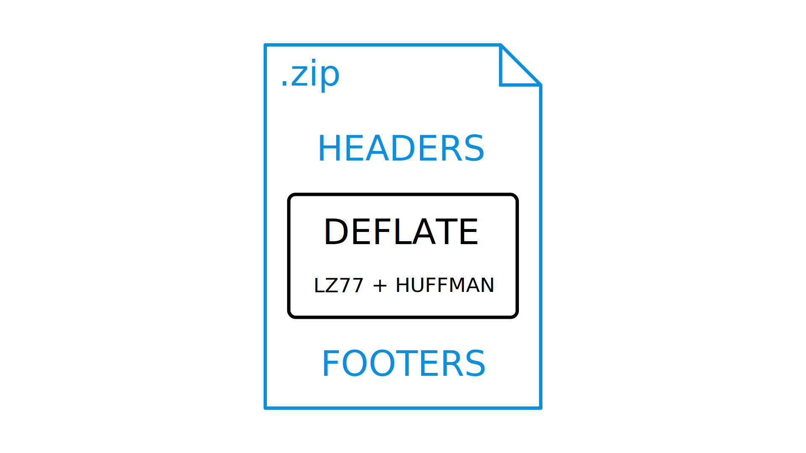
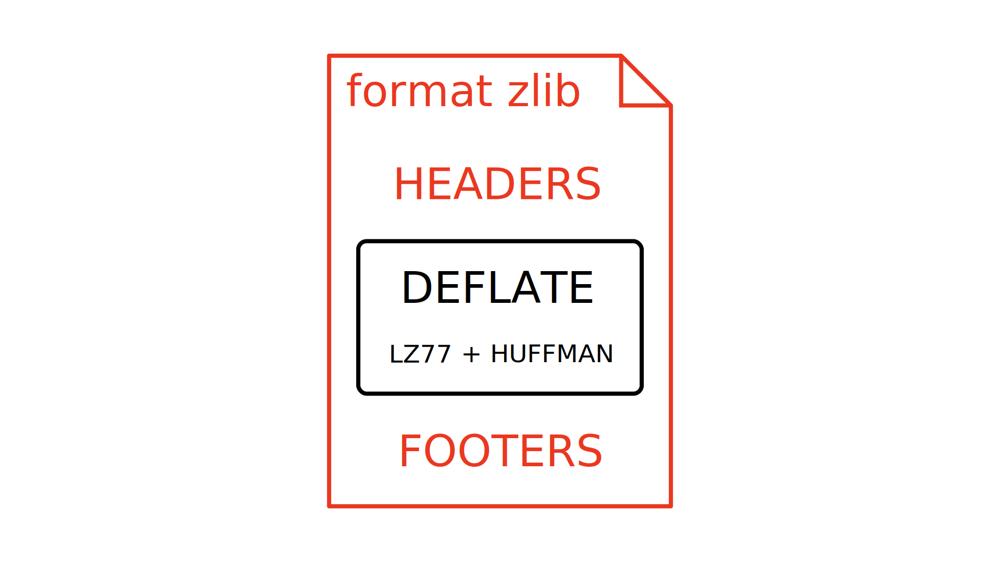
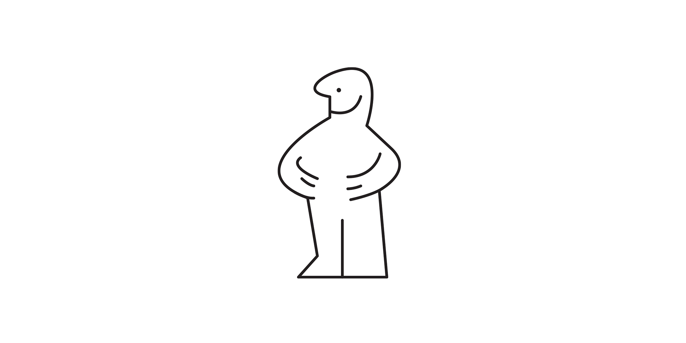
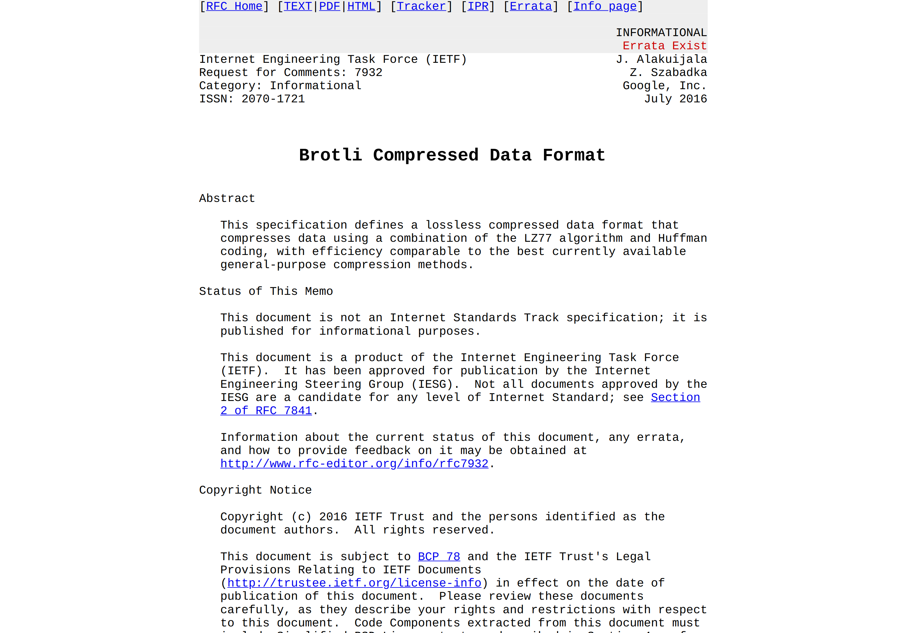

---
author:
author-twitter:
author-company:
event: Snowcamp 2024
date: 1 février 2024
---

# La compression Web : comment (re)prendre le contrôle ?

## blank
> @00:00:00@

## huffman score=auto
ZKECAIH
<!-- animation shuffle -->
> #HS# (en train de chercher un mot)
> $AC$ Tu fais quoi Hubert ?
> #HS# Bah je cherche un mot avec ce tirage, là, mais je galère.
> $AC$ C'est super hein, mais on est pas là pour ça.

## poster fade-from
La compression web
> $AC$ Bonjour à *toutes et à tous*, j'm'appelle Antoine Caron,
> j'suis développeur Web chez Scaleway et je suis accompagné d'Hubert Sablonnière, développeur Web chez Clever Cloud.
> #HS# _(signe de la main)_ Bonjour ! Je suis joueur de Scrabble aussi.
> $AC$ _(un peu saoulé)_ Oui oui, on a compris.
> Aujourd'hui, on aimerait vous parler de compression,
> et vu que c'est un sujet assez vaste, on a choisi de se concentrer sur un contexte qu'on aime particulièrement :
> *le Web* !
> #HS# En fait, il y a un truc qui nous fascine tous les deux...
> À l'instant où on vous parle, y'a des *millions* de serveurs dans le monde qui sont en train de compresser des réponses HTTP,
> et  y'a des *milliards* de navigateurs qui sont en train de les décompresser.
> Du coup, on a regardé comment ça marche et on aimerait vous partager ça...

## blank black
> ...en ajoutant au passage quelques rappels et bonnes pratiques.

## section
Lexique
> @00:01:00@
> #HS# On va commencer tout de suite par des petites clarifications lexicales.
> Quand on parle de compression, le monde se divise en deux catégories :

## text
🤔 *Avec* ou *Sans* perte de données ?
> la compression avec perte de données,
> et la compression sans perte de données.
> En général, on associe la compression avec perte de données a des formats d'image ou d'audio/vidéo : JPEG, MP3 ou MPEG.
> Mais en fait, sur le Web, on retrouve également de la compression avec perte de données,
> sur du JavaScript, du CSS ou encore du HTML.
> Et dans ces cas là, on parle de...

## text
🗑️ Minification
> "minification".

## blank
> On va prendre un exemple JavaScript,

## code title="math-example.js"
```js simple-js-example
export function add (firstNumber, secondNumber) {

}


export function factorial (number) {


}
```
> avec un fichier qui expose des fonctions de maths.

## code title="math-example.js"
```js simple-js-example
export function add (firstNumber, secondNumber) {
  return firstNumber + secondNumber;
}


export function factorial (number) {


}
```
> Une addition, tout ce qu'il y a de plus basique,

## code title="math-example.js"
```js simple-js-example
export function add (firstNumber, secondNumber) {
  return firstNumber + secondNumber;
}


export function factorial (number) {
  if (number === 0) {
    return 1;
  }
  return number * factorial(number - 1);
}
```
> et une petite factorielle des familles,

## code title="math-example.js"
```js simple-js-example
export function add (firstNumber, secondNumber) {
  return firstNumber + secondNumber;
}

// Recursive FTW!
export function factorial (number) {
  if (number === 0) {
    return 1;
  }
  return number * factorial(number - 1);
}
```
> avec de la récursivité s'il vous plait ;-)

## code title="math-example.js"
```js simple-js-example size
export function add (firstNumber, secondNumber) {
  return firstNumber + secondNumber;
}

// Recursive FTW!
export function factorial (number) {
  if (number === 0) {
    return 1;
  }
  return number * factorial(number - 1);
}
```
> Pour l'instant, le fichier fait 228 octets.
> Le minifieur JavaScript que vous utilisez, il connait la syntaxe.
> Il va analyser le code et il va se dire :

## code title="math-example.js"
```text simple-js-example size highlight
export function add (firstNumber, secondNumber) {

  return firstNumber + secondNumber;
                                   _
}


// Recursive FTW!
_________________
export function factorial (number) {

  if (number === 0) {
                    _
    return 1;
            _
  }
  _
  return number * factorial(number - 1);
                                       _
}
```
> OK, là y a des point-virgules, des accolades et des commentaires qui servent à rien.

## code title="math-example.*min*.js"
```js simple-js-example size
export function add (firstNumber, secondNumber) {
  return firstNumber + secondNumber
}


export function factorial (number) {
  if (number === 0)
    return 1

  return number * factorial(number - 1)
}
```
> Bim, 203 octets !

## code title="math-example.*min*.js"
```text simple-js-example size highlight
export function add (firstNumber, secondNumber) {

  return firstNumber + secondNumber

}


export function factorial (number) {

  if (number === 0)
  __ _            _
    return 1
    ______


  return number * factorial(number - 1)
  ______
}
```
> Là le "if return ci sinon return ça",
> j'peux faire un ternaire, c'est plus court.

## code title="math-example.*min*.js"
```js simple-js-example size
export function add (firstNumber, secondNumber) {
  return firstNumber + secondNumber
}


export function factorial (number) {
  return number === 0
    ? 1
    : number * factorial(number - 1)

}
```
> Bim, 197 octets !

## code title="math-example.*min*.js"
```text simple-js-example size highlight
export function add (firstNumber, secondNumber) {
                      __________   ___________
  return firstNumber + secondNumber
          __________    ___________
}


export function factorial (number) {
                            _____
  return number === 0
          _____
    ? 1

    : number * factorial(number - 1)
       _____              _____


}
```
> Les variables super longues là, pas besoin de ça en prod,
> ça fonctionnera pareil en plus court.

## code title="math-example.*min*.js"
```js simple-js-example size
export function add (f, s) {
  return f + s
}


export function factorial (n) {
  return n === 0
    ? 1
    : n * factorial(n - 1)

}
```
> Bim 135 octets !

## code title="math-example.*min*.js"
```text simple-js-example size highlight
export function add (f, s) {
                   _   _  _
  return f + s
__      _ _ _
}


export function factorial (n) {
                         _   _
  return n === 0
__        _   _
    ? 1
____ _
    : n * factorial(n - 1)
____ _ _ _           _ _


}
```
> Et bien évidemment, il va supprimer tous les espaces et sauts de lignes inutiles,

## code title="math-example.*min*.js"
```js simple-js-example size
export function add(f,s){return f+s}export function factorial(n){return n===0?1:n*factorial(n-1)}
```
> pour arriver à un résultat le plus petit possible sans changer le fonctionnement du code.
> Et ça, c'est qu'un exemple assez simple des transformations qu'un minifieur moderne est capable de faire.
> Une fois qu'on a atteint les limites de ce qu'on peut faire avec la minification, on va appliquer de la...

## text
🤐 Compression
> compression.
> Sous-entendu, de la compression...

## text
🤐 Compression *(sans perte)*
> sans perte de données.
> Mais bon, en général, on ne précise...

## text
🤐 Compression
> ...pas et tout le monde comprend qu'on parle de techniques et d'algos sans perte.
> Le compresseur, il connait *pas* la syntaxe du fichier,
> il va travailler directement...

## code title="math-example.min.js"
```text bin-js-example size=98
6578 706f 7274 2066 756e
6374 696f 6e20 6164 6428
662c 7329 7b72 6574 7572
6e20 662b 737d 6578 706f
7274 2066 756e 6374 696f
6e20 6661 6374 6f72 6961
6c28 6e29 7b72 6574 7572
6e20 6e3d 3d3d 303f 313a
6e2a 6661 6374 6f72 6961
6c28 6e2d 3129 7d0a
```
> sur les octets.
> Bon nous quand on voit ça, on sait que c'est le...

## code title="math-example.min.js"
```text bin-js-example size=98
6578 706f 7274 2066 756e  export fun
6374 696f 6e20 6164 6428  ction add(
662c 7329 7b72 6574 7572  f,s){retur
6e20 662b 737d 6578 706f  n f+s}expo
7274 2066 756e 6374 696f  rt functio
6e20 6661 6374 6f72 6961  n factoria
6c28 6e29 7b72 6574 7572  l(n){retur
6e20 6e3d 3d3d 303f 313a  n n===0?1:
6e2a 6661 6374 6f72 6961  n*factoria
6c28 6e2d 3129 7d0a       l(n-1)}.
```
> ...fichier JavaScript de tout à l'heure,
> on voit bien...

## code title="math-example.min.js"
```text bin-js-example highlight size=98
6578 706f 7274 2066 756e  export fun
______________            ______
6374 696f 6e20 6164 6428  ction add(

662c 7329 7b72 6574 7572  f,s){retur

6e20 662b 737d 6578 706f  n f+s}expo
               _________        ____
7274 2066 756e 6374 696f  rt functio
____                      __
6e20 6661 6374 6f72 6961  n factoria

6c28 6e29 7b72 6574 7572  l(n){retur

6e20 6e3d 3d3d 303f 313a  n n===0?1:

6e2a 6661 6374 6f72 6961  n*factoria

6c28 6e2d 3129 7d0a       l(n-1)}.
```
> les exports,

## code title="math-example.min.js"
```text bin-js-example highlight size=98
6578 706f 7274 2066 756e  export fun
                 _______         ___
6374 696f 6e20 6164 6428  ction add(
____________              _____
662c 7329 7b72 6574 7572  f,s){retur

6e20 662b 737d 6578 706f  n f+s}expo

7274 2066 756e 6374 696f  rt functio
       _________________     _______
6e20 6661 6374 6f72 6961  n factoria
__                        _
6c28 6e29 7b72 6574 7572  l(n){retur

6e20 6e3d 3d3d 303f 313a  n n===0?1:

6e2a 6661 6374 6f72 6961  n*factoria

6c28 6e2d 3129 7d0a       l(n-1)}.
```
> les fonctions,

## code title="math-example.min.js"
```text bin-js-example highlight size=98
6578 706f 7274 2066 756e  export fun

6374 696f 6e20 6164 6428  ction add(

662c 7329 7b72 6574 7572  f,s){retur
            ____________       _____
6e20 662b 737d 6578 706f  n f+s}expo
__                        _
7274 2066 756e 6374 696f  rt functio

6e20 6661 6374 6f72 6961  n factoria

6c28 6e29 7b72 6574 7572  l(n){retur
            ____________       _____
6e20 6e3d 3d3d 303f 313a  n n===0?1:
__                        _
6e2a 6661 6374 6f72 6961  n*factoria

6c28 6e2d 3129 7d0a       l(n-1)}.
```
> et les returns.
> le compresseur lui,

## code title="math-example.min.js"
```text bin-js-example size=98
6578 706f 7274 2066 756e
6374 696f 6e20 6164 6428
662c 7329 7b72 6574 7572
6e20 662b 737d 6578 706f
7274 2066 756e 6374 696f
6e20 6661 6374 6f72 6961
6c28 6e29 7b72 6574 7572
6e20 6e3d 3d3d 303f 313a
6e2a 6661 6374 6f72 6961
6c28 6e2d 3129 7d0a
```
> il s'en fout,
> il voit 98 octets,
> il applique ses algos et il essaie de produire un résultat...

## code title="math-example.min.js.*gz*" fade-from
```text bin-js-example size=89
1f8b 0800 0000 0000 0003  ..........
4bad 28c8 2f2a 5148 2bcd  K.(./*QH+.
4b2e c9cc cf53 484c 49d1  K....SHLI.
48d3 29d6 ac2e 4a2d 292d  H.)...J-)-
ca53 48d3 2eae 4d45 5393  .SH...MES.
9698 5c92 5f94 9998 a391  ..\._.....
0757 9767 6b6b 6b60 6f68  .W.gkkk`oh
95a7 8524 ab6b a859 cb05  ...$.k.Y..
000d c88f 1162 0000 00    .....b...
```
> plus petit,
> le tout, en étant capable de retrouver l'original à la décompression.

## blank black

## section
Ordres de  grandeur
> @00:03:30@
> $AC$ Ok, maintenant qu'on sait de quoi on parle il serait important de comprendre l'impact de la compression et minification

## barchart logo=js
math-example.*js* _228o_
brut : 228 brut
minifié : 98 min
compressé : 153 compressed
minifié<br>& compressé : 89 gzip
> $AC$ Sur l'exemple d'Hubert, vous pouvez observer que la compression et la minification se complètent plutôt mais prenons un fichier un peu plus grand.

## barchart logo=js
jquery.*js* _285,3ko_
brut : 285314 brut
minifié : 87029 min
compressé : 83915 compressed
minifié<br>& compressé : 30190 gzip
> $AC$ Sur une version de JQuery par exemple, on voit que la compression, avec la minification permet d'obtenir un fichier drastiquement plus petit.
> La minication faisant déjà bien le job, on gagne bien les 2/3 du poids.

## barchart logo=js percent
jquery.*js* _285,3ko_
brut : 285314 brut
minifié : 87029 min
compressé : 83915 compressed
minifié<br>& compressé : 30190 gzip
> Les valeures brutes c'est cool, parlons en ordre de grandeur, JQuery en version minifié et compressé c'est 10% de la taille source.

## barchart logo=css percent
bootstrap.*css* _205,5ko_
brut : 205484 brut
minifié : 161487 min
compressé : 26408 compressed
minifié<br>& compressé : 23906 gzip
> Même avec le CSS c'est tout aussi efficace, ici avec Bootstrap.

## barchart logo=html percent
hibernate-user-guide.*html* _2,4Mo_
brut : 2421852 brut
minifié : 2334777 min
compressé : 372419 compressed
minifié<br>& compressé : 366546 gzip
> Ou bien même avec un document HTML, ici la doc complète d'Hibernate en une seule page, _oui ça existe_

## barchart logo=json percent
departements-region.*json* _9,6ko_
brut : 9576 brut
minifié : 7152 min
compressé : 1315 compressed
minifié<br>& compressé : 1244 gzip
> Le JSON c'est la même chose, mais ici la minifaction a relativement peut d'impact.

## tip
1) La compression, ça va de pair avec la minification.
> $AC$ Si on veut résumer, la compression va de pair avec la minification

## blank
> #HS# Réduire la taille, c'est bien mais faut se poser la question de l'impact sur les utilisateurs.

## text
🎓 En théorie
> $AC$ Ok faisons quelques projections théoriques avec différentes débits.

## barchart logo=js unit="time" speed="50"
jquery.js _285,3ko_ _*3G lente à 50ko/s*_
brut : 285314 brut
minifié : 87029 min
compressé : 83915 compressed
minifié<br>& compressé : 30190 gzip
> Et ce serait mentir, selon Web Page Test, un internet lent, une 3G à 50ko/s, qui nous rappelle nos meilleurs années AOL/Wanadoo
> On passe d'un temps équivalent à un café Nespresso qui coulant dans sa tasse à moins d'une seconde.

## barchart logo=js unit="time" speed="1125"
jquery.js _285,3ko_ _*4G à 1,1Mo/s*_
brut : 285314 brut
minifié : 87029 min
compressé : 83915 compressed
minifié<br>& compressé : 30190 gzip
> Ok avec de la 4G, c'est pour moi tout aussi impressionnant, un peu plus de 200ms de différence c'est perceptible par un utilisateur.

## media


> #HS# Parenthèse d'ailleurs, le site Bundlephobia vous permet d'estimer la taille d'un package npm en minifié / gzippé et le temps de téléchargement.

## text
⏱️ En pratique
> $AC$ Et si on voyait ce que ça donnait en vrai ?
> Prenons une page web au hasard...

## media


> #HS# Genre la page Wikipedia du Scrabble 

## media contain


> $AC$ Si tu veux Hubert....
> Une page web, c'est une grande cascade de requêtes pour récupérer les ressources qui la composent.
> Le chargement / parsing d'une ressource déclenchant parfois le téléchargement d'une autre.


## wpt title="en.wikipedia.org/wiki/Scrabble _*3G slow à 50ko/s*_"
<video src="src/videos/wpt-scrabble-3gslow.mp4" controls></video>
<!-- https://www.webpagetest.org/video/view.php?tests=231012_BiDcBM_BC9-l:sans%20compression-e:17.1,231012_AiDc6X_BGC-l:avec%20compression-e:7.4&bg=ffffff&text=000000 -->

> Voyons donc ensemble une comparaison du chargement de cette page en 3G avec et sans comrpession.
> C'est long, c'est très long...
> 17 secondes en comparaison de 7 secondes

## blank white

## wpt title="en.wikipedia.org/wiki/Scrabble _*4G à 1,1Mo/s*_"
<video src="src/videos/wpt-scrabble-4g.mp4" controls></video>
<!-- https://www.webpagetest.org/video/view.php?tests=231012_BiDcVA_BH1-l:sans%20compression-e:2.4,231012_BiDcF8_BHG-l:avec%20compression-e:2.1&bg=ffffff&text=000000 -->

> En 4g c'est moins impressionant mais en pourcentage ça reste très cool.


## blank white

## wpt title="en.wikipedia.org/wiki/Scrabble _*sans limite*_"
<video src="src/videos/wpt-scrabble-nolimit.mp4" controls></video>
<!-- https://www.webpagetest.org/video/view.php?tests=231012_BiDcKV_BJ8-l:sans%20compression-e:1.2,231012_BiDcAV_BJA-l:avec%20compression-e:1.2&bg=ffffff&text=000000&slow=1 -->

> Bien évidemment, avec un réseau illimité on ne voit quasi pas la différence.

## tip
2) La compression, c'est nécessaire (même en 2024).
> $AC$ Et oui même en 2024, la compression c'est donc nécessaire.
> #HS# Non mais Antoine, on enfonce des portes ouvertes,
> tout le monde sait qu'il faut compresser.
> Enfin... j'espère...

## media


> $AC$ Vous connaissez l'almanac du web ? 
> Une ressource hyper intéressante de l'usage du web grâce aux données du web public.

## media


> En 2021, ils ont même sortis une étude dédiée à la compression.
> Et spoiler, il n'y a pas que des bonnes nouvelles.

## barchart unit="%" max="100"
*%* de fichiers servis *sans* compression _Almanac 2021_
// JS : 12.7 brut
// CSS : 14.2 brut
// JSON : 31.8 brut
// SVG : 36.0 brut
// HTML : 56.0 brut

## barchart unit="%" max="100"
*%* de fichiers servis *sans* compression _Almanac 2021_
JS : 12.7 brut
// CSS : 14.2 brut
// JSON : 31.8 brut
// SVG : 36.0 brut
// HTML : 56.0 brut

## barchart unit="%" max="100"
*%* de fichiers servis *sans* compression _Almanac 2021_
JS : 12.7 brut
CSS : 14.2 brut
// JSON : 31.8 brut
// SVG : 36.0 brut
// HTML : 56.0 brut

> Non mais sérieux, autant de fichiers servis non compressés, c'est pas possible

## barchart unit="%" max="100"
*%* de fichiers servis *sans* compression _Almanac 2021_
JS : 12.7 brut
CSS : 14.2 brut
JSON : 31.8 brut
// SVG : 36.0 brut
// HTML : 56.0 brut

## barchart unit="%" max="100"
*%* de fichiers servis *sans* compression _Almanac 2021_
JS : 12.7 brut
CSS : 14.2 brut
JSON : 31.8 brut
SVG : 36.0 brut
// HTML : 56.0 brut

## barchart unit="%" max="100" fade-from
*%* de fichiers servis *sans* compression _Almanac 2021_
JS : 12.7 brut
CSS : 14.2 brut
JSON : 31.8 brut
SVG : 36.0 brut
HTML : 56.0 brut
<!-- à retravailler -->
> #HS# Et ça, ce n'est que sur l'internet public accessible à tous,
> je pense que sur les intranets et autres applis de gestion sur lesquelles on bosse, c'est pire. 

## blank black
> #HS# Maintenant qu'on est toutes et tous convaincus qu'il faut compresser et pourquoi,
> on va essayer de regarder un peu ce qu'il se passe...

## section
Dans les  tuyaux
> @00:09:00@
> ...dans les tuyaux avec le protocole HTTP.

## blank
> Imaginez un navigateur qui veut récupérer une page Web.

## code
```http type="request"
GET /index.html HTTP/1.1
 
```
```http type="request" hide-height
GET /index.html HTTP/1.1
accept-encoding: gzip, deflate, br
```
```http type="response" hide
HTTP/1.1 200 OK
 
```
> Il va dire au serveur "Hey, donne-moi le fichier index HTML !".

## code
```http type="request"
GET /index.html HTTP/1.1
 
```
```http type="request" hide-height
GET /index.html HTTP/1.1
accept-encoding: gzip, deflate, br
```
```http type="response"
HTTP/1.1 200 OK
 
```
> Le serveur va alors répondre :
> "tiens le voilà, 200 OK tout va bien".
> Dans la requête HTTP, le navigateur va pouvoir préciser quels formats de compression il supporte avec...

## code
```http type="request"
GET /index.html HTTP/1.1
accept-encoding: 
```
```http type="request" hide-height
GET /index.html HTTP/1.1
accept-encoding: gzip, deflate, br
```
```http type="response"
HTTP/1.1 200 OK
 
```
> ...l'en-tête "accept-encoding".

## code
```http type="request"
GET /index.html HTTP/1.1
accept-encoding: gzip
```
```http type="request" hide-height
GET /index.html HTTP/1.1
accept-encoding: gzip, deflate, br
```
```http type="response"
HTTP/1.1 200 OK
 
```
> Par exemple, il peut dire : "Je comprends le gzip...

## code
```http type="request"
GET /index.html HTTP/1.1
accept-encoding: gzip, deflate
```
```http type="request" hide-height
GET /index.html HTTP/1.1
accept-encoding: gzip, deflate, br
```
```http type="response"
HTTP/1.1 200 OK
 
```
> ...le deflate...

## code
```http type="request"
GET /index.html HTTP/1.1
accept-encoding: gzip, deflate, br
```
```http type="request" hide-height
GET /index.html HTTP/1.1
accept-encoding: gzip, deflate, br
```
```http type="response"
HTTP/1.1 200 OK
 
```
> ...et le brotli.
> De son côté, le serveur va regarder quels formats il supporte parmi ceux là, et il va répondre avec...

## code
```http type="request"
GET /index.html HTTP/1.1
accept-encoding: gzip, deflate, br
```
```http type="request" hide-height
GET /index.html HTTP/1.1
accept-encoding: gzip, deflate, br
```
```http type="response"
HTTP/1.1 200 OK
content-encoding: 
```
> l'en-tête "content-encoding".
> Avec ça, il vient préciser le format qu'il a utilisé pour la réponse qu'il vient d'envoyer.
> Par exemple :

## code
```http type="request"
GET /index.html HTTP/1.1
accept-encoding: gzip, deflate, br
```
```http type="request" hide-height
GET /index.html HTTP/1.1
accept-encoding: gzip, deflate, br
```
```http type="response"
HTTP/1.1 200 OK
content-encoding: gzip
```
> gzip, ou même...

## code
```http type="request"
GET /index.html HTTP/1.1
accept-encoding: gzip, deflate, br
```
```http type="request" hide-height
GET /index.html HTTP/1.1
accept-encoding: gzip, deflate, br
```
```http type="response"
HTTP/1.1 200 OK
content-encoding: br
```
> ...brotli s'il le supporte.

## demo
> Ouvrir les devtools
> Charger la page du Scrabble
> Montrer les en-tête de requête
> Montrer les en-tête de réponse
> Montrer la colonne "transfert"
> Montrer le content-length "transfert"
> Montrer la colonne "taille"
> Mentionner que "transfert" inclue les en-têtes

## tip
3) La compression, c'est natif au <br> fonctionnement du Web.
> La compression, c'est natif au fonctionnement du Web,
> et la puissance du truc, c'est qu'un vieux navigateur peut discuter avec un serveur moderne ou inversement et tout le monde se comprend.
> Bon après, même un vieux navigateur, il sait faire du gzip.
> À tel point que...

## media

> Can I Use essaie même pas d'afficher les versions supportées.

## blank
> On continue notre exploration de ce qu'il se passe dans les tuyaux.
> Avant, quand je me mettais à la place d'un navigateur,
> $AC$ Ah ouais tu fais ça toi ?
> Ouais, j'me dis :

## gantt title="🤔"
Réception : 0
Parsing HTML : 100
Affichage : 100
> il télécharge une page,
> puis il parse l'HTML,
> puis il commence à l'afficher.
> On va regarder si c'est vraiment le cas avec une démo.

## demo
> *Charger la page sans compression*
> Expliquer la page "Sherlock" tout ça...
> On a beau avoir une page très longue, on a pas trop le temps de voir ce qu'il se passe,
> du coup, on va ralentir artificiellement le serveur.
> *Charger la page sans compression (ralentie)*
> Montrer l'onglet network avec les 4 mega qui se remplissent
> Aller dans le DOM et montrer que la page se construit alors qu'on a pas encore tout reçu.
> Je trouve ça assez dingue parceque ça veut dire, que le navigateur,

## gantt title="🤔"
Réception : 0
Parsing HTML : 100
Affichage : 100
> il fonctionne pas par étapes sucessives bloquantes,

## gantt title="😀"
Réception : 0
Parsing HTML : 33
Affichage : 33
> il fonctionne en temps réel et il est capable de parser et d'afficher le début d'une page HTML avant même d'avoir reçu la fin du fichier
> $AC$ Ce fonctionnement, il est pas accidentel, ça fait partie de la spec HTML de savoir faire ça.

## demo
> Qu'est ce qu'il se passe si on rajoute de la compression ?
> *Charger la page avec compression (ralentie)*
> Faire le constate que la décompression ne gene pas la gestion du flux.

## gantt title="🤔"
Réception : 0
Décompression : 100
Parsing HTML : 100
Affichage : 20
> Ça veut dire que la décompréssion n'est pas bloquante.

## gantt title="😃"
Réception : 0
Décompression : 20
Parsing HTML : 20
Affichage : 20
> Elle fait partie de cette pipeline et le navigateur est capable de décomprésser, parser et afficher la page avant même d'avoir terminé de récupérer le fichier.

## gantt title="🤩"
Compression : 0
Envoi : 20
Réception : 20
Décompression : 20
Parsing HTML : 20
Affichage : 20
> C'est pareil pour la compression coté serveur.

## tip fade-from
4) La compression, ça n'interrompt pas le flux.
> La compression (et la décompression), ça n'interrompt pas le flux, ça ne perturbe pas le fonctionnement temps réel du Web.

## blank black

## section
Retour  aux sources
> @00:14:30@
> $AC$ Mais tout ça, ça ne date pas d'hier.
> Il va falloir sortir la DeLorean mon cher Hubert
> Quand on parle de Gzip, on parle pas d'un truc qui date d'hier.

## timeline year=2010 animated
Bien avant bootstrap
> $AC$ On est bien avant Bootstrap, bien avant react

## timeline year=2000 animated
Bien avant les années 2000
> $AC$ On est bien avant le web des années 2000 avec les compteurs de visiteurs
> Les design métaliques qui me manquent un peu

## timeline year=1980 animated
PKZIP, 1986, Phil Katz, 
GZIP, 1992, Jean-Loup Gailly / Mark Adler, 
> $AC$ Il faut remonter à 1992 pour retrouver la RFC de GZIP par Jean-Loup Gailly et Mark Adler
> RFC 1952
> #HS# Tu faisais quoi en 1992 Antoine ?
> $AC$ 😅
> Ils posent les bases d'un modèle de compression basés et inspirés de traveaux de PKZIP par Phil Katz quelques années
> avant.
> On parle du Web 56k de l'époque, économiser autant de bits, c'était une révolution.
> Mais pour faire PKZIP et GZIP, ils ne sont pas partis de rien
> Il ont été piocher d'abord dans des travaux des années 70 et même des années 50

## timeline year=1970 animated
LZ77, 1977, Abraham Lempel and Jacob Ziv, 
> $AC$ Oulà oui on parle de travaux fait 20 ans avant.
> Tu faisais quoi en 1977 Hubert ?
> #HS# 😅
> $AC$ Travaux de deux scientifiques Abraham Lempel and Jacob Ziv qui proposent en 1977 un algortithme de compression de
> texte nommé LZ77
> _LZ77 mais qu'est-ce que ça peut pouvoir dire ? ça reste encore un mystère_

## timeline year=1950 animated
Code de Huffman, 1952, David A. Huffman, 
> $AC$ Oui mais PKZIP et GZIP n'ont pas été piocher que dans les travaux des années 70
> Ils ont été reprendre de travaux publiés en 1952 par Mr Huffman.
> #HS# 52, c'est l'année de l'explosion du Scrabble
> $AC$ Le codage de huffman, on est là bien avant les problématiques de l'interweb
> Donc, ce qu'on est en train de vous dire là, c'est que la recherche fondamentale
> ça peut avoir des impacts considérables sur l'évolution de la technologie des années après?
> 40 ans séparent PKZIP du codage d'Huffman et plus de 30 ans séparent GZIP de 2024.

## blank black

## section
Code de  Huffman
> @00:15:30@
> #HS# Alors, c'est l'heure d'expliquer le code de Huffman et son algorithme.

## blank
> #HS# Pour ça, on va prendre un mot...

## text
sablonnière
> ...au hasard.
> $AC$ Hubert ?

## huffman score=auto
SABLONNIERE
> #HS# Non, mais c'est un vrai mot, on peut le jouer au Scrabble.
> $AC$ Hubert !

## blank
> #HS# Bon, d'accord, de toute façon, j'ai jamais réussi à le placer.

## huffman
COMPRESSION
> #HS# On va prendre le mot "COMPRESSION".
> Quand on stocke ce mot dans un fichier texte, on obtient un fichier de 11 octets, un octet par caractère.

## huffman score=8
COMPRESSION
> Chaque octet contient les 8 bits nécessaires pour représenter le code ASCII en binaire.

## code
```text highlight
$ ascii
  _____
Usage: ascii [-adxohv] [-t] [char-alias...]

   -t = one-line output  -a = vertical format

   -d = Decimal table  -o = octal table  -x = hex table  -b binary table

   -h = This help screen -v = version information
```
> Si vous êtes nul en code ASCII comme moi,
> vous pouvez utiliser la commande `ascii` sous Linux.

## code
```text style="font-size: 0.95rem" highlight="hide-mark"
$ ascii -b

0000000 NUL    0010000 DLE    0100000      0110000 0    1000000 @    1010000 P    1100000 `    1110000 p 
                                                                     _________
0000001 SOH    0010001 DC1    0100001 !    0110001 1    1000001 A    1010001 Q    1100001 a    1110001 q 

0000010 STX    0010010 DC2    0100010 "    0110010 2    1000010 B    1010010 R    1100010 b    1110010 r 
                                                                     _________
0000011 ETX    0010011 DC3    0100011 #    0110011 3    1000011 C    1010011 S    1100011 c    1110011 s 
                                                        _________    _________
0000100 EOT    0010100 DC4    0100100 $    0110100 4    1000100 D    1010100 T    1100100 d    1110100 t 

0000101 ENQ    0010101 NAK    0100101 %    0110101 5    1000101 E    1010101 U    1100101 e    1110101 u 
                                                        _________
0000110 ACK    0010110 SYN    0100110 &    0110110 6    1000110 F    1010110 V    1100110 f    1110110 v 

0000111 BEL    0010111 ETB    0100111 '    0110111 7    1000111 G    1010111 W    1100111 g    1110111 w 

0001000 BS     0011000 CAN    0101000 (    0111000 8    1001000 H    1011000 X    1101000 h    1111000 x 

0001001 HT     0011001 EM     0101001 )    0111001 9    1001001 I    1011001 Y    1101001 i    1111001 y 
                                                        _________
0001010 LF     0011010 SUB    0101010 *    0111010 :    1001010 J    1011010 Z    1101010 j    1111010 z 

0001011 VT     0011011 ESC    0101011 +    0111011 ;    1001011 K    1011011 [    1101011 k    1111011 { 

0001100 FF     0011100 FS     0101100 ,    0111100 <    1001100 L    1011100 \    1101100 l    1111100 | 

0001101 CR     0011101 GS     0101101 -    0111101 =    1001101 M    1011101 ]    1101101 m    1111101 } 
                                                        _________
0001110 SO     0011110 RS     0101110 .    0111110 >    1001110 N    1011110 ^    1101110 n    1111110 ~ 
                                                           _________
0001111 SI     0011111 US     0101111 /    0111111 ?    1001111 O    1011111 _    1101111 o    1111111 DEL
                                                        _________ 
```
> Vous faites *ascii -b* pour avoir la table de correspondance.

## code
```text style="font-size: 0.95rem" highlight
$ ascii -b

0000000 NUL    0010000 DLE    0100000      0110000 0    1000000 @    1010000 P    1100000 `    1110000 p 
                                                                     _________
0000001 SOH    0010001 DC1    0100001 !    0110001 1    1000001 A    1010001 Q    1100001 a    1110001 q 

0000010 STX    0010010 DC2    0100010 "    0110010 2    1000010 B    1010010 R    1100010 b    1110010 r 
                                                                     _________
0000011 ETX    0010011 DC3    0100011 #    0110011 3    1000011 C    1010011 S    1100011 c    1110011 s 
                                                        _________    _________
0000100 EOT    0010100 DC4    0100100 $    0110100 4    1000100 D    1010100 T    1100100 d    1110100 t 

0000101 ENQ    0010101 NAK    0100101 %    0110101 5    1000101 E    1010101 U    1100101 e    1110101 u 
                                                        _________
0000110 ACK    0010110 SYN    0100110 &    0110110 6    1000110 F    1010110 V    1100110 f    1110110 v 

0000111 BEL    0010111 ETB    0100111 '    0110111 7    1000111 G    1010111 W    1100111 g    1110111 w 

0001000 BS     0011000 CAN    0101000 (    0111000 8    1001000 H    1011000 X    1101000 h    1111000 x 

0001001 HT     0011001 EM     0101001 )    0111001 9    1001001 I    1011001 Y    1101001 i    1111001 y 
                                                        _________
0001010 LF     0011010 SUB    0101010 *    0111010 :    1001010 J    1011010 Z    1101010 j    1111010 z 

0001011 VT     0011011 ESC    0101011 +    0111011 ;    1001011 K    1011011 [    1101011 k    1111011 { 

0001100 FF     0011100 FS     0101100 ,    0111100 <    1001100 L    1011100 \    1101100 l    1111100 | 

0001101 CR     0011101 GS     0101101 -    0111101 =    1001101 M    1011101 ]    1101101 m    1111101 } 
                                                        _________
0001110 SO     0011110 RS     0101110 .    0111110 >    1001110 N    1011110 ^    1101110 n    1111110 ~ 
                                                           _________
0001111 SI     0011111 US     0101111 /    0111111 ?    1001111 O    1011111 _    1101111 o    1111111 DEL
                                                        _________ 
```
> Ici, c'est les caractères du mot "COMPRESSION" qui nous intéressent.

## huffman score=8 bits=auto
COMPRESSION
> En 1952, Huffman constate que cette représentation binaire est linéaire.
> Le nombre total de bits est...

## huffman score=8 bits=auto total-score
COMPRESSION
> ...directement proportionnel au nombre de caractères,
> et lui, il veut limiter ce nombre de bits.
> À la rigueur, nous on voit ça, on se dit, mais attends,
> j'ai que 9 caractères différents dans mon mot,
> j'ai pas besoin de 8 bits pour les coder,

## huffman step=0 score=4 total-score bits=inc
COMPRESSION
> 4 ça suffirait.
> Huffman, il va beaucoup plus loin.
> Il se dit :
> En codant les caractères qui apparaissent le plus souvent avec peu de bits,
> et en codant les caractères qui apparaissent le moins souvent avec beaucoup de bits,
> en moyenne, on devrait réduire le nombre de total de bits et gagner de la place.
> $AC$ J'crois qu'on les a perdus.
> #HS# Mais non, en fait, c'est comme au...

## barchart narrow unit=""
Score des lettres au Scrabble (français)
// A : 1
// B : 3
// C : 3
// D : 2
// E : 1
// F : 4
// G : 2
// H : 4
// I : 1
// J : 8
// K : 10
// L : 1
// M : 2
// N : 1
// O : 1
// P : 3
// Q : 8
// R : 1
// S : 1
// T : 1
// U : 1
// V : 4
// W : 10
// X : 10
// Y : 10
// Z : 10
> Scrabble !

## barchart narrow unit=""
Score des lettres au Scrabble (français)
A : 1
// B : 3
// C : 3
// D : 2
E : 1
// F : 4
// G : 2
// H : 4
I : 1
// J : 8
// K : 10
L : 1
// M : 2
N : 1
O : 1
// P : 3
// Q : 8
R : 1
S : 1
T : 1
U : 1
// V : 4
// W : 10
// X : 10
// Y : 10
// Z : 10
> Les lettres les plus fréquentes ont un petit score.

## barchart narrow unit=""
Score des lettres au Scrabble (français)
A : 1
// B : 3
// C : 3
D : 2
E : 1
// F : 4
G : 2
// H : 4
I : 1
// J : 8
// K : 10
L : 1
M : 2
N : 1
O : 1
// P : 3
// Q : 8
R : 1
S : 1
T : 1
U : 1
// V : 4
// W : 10
// X : 10
// Y : 10
// Z : 10
> et moins les lettres...

## barchart narrow unit=""
Score des lettres au Scrabble (français)
A : 1
B : 3
C : 3
D : 2
E : 1
// F : 4
G : 2
// H : 4
I : 1
// J : 8
// K : 10
L : 1
M : 2
N : 1
O : 1
P : 3
// Q : 8
R : 1
S : 1
T : 1
U : 1
// V : 4
// W : 10
// X : 10
// Y : 10
// Z : 10
> ...sont fréquentes...

## barchart narrow unit=""
Score des lettres au Scrabble (français)
A : 1
B : 3
C : 3
D : 2
E : 1
F : 4
G : 2
H : 4
I : 1
// J : 8
// K : 10
L : 1
M : 2
N : 1
O : 1
P : 3
// Q : 8
R : 1
S : 1
T : 1
U : 1
V : 4
// W : 10
// X : 10
// Y : 10
// Z : 10
> ...et plus...

## barchart narrow unit=""
Score des lettres au Scrabble (français)
A : 1
B : 3
C : 3
D : 2
E : 1
F : 4
G : 2
H : 4
I : 1
J : 8
// K : 10
L : 1
M : 2
N : 1
O : 1
P : 3
Q : 8
R : 1
S : 1
T : 1
U : 1
V : 4
// W : 10
// X : 10
// Y : 10
// Z : 10
> ...leur score est ...

## barchart narrow unit=""
Score des lettres au Scrabble (français)
A : 1
B : 3
C : 3
D : 2
E : 1
F : 4
G : 2
H : 4
I : 1
J : 8
K : 10
L : 1
M : 2
N : 1
O : 1
P : 3
Q : 8
R : 1
S : 1
T : 1
U : 1
V : 4
W : 10
X : 10
Y : 10
Z : 10
> ...est élevé.

## huffman score=auto
COMPRESSION
> Si on représentait chaque lettre en utilisant le score au Scrabble pour le nombre de bits,

## huffman total-score score=auto
COMPRESSION
> on obtiendrait un nombre total de bits plus petit.
> En gros, l'idée de Huffman c'est ça !
> $AC$ Oui, sauf qu'avec un seul bit, t'as 0 et 1,
> tu vas pas pouvoir coder "R", "A", "I" et "E".
> Et en plus, là t'as utilisé une fréquence de lettres qui est plus ou moins basée sur des moyennes de la langue
> française alors que t'as qu'un tout petit mot.

## media contain black

> $AC$ Huffman c'est un génie, le mec a 26 ans, il est étudiant au MIT, dans la même classe que Claude Shannon,
> et quand son prof lui dit "soit tu passes un partiel, soit t'écrit un papier de recherche",
> le mec il choisit le papier de recherche.
> Il invente un algo pour trouver le meilleur codage binaire pour un ensemble de caractères.
> En plus, il prouve mathématiquement que c'est la meilleure solution possible.
> 70 ans plus tard, son algo est partout, il a plié le game.

## media contain black thug-life="0.1,-0.05,14,5"

> #HS# J'avoue, c'est trop le boss.

## huffman animation
COMPRESSION
> #HS# Alors comme on le disait plus tôôt,
> l'algo de Huffman se base sur la fréquence des caractères.

## huffman step=1 animation
COMPRESSION
> Dans notre mot, on a 2 S et 2 O.
> Ensuite on va répéter plusieurs fois la même chose.

## huffman step=2 animation
COMPRESSION
> On va trier par fréquence et ensuite on va prendre les deux les moins fréquents sur la droite,
> on va additionner les fréquences et les regrouper en construisant un arbre binaire.
> "je trie"
> "je regroupe dans un arbre en additionnant les fréquences"

## huffman step=3 animation
COMPRESSION

## huffman step=4 animation
COMPRESSION

## huffman step=5 animation
COMPRESSION

## huffman step=6 animation
COMPRESSION

## huffman step=7 animation
COMPRESSION

## huffman step=8 animation
COMPRESSION

## huffman step=9 animation
COMPRESSION

## huffman step=10 animation
COMPRESSION

## huffman step=11 animation
COMPRESSION

## huffman step=12 animation
COMPRESSION

## huffman step=13 animation
COMPRESSION

## huffman step=14 animation
COMPRESSION

## huffman step=15 animation
COMPRESSION

## huffman step=16 animation
COMPRESSION

## huffman step=17 animation
COMPRESSION

## huffman step=18 score-sheet
COMPRESSION

## huffman step=19
COMPRESSION

## huffman step=19 total-score
COMPRESSION

## media contain white fade-from


## blank black

## section
LZ77
> @00:21:30@

## text
🗓️ Et *25 ans* plus tard...

## text small
_*"*On peut tromper une personne mille fois._<br>
_On peut tromper mille personnes une fois._<br>
_Mais on ne peut pas tromper mille personnes, mille fois.*"*_
> $AC$ Je mets n'importe qui au défi ici de dire cette cette citation des nuls de mémoire et sans se tromper.
> Personellement ça m'est impossible.
> #HS# On se répète un peu là non ? 
> $AC$ En observant cette phrase on peut surement se dire que se limiter à optimiser caractère par caractère est pas le plus intéressant.

## media contain white

> $AC$ Et si on jouait à mot compte moins ?
> #HS# Coooool !

## media

> $AC$ On va chasser les motifs répétitifs.

> $AC$ L'idée de Mr Lempel et Mr Ziv c'est de trouver un moyen de réduire le nombre de bit nécessaire pour représenter un motif qui se répète.
> Et si on remplaçait des parties du messages par des étiquettes/des pointeurs vers une autre partie du message.
> Je vais vous montrer sur un exemple simple

## lzd init style="font-size: 1.5rem"
mille-feuille
-[--]----(--)
> $AC$ On va lire char par char le texte qu'on souhaite compresser.

## lzd step=0 style="font-size: 1.5rem"

## lzd finish style="font-size: 1.5rem"

## blank white

## lzd init
ON PEUT TROMPER UNE PERSONNE MILLE FOIS. ON PEUT TROMPER MILLE PERSONNES UNE FOIS. MAIS ON NE PEUT PAS TROMPER MILLE PERSONNES, MILLE FOIS.
--[-]--------------(-)---------------------------------------------------------------------------------------------------------------------
-----------------[-]------(-)--------------------------------------------------------------------------------------------------------------
[--------------]-------------------------(--------------)----------------------------------------------------------------------------------
-----------------------------[----]----------------------(----)----------------------------------------------------------------------------
--------------------[------]-----------------------------------(------)--------------------------------------------------------------------
---------------[---]----------------------------------------------------(---)--------------------------------------------------------------
-----------------------------------[----]------------------------------------(----)--------------------------------------------------------
----------------------------------------[--]-------------------------------------------(--)------------------------------------------------
-----------------[---]---------------------------------------------------------------------(---)-------------------------------------------
----------------------------------------------[-]-----------------------------------------------(-)----------------------------------------
------------------------------------------------[----------------------]------------------------------(----------------------)-------------
----------------------------[----------]---------------------------------------------------------------------------------------(----------)

## lzd step=0

## lzd replacement=0

## lzd replacement=1

## lzd replacement=2

## lzd replacement=3

## lzd replacement=4

## lzd replacement=5

## lzd replacement=6

## lzd replacement=7

## lzd replacement=8

## lzd replacement=9

## lzd replacement=10

## lzd replacement=11

## lzd finish

## blank white
> #HS# Mais le système d'étiquettage est bien plus puissant que ça
> $AC$ En effet, Hubert, prenons l'exemple de la fin de Hey Jude des Beatles.

## lzd init
Na, na, na, na, na, na, na, na, na, na, na, na, hey, Jude.
[---(--------------------------------------]---)----------
> $AC$ C'est beau la poésie anglaise, bon, passons.

## lzd step=0

## lzd finish fade-from
> $AC$ On a clairement moins de tuiles en bas qu'en haut non ? 
> #HS# Pourtant si on reçoit le texte du bas on peut facilement regénérer le texte du haut.
> Même si on le reçoit progressivement.

## blank black

## section
ET  CONCRETEMENT ?
> @00:27:30@
> Concrètement, comment ça fonctionne quand on va essayer de combiner les deux ?

## blank white
> Alors, en fait, un an après avoir créé...

## media white

> ...LZ77, Lempel et Ziv créent un autre algorithme,

## media white

> LZ78 !
> Et ces 2 algos qui fonctionnent un peu différemment,
> mais qui font la même chose,
> vont donner naissance à...

## media white

> ...2 familles d'algos,

## media white

> créés par d'autres gens,

## media white

> et qui s'inspirent les uns les autres.

## media white

> LZW, on le retrouve dans ce format d'image bien connu composé des lettres G I F. 

## media white

> #HS# LZSS, on le retrouve dans WinRar.
> $AC$ Il y en a qui ont payé leur license WinRar ?

## media white

> LZMA, on le retrouve dans 7zip.

## media white fade-from

> Mais aujourd'hui, c'qui nous intéresse particulièrement,
> c'est DEFLATE.
> Par ce que DEFLATE, c'est qu'il y a dans WinZIP, gzip, dans les fichiers PNG, etc.

## media fade-into

> Si vous étes intéréssés par cette saga des familles de compression,
> Colt McAnlis chez Google, il a fait une super vidéo sur le sujet.
> On vous la recommande.

## media contain

> Phil Katz, en 1990,
> il se dit OK, je prends du texte,

## media contain white

> je le compresse avec LZ77,
> du coup, j'ai des symboles et des étiquettes pour les répétitions,
> je vais regarder la fréquence des symboles et des étiquettes,

## media contain white

> et je vais appliquer un code de Huffman là dessus.
> FUSION !
> et avec ça, il choisi la manière dont il va coder ça en binaire,

## media contain white

> et il appelle ça l'algoritme et le format de donnée DEFLATE.

## media

> Quelques années après ça a été mis dans une RFC.
> Qui est passionnante, faut l'avouer.
> Autour de ce bloc de bits DEFLATE,
> il rajoute...

## media contain white

> des headers et des footers,
> et avec ça, il créé...

## media contain white

> ...le format de fichier .zip !
> Merci Phil Katz.

## media contain

> Quelques années après,
> on a Jean-loup Gailly et Mark Adler qui reprennent la même manière de coder les bits de DEFLATE,

## media contain white

> mais avec des headers/footers différents,
> et ils créent l'outil gzip et le format de fichier qui va avec le .gz.

## media

> On retrouve ça dans une autre RFC qui va juste expliquer ce qu'il y a dans le header et le footer.

<!--
## blank white
> Dans nos recherches, on est tombé

## code
```http type="request"
GET /index.html HTTP/1.1
accept-encoding: gzip, deflate, br
```
```http type="request" hide-height
GET /index.html HTTP/1.1
accept-encoding: gzip, deflate, br
```
```http type="response"
HTTP/1.1 200 OK
content-encoding: deflate
```

## media contain white


## media


## code
```http type="request"
GET /index.html HTTP/1.1
accept-encoding: gzip, deflate, br
```
```http type="request" hide-height
GET /index.html HTTP/1.1
accept-encoding: gzip, deflate, br
```
```http type="response"
HTTP/1.1 200 OK
content-encoding: gzip
```
-->

## blank
> #HS# Tu crois qu'ils sont prets ?
> $AC$ J'sais pas...
> #HS# Est-ce que vous etes prets ?

## gzip mode="symbols-h"
> #HS# Est-ce que vous etes toujours prets ?
> Expliquer les headers
> Expliquer les footers
> Expliquer le block deflate
> Rappeler qu'il y a d'abord eu un LZ77 pour créer des étiquettes
> Puis :
> - un codage de Huffman pour savoir comment coder les symboles et les longueurs
> - et un codage de Huffman pour les distances

## code title="Codes de *Huffman* type 1 _RFC 1951 : DEFLATE_"
```text
Lit Value    Bits        Codes
---------    ----        -----
  0 - 143     8          00110000 through
                         10111111
144 - 255     9          110010000 through
                         111111111
256 - 279     7          0000000 through
                         0010111
280 - 287     8          11000000 through
                         11000111
```

## media


## gzip mode="symbols-h"
> Montrer le "end of block"
> Dévoiler le O, le N, l'espace, le P...
> Aller, jusqu'à la première longueur

## gzip mode="symbols-h" bit-index=235
> Montrer le "end of block"
> Dévoiler le O, le N, l'espace, le P...
> Aller, jusqu'à la première longueur

## code title="*Longueurs* type 1 _RFC 1951 : DEFLATE_"
```text
     Extra                Extra                Extra
Code  Bits Lengths   Code  Bits Lengths   Code  Bits Lengths
---- ----- -------   ---- ----- -------   ---- ----- -------
 257     0      3     267     1   15,16    277     4  67- 82
 258     0      4     268     1   17,18    278     4  83- 98
 259     0      5     269     2   19-22    279     4  99-114
 260     0      6     270     2   23-26    280     4 115-130
 261     0      7     271     2   27-30    281     5 131-162
 262     0      8     272     2   31-34    282     5 163-194
 263     0      9     273     3   35-42    283     5 195-226
 264     0     10     274     3   43-50    284     5 227-257
 265     1  11,12     275     3   51-58    285     0     258
 266     1  13,14     276     3   59-66
```

## gzip mode="symbols-h" bit-index=242
> Dévoiler la longueur L:3

## code title="*Distances* type 1 _RFC 1951 : DEFLATE_"
```text
     Extra                  Extra                  Extra
Code  Bits Distances   Code  Bits Distances   Code  Bits   Distances
---- ----- ---------   ---- ----- ---------   ---- ----- -----------
   0     0         1     10     4   33-  48     20     9   1025-1536
   1     0         2     11     4   49-  64     21     9   1537-2048
   2     0         3     12     5   65-  96     22    10   2049-3072
   3     0         4     13     5   97- 128     23    10   3073-4096
   4     1      5, 6     14     6  129- 192     24    11   4097-6144
   5     1      7, 8     15     6  193- 256     25    11   6145-8192
   6     2      9-12     16     7  257- 384     26    12  8193-12288
   7     2     13-16     17     7  385- 512     27    12 12289-16384
   8     3     17-24     18     8  513- 768     28    13 16385-24576
   9     3     25-32     19     8  769-1024     29    13 24577-32768
```

## gzip mode="symbols-h" bit-index=249
> Dévoiler la distance D:17
> Dévoiler les bits supplémentaires

## gzip mode="text" bit-index=252
> $AC$ explication des 3 caractères en 15 bits

## gzip mode="text" bit-index=648
> Afficher le résultat final
> montrer des exemples de gains

## media fade-from


## blank black

## section
A la recherche  du pouilleme
> @00:34:30@
> pourquoi ? 1% c'est beaucoup de moula
> cloudflare qui a un fork de zlib

## media


## barchart small
Niveaux de compression *gzip* _jquery.min.js_
min : 87029 min
1 : 35238 gzip
2 : 33957 gzip
3 : 33003 gzip
4 : 31336 gzip
5 : 30406 gzip
6 : 30190 gzip
7 : 30143 gzip
8 : 30129 gzip
9 : 30129 gzip

## media

> zopfli
> complexité de la recherche de motifs
> meilleure taux mais moins bonne perf
> même FORMAT OMG !!

## barchart
Niveaux de compression _jquery.min.js_
min : 87029 min
gzip *9* : 30129 gzip
zopfli : 29227 zopfli

## media

> brotli
> stats et ordre de grandeur
> huffman de l'espace (context modeling)
> taille des fenetres LZ
> dictionnaire statique qui reflète le Web ou plus ou moins (montrer)
> transformations de dico (montrer)

## barchart small
Niveaux de compression *brotli* _jquery.min.js_
min : 87029 min
1 : 34909 brotli
2 : 32234 brotli
3 : 31956 brotli
4 : 31290 brotli
5 : 29734 brotli
6 : 29543 brotli
7 : 29478 brotli
8 : 29416 brotli
9 : 29400 brotli
10 : 27853 brotli
11 : 27450 brotli

## barchart
Niveaux de compression _jquery.min.js_
min : 87029 min
gzip *9* : 30129 gzip
zopfli : 29227 zopfli
brotli *11* : 27450 brotli

## blank white

## text
📖 *Dictionnaire* brotli
> #HS#

## text
😯 13 504 *"mots"*

## text
🗺️ *Anglais*, Espagnol, Chinois,
<br> Hindi, Russe, Arabe

## text
📄 HTML, CSS, JavaScript

## code
```text style="font-size: 0.95rem"
 time down life left back code data show only site city open just like free work text year over body
 love form book play live line help home side more word long them view find page days full head term
 each area from true mark able upon high date land news even next case both post used made hand here
 what name Link blog size base held make main user ') + hold ends with News read were sign take have
 game seen call path well plus menu film part join this list good need ways west jobs mind also logo
 rich uses last team army food king will east ward best fire Page know away .png move than load give
 self note much feed many rock icon once look hide died Home rule host ajax info club laws less half
 some such zone 100% ones care Time race blue four week face hope gave hard lost when park kept pass
 ship room HTML plan Type done save keep flag link sold five took rate town jump thus dark card file
 fear stay kill that fall auto ever .com talk shop vote deep mode rest turn born band fell rose url(
 skin role come acts ages meet gold .jpg item vary felt then send drop View copy 1.0" </a> stop else
 lies tour pack .gif past css? gray mean &gt; ride shot late said road var  feel john rick port fast
 'UA- dead </b> poor bill type U.S. wood must 2px; Info rank wide want wall lead [0]; paul wave sure
 $('# wait mass arms goes gain lang paid !--  lock unit root walk firm wife xml" song test 20px kind
 rows tool font mail safe star maps core rain flow baby span says 4px; 6px; arts foot real wiki heat
 step trip org/ lake weak told Form cast fans bank very runs july task 1px; goal grew slow edge id="
 sets 5px; .js? 40px if ( soon seat none tube zero sent reed fact into gift harm 18px came hill bold
 zoom void easy ring fill peak init cost 3px; jack tags bits roll edit knew near <!-- grow JSON duty
 Name sale you  lots pain jazz cold eyes fish www. risk tabs prev 10px rise 25px Blue ding 300, ball
 ford earn wild box. fair lack vers pair june tech if(! pick evil $("# warm lord does pull ,000 idea
```

## code
```text style="font-size: 0.95rem"
</a><a href="http://  </a></li><li class="  form action="http://  <div style="display:
type="text" name="q"  <table width="100%"   background-position:  " border="0" width="
rel="shortcut icon"   h6><ul><li><a href="    <meta http-equiv="  css" media="screen"
responsible for the   " type="application/  " style="background-  html; charset=utf-8"
 allowtransparency="  stylesheet" type="te  **<meta http-equiv="  ></span><span class=
"0" cellspacing="0">  ;*</script>*<script   sometimes called the  does not necessarily
For more information  at the beginning of   <!DOCTYPE html><html  particularly in the
type="hidden" name="  javascript:void(0);"  effectiveness of the   autocomplete="off"
generally considered  ><input type="text"   "></script>**<script  throughout the world
common misconception  association with the  </div>*</div>*<div c  during his lifetime,
corresponding to the  type="image/x-icon"   an increasing number  diplomatic relations
are often considered  meta charset="utf-8"   <input type="text"   examples include the
">*<div class="
&amp;nbsp;&amp;nbsp;  to determine whether  quite different from  marked the beginning
distance between the  contributions to the  conflict between the  widely considered to
was one of the first  with varying degrees  have speculated that  (document.getElement
participating in the  originally developed  eta charset="utf-8">   type="text/css" />*
interchangeably with  more closely related  social and political  that would otherwise
perpendicular to the  style type="text/css  type="submit" name="  families residing in
developing countries  computer programming  economic development  determination of the
```

<!--
## barchart tiny unit="raw"
Nombre de "mots" de N "lettres" dans le dictionnaire brotli
4 : 1024 brotli
5 : 1024 brotli
6 : 2048 brotli
7 : 2048 brotli
8 : 1024 brotli
9 : 1024 brotli
10 : 1024 brotli
11 : 1024 brotli
12 : 1024 brotli
13 : 512 brotli
14 : 512 brotli
15 : 256 brotli
16 : 128 brotli
17 : 128 brotli
18 : 256 brotli
19 : 128 brotli
20 : 128 brotli
21 : 64 brotli
22 : 64 brotli
23 : 32 brotli
24 : 32 brotli
-->

## text
✂️ *×* 121 *transformations*

## code
```text style="font-size: 0.9rem"
n                 f                 fo                fou               ion               tion            
foun              ation             found             dation            founda            foundat         
ndation           undation          foundati          oundation         foundatio         foundation      
Foundation        FOUNDATION        foundation⎵       Foundation⎵       ⎵foundation       foundation"     
foundation.       foundation]       ⎵Foundation       .foundation       foundation'       foundation:     
foundation(       Foundation"       FOUNDATION⎵       Foundation'       foundation,       Foundation(     
Foundation.       ⎵FOUNDATION       FOUNDATION"       FOUNDATION'       Foundation,       FOUNDATION.     
FOUNDATION,       FOUNDATION(       ⎵foundation⎵      foundation,⎵      ⎵Foundation⎵      foundation">    
foundation\n      foundation.⎵      Foundation,⎵      .foundation(      Foundation">      foundation="    
⎵foundation.      .foundation⎵      ⎵FOUNDATION⎵      foundation='      Foundation.⎵      ⎵foundation(    
⎵Foundation.      FOUNDATION">       foundation      ⎵foundation,      Foundation="      FOUNDATION="    
FOUNDATION,⎵      Foundation='      ⎵Foundation,      FOUNDATION.⎵      ⎵FOUNDATION.      FOUNDATION='    
s⎵foundation⎵     ,⎵foundation⎵     e⎵foundation⎵     foundation⎵a⎵     ⎵foundation,⎵     foundatioing⎵   
⎵foundation.⎵     foundationed⎵     foundationly⎵     ⎵Foundation,⎵     ⎵foundation="     foundationer⎵   
foundational⎵     ⎵Foundation.⎵     ⎵foundation='     ⎵FOUNDATION="     ⎵FOUNDATION,⎵     ⎵FOUNDATION.⎵   
⎵Foundation="     ⎵FOUNDATION='     ⎵Foundation='     foundation⎵of⎵    foundation⎵in⎵    foundation⎵to⎵  
foundation⎵by⎵    foundation⎵on⎵    foundation⎵as⎵    foundation⎵is⎵    foundation\n\t    foundation⎵at⎵  
foundationful⎵    foundationive⎵    foundationest⎵    foundationize⎵    foundationous⎵    foundation⎵the⎵ 
foundation⎵and⎵   foundation⎵for⎵   ⎵the⎵foundation   .com/foundation   foundation⎵not⎵   foundationless⎵ 
foundation⎵that⎵  foundation⎵with⎵  foundation⎵from⎵  foundation.⎵The⎵  foundation.⎵This⎵
```

## text
🤯 *=* 1 633 984 *possibilités*
> plus on est vieux => plus on est abstrait
> plus on est récent => plus on connait ce qu'on compresse (pour gagner sur les derniers %)

<!--
## barchart
Niveaux de compression _dictionnaire-brotli.txt_
brut : 122824 brut
gzip *9* : 58915 gzip
brotli *11* : 26960 brotli
-->

## media


## tip
7) La compression, ça marche mieux avec brotli.

## barchart small unit="ms" max="142.2"
Temps de compression *brotli* _jquery.min.js_
1 : 1.3 brotli
2 : 1.8 brotli
3 : 2.0 brotli
4 : 2.4 brotli
5 : 3.3 brotli
6 : 3.9 brotli
7 : 5.1 brotli
8 : 6.3 brotli
9 : 8.8 brotli
10 : 37.3 brotli
11 : 97.2 brotli

## barchart unit="ms"
Temps de compression *zopfli* _jquery.min.js_
zopfli : 142.2 zopfli

<!--
## barchart small unit="ms" max="142.2"
Temps de compression *gzip* _jquery.min.js_
1 : 1.8 gzip
2 : 1.9 gzip
3 : 2.1 gzip
4 : 2.3 gzip
5 : 2.9 gzip
6 : 3.4 gzip
7 : 3.6 gzip
8 : 3.7 gzip
9 : 3.7 gzip
-->

## barchart unit="ms"
Temps de compression _jquery.min.js_
gzip *9* : 3.7 gzip
zopfli : 142.2 zopfli
brotli *11* : 97.2 brotli

## blank white

## barchart unit="ms" max="142.2"
Temps de *dé*compression _jquery.min.js_
gzip *9* : 1.1 gzip
zopfli : 1.1 zopfli
brotli *11* : 1.1 brotli

<!--
## barchart small unit=""
Temps de décompression gzip _jquery.min.js_
gz*1* : 1.0
gz*2* : 1.1
gz*3* : 1.1
gz*4* : 1.1
gz*5* : 1.1
gz*6* : 1.1
gz*7* : 1.0
gz*8* : 1.1
gz*9* : 1.1
zopfli : 1.1

## barchart small unit=""
Temps de décompression brotli _jquery.min.js_
br*1* : 1.0
br*2* : 1.0
br*3* : 1.0
br*4* : 0.9
br*5* : 1.0
br*6* : 1.0
br*7* : 1.0
br*8* : 0.9
br*9* : 0.9
br*10* : 1.1
br*11* : 1.1
-->

## tip
8) La compression <br> des fichiers statiques <br>se fait une seule fois au build.

## media


## blank
> maintenant que vous voyez comment ça compresse
> quel sort on réserve au gens qui compresse du JPEG ?
> explications

## media


## barchart percent
cats.*jpeg* _591,8ko_
brut : 591794 brut
gzip *9* : 584070 gzip
brotli *11* : 579413 brotli

## barchart unit="%" max="100"
*%* de fichiers servis *avec* compression _Almanac 2020_
JPEG : 3.27 brut
GIF : 3.42 brut
PNG : 3.70 brut
<!-- https://almanac.httparchive.org/en/2020/compression -->

## tip
9) La compression, ça n'a pas d'effet sur <br>les fichiers déjà compressés.
> anecdote zipper un .zip
> On peut compresser une fois mille fichiers,
> mais peut pas compresser mille fois un fichier.

## code title="Formats binaires *compressibles* :"
```text
application/wasm
font/otf
font/ttf
image/bmp
image/x-icon
```
<!--application/tar-->

<!--
## barchart percent
cats.*bmp* _5,1Mo_
brut : 5062638 brut
gzip *9* : 1745586 gzip
brotli *11* : 1430160 brotli
-->

## barchart percent fade-from
sql.*wasm* _613,4ko_
brut : 613426 brut
gzip *9* : 302566 gzip
brotli *11* : 262591 brotli
<!-- https://github.com/sql-js/sql.js -->

## blank black

## section
Au dela du  pouilleme
> @00:41:00@

<!--
## media

> zstd
-->

## media fade-from

> dictionnaire brouillon WICG

## code title="Dictionnaire partagé *dynamique*"
```http type="request"
GET /js/jquery-3.7.0.js HTTP/1.1
```
```http type="response" hide-height
HTTP/1.1 200 OK
use-as-dictionary: match="/js/jquery-*.js"
```
```http type="response" hide
HTTP/1.1 200 OK
use-as-dictionary: match="/js/jquery-*.js"
```

## code title="Dictionnaire partagé *dynamique*"
```http type="request"
GET /js/jquery-3.7.0.js HTTP/1.1
```
```http type="response" hide-height
HTTP/1.1 200 OK
use-as-dictionary: match="/js/jquery-*.js"
```
```http type="response"
HTTP/1.1 200 OK
 
```

## code title="Dictionnaire partagé *dynamique*"
```http type="request"
GET /js/jquery-3.7.0.js HTTP/1.1
```
```http type="response" hide-height
HTTP/1.1 200 OK
use-as-dictionary: match="/js/jquery-*.js"
```
```http type="response"
HTTP/1.1 200 OK
use-as-dictionary: 
```

## code title="Dictionnaire partagé *dynamique*"
```http type="request"
GET /js/jquery-3.7.0.js HTTP/1.1
```
```http type="response" hide-height
HTTP/1.1 200 OK
use-as-dictionary: match="/js/jquery-*.js"
```
```http type="response"
HTTP/1.1 200 OK
use-as-dictionary: match="/js/jquery-*.js"
```

## blank

## code title="Dictionnaire partagé *dynamique*"
```http type="request"
GET /js/jquery-3.7.1.js HTTP/1.1
 
 
```
```http type="request" hide-height
GET /js/jquery-3.7.1.js HTTP/1.1
accept-encoding: gzip, br, sbr
sec-available-dictionary: [SHA-256 HASH]
```
```http type="response" hide
HTTP/1.1 200 OK
content-encoding: sbr
```

## code title="Dictionnaire partagé *dynamique*"
```http type="request"
GET /js/jquery-3.7.1.js HTTP/1.1
accept-encoding: gzip, br
 
```
```http type="request" hide-height
GET /js/jquery-3.7.1.js HTTP/1.1
accept-encoding: gzip, br, sbr
sec-available-dictionary: [SHA-256 HASH]
```
```http type="response" hide
HTTP/1.1 200 OK
content-encoding: sbr
```

## code title="Dictionnaire partagé *dynamique*"
```http type="request"
GET /js/jquery-3.7.1.js HTTP/1.1
accept-encoding: gzip, br, sbr
 
```
```http type="request" hide-height
GET /js/jquery-3.7.1.js HTTP/1.1
accept-encoding: gzip, br, sbr
sec-available-dictionary: [SHA-256 HASH]
```
```http type="response" hide
HTTP/1.1 200 OK
content-encoding: sbr
```

## code title="Dictionnaire partagé *dynamique*"
```http type="request"
GET /js/jquery-3.7.1.js HTTP/1.1
accept-encoding: gzip, br, sbr
sec-available-dictionary: [SHA-256 HASH]
```
```http type="request" hide-height
GET /js/jquery-3.7.1.js HTTP/1.1
accept-encoding: gzip, br, sbr
sec-available-dictionary: [SHA-256 HASH]
```
```http type="response" hide
HTTP/1.1 200 OK
content-encoding: sbr
```

## code title="Dictionnaire partagé *dynamique*"
```http type="request"
GET /js/jquery-3.7.1.js HTTP/1.1
accept-encoding: gzip, br, sbr
sec-available-dictionary: [SHA-256 HASH]
```
```http type="request" hide-height
GET /js/jquery-3.7.1.js HTTP/1.1
accept-encoding: gzip, br, sbr
sec-available-dictionary: [SHA-256 HASH]
```
```http type="response"
HTTP/1.1 200 OK
content-encoding: sbr
```

## barchart
jquery.*js* _285,3ko_
min : 87029 min
brotli : 27450 brotli
shared brotli : 8776 brotli
<!--gzip *9* : 30129 gzip
zopfli : 29227 zopfli-->

## code title="Dictionnaire partagé *statique*"
```html
<head>
  <!-- ··· -->
  <link rel=dictionary href="/dictionaries/product_v1.dat">
</head>
```

## code title="Dictionnaire partagé *statique*"
```http type="request"
GET /dictionaries/product_v1.dat HTTP/1.1
```
```http type="response" hide
HTTP/1.1 200 OK
use-as-dictionary: match="/product/*"
```

## code title="Dictionnaire partagé *statique*"
```http type="request"
GET /dictionaries/product_v1.dat HTTP/1.1
```
```http type="response"
HTTP/1.1 200 OK
use-as-dictionary: match="/product/*"
```

## blank

## code title="Dictionnaire partagé *statique*"
```http type="request"
GET /product/42 HTTP/1.1
 
 
```
```http type="request" hide-height
GET /product/42 HTTP/1.1
accept-encoding: gzip, br, sbr 
sec-available-dictionary: [SHA-256 HASH]
```
```http type="response" hide
HTTP/1.1 200 OK
content-encoding: sbr
```

## code title="Dictionnaire partagé *statique*"
```http type="request"
GET /product/42 HTTP/1.1
accept-encoding: gzip, br, sbr 
sec-available-dictionary: [SHA-256 HASH]
```
```http type="request" hide-height
GET /product/42 HTTP/1.1
accept-encoding: gzip, br, sbr 
sec-available-dictionary: [SHA-256 HASH]
```
```http type="response" hide
HTTP/1.1 200 OK
content-encoding: sbr
```

## code title="Dictionnaire partagé *statique*"
```http type="request"
GET /product/42 HTTP/1.1
accept-encoding: gzip, br, sbr 
sec-available-dictionary: [SHA-256 HASH]
```
```http type="request" hide-height
GET /product/42 HTTP/1.1
accept-encoding: gzip, br, sbr 
sec-available-dictionary: [SHA-256 HASH]
```
```http type="response"
HTTP/1.1 200 OK
content-encoding: sbr
```

## blank black

## section
Recap
> @00:43:30@
> $AC$ Aujourd'hui a essayé de faire de le tour de ce qui nous parait essentiel pour comprendre la compression dans le monde du Web.
> Bon, Hubert a aussi inséré discrètement quelques références au Scrabble.

## huffman score=auto
HACKIEZ
> #HS# Ouais d'ailleurs j'ai trouvé mon mot.
> Hacker à l'imparfait ou subjonctif présent !
> 30 points + 50 points de bonus

## tip recap
1) Ça va de pair avec la minification.
2) C'est nécessaire (même en 2024).
3) C'est natif au fonctionnement du Web.
4) Ça n'interrompt pas le flux.
5) C'est _lettre compte moins_.
6) C'est _mot compte moins_.
7) Ça marche mieux avec brotli.
8) Le statique se compresse une seule fois au build.
9) Ça n'a pas d'effet sur les fichiers déjà compressés.
> $AC$ Pour être certain que vous reteniez les 9 rappels/principes importants de la présentation
> $AC$ 1, 2
> #HS# 3, 4, 5
> $AC$ 6, 7, 8
> #HS# 9

## poster
Merci beaucoup !
> @00:45:00@

## credits

Références :

* Dépôt de la présentation : https://github.com/hsablonniere/talk-compression/tree/snowcamp-2024

Liens :

* Bundlephobia : https://bundlephobia.com
* Almanac de l'HTTP Archive : https://almanac.httparchive.org
* Can I use (gzip) : https://caniuse.com/sr_content-encoding-gzip
* Can I use (brotli) : https://caniuse.com/brotli
* Why the LZ algorithms are so dominant (Colt McAnlis) : https://www.youtube.com/watch?v=Jqc418tQDkg
<!--* RFC zlib : https://www.rfc-editor.org/rfc/rfc1950-->
* RFC gzip : https://www.rfc-editor.org/rfc/rfc1951
* RFC deflate : https://www.rfc-editor.org/rfc/rfc1952
* Data Compression (Bill Bird) - 11 DEFLATE (gzip) : https://www.youtube.com/watch?v=SJPvNi4HrWQ
* Fork zlib de Cloudflare : https://github.com/cloudflare/zlib
* Projet brotli : https://github.com/google/zopfli
* RFC brotli : https://www.rfc-editor.org/rfc/rfc7932
<!--* RFC zstd : https://www.rfc-editor.org/rfc/rfc8878.html-->
* Brouillon WICG "Compression Dictionary Transport" : https://github.com/WICG/compression-dictionary-transport

Images :

* Image du mur d'azulejos par Alice Butenko : https://unsplash.com/fr/photos/zstWUZFj77w

Polices :

* Yanone Kaffeesatz : https://fonts.google.com/specimen/Yanone+Kaffeesatz
* Just Another Hand : https://fonts.google.com/specimen/Just+Another+Hand
* Boogaloo : https://fonts.google.com/specimen/Boogaloo
* Interstate : https://fonts.adobe.com/fonts/interstate
* Sufler : https://www.dafontfree.io/sufler-font/
* OperatorMono : https://www.typography.com/blog/introducing-operator

Remerciements :

* Ma grand mère Berthe : pour ses parties de Scrabble
* Hubert : pour ces nombreux échanges hyper cools pour préparer ce talk
* Antoine : pour m'avoir expliqué que mon idée d'algo de compression CSS, c'était nul à coté de LZ
